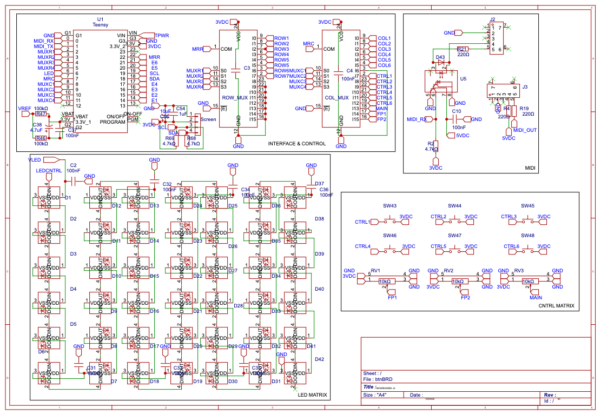

# MOARkNOBS-42

> The button-mashing, knob-twisting controller that refuses to behave.

This repo bundles the firmware, hardware designs and documentation for the **MOARkNOBS-42** project. If you're after the gritty details, dive into the subdirectories below.

## Where's what

- **firmware/** – Teensy 4.0 source and project files. The full manual lives in [firmware/README.md](firmware/README.md).
  - **App/** – simple WebSerial editor to tweak settings over USB.
  - **test/** – manual hardware test suite with its own [README](firmware/test/README.md).
- **hardware/** – PCB and enclosure docs. Check [hardware/README.md](hardware/README.md) for the overview.
  - **BTN_42/** – button board design; more notes in [BTN_42/README.md](hardware/BTN_42/README.md). Block diagrams and schematics are under [`sketch/`](hardware/BTN_42/sketch).
- **HISTORY.md** – running log of how this project came to be.

## Getting started

1. Build and flash the firmware.
2. Order or assemble the board from the hardware files.
3. Wire things up and start twisting knobs.

## Development Timeline

For a month-by-month look at how this controller came together, see
[HISTORY.md](HISTORY.md).

## License

MIT, see [LICENSE](LICENSE) for details.

## Author

BSSS project team.
