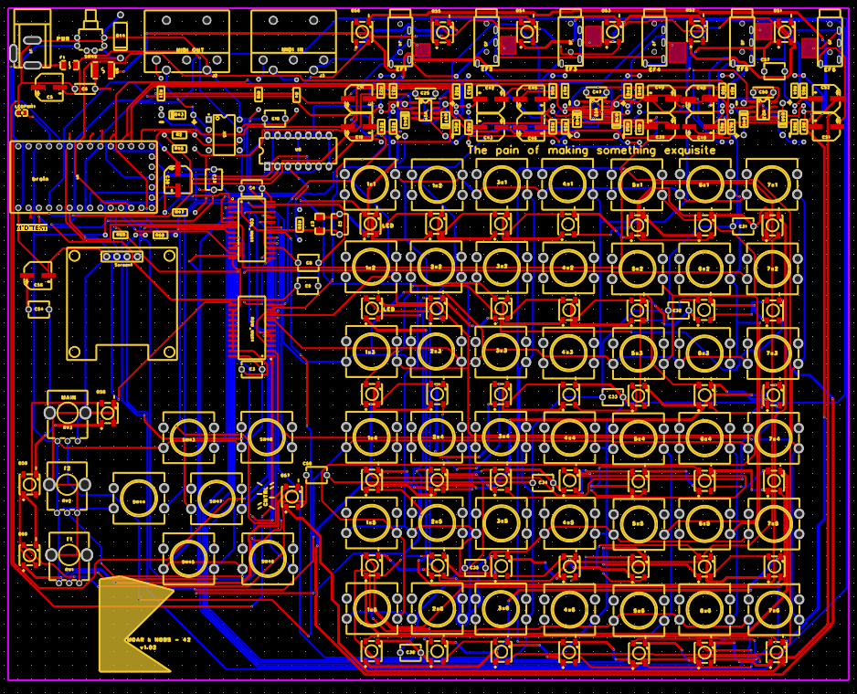

# MOARkNOBS-42


> The button-mashing, knob-twisting controller that refuses to behave.

This repo bundles the firmware, hardware designs and documentation for the **MOARkNOBS-42** project. Dive into the subdirectories below for the gritty details.

This isn't just a code dump; it's a loud, messy lab notebook. Every README, sketch, and test exists so you can follow the breadcrumb trail and spin up your own mutant MIDI rig.

## Features at a Glance

- **Full RGB LED riot** – 52 WS2812s light up slot halos, envelope eyes and whatever else needs to scream.
- **Speaks every dialect** – NRPN, RPN, SysEx, CC, Note, Program Change, Pitch Bend and Aftertouch or it doesn't play. [More on MIDI types](firmware/README.md#supported-message-types).
- **42 virtual slots** – each a self-contained MIDI brain with its own LED halo. [Slot anatomy](firmware/README.md#supported-message-types).
- **Six envelope followers** – feed it audio or CV; hardware ON/OFF lets you muzzle the math when you need to. [How the EFs work](firmware/README.md#dynamic-envelope-modulation).
- **Built-in arpeggiator** – clock-locked riffs with filter knobs warping length and pattern. [Arp details](firmware/README.md#arpeggiator-mode).
- **Freq/Q double agents** – when the arp chills, Freq shoves velocity while Q decides if a twist actually spits out a note.
- **Profiles on tap** – three EEPROM bunkers to stash complete setups; jump between live, studio and meltdown. [Profiles guide](#profiles-stash-three-setups).
- **WebSerial editor + OSC bridge** – tweak the box from a browser or fire OSC/WebMIDI across a Node shim. [WebSerial guide](docs/WebSerial.md) • [Bridge playbook](docs/OSCBridge.md).
- **Button mayhem** – six control buttons and a world of combos to reset, randomize or just start trouble. [Button chart](firmware/README.md#button-mayhem).
- **Test harness included** – Unity-driven sanity checks and manual hardware tests when paranoia strikes. [Test suite](firmware/test/README.md).



## Where's what

- **docs/** – Builder's Handbook, history log, WebSerial guide, and thermal rants.
  - [Pin Map](docs/PinMap.md) – MCU pins and what they terrorize.
  - [EEPROM Layout](docs/EEPROMLayout.md) – offsets for every saved byte.
- **firmware/** – Teensy 4.0 source and project files. The full manual lives in [firmware/README.md](firmware/README.md).
  - **App/** – simple WebSerial editor to tweak settings over USB. See [README_webserial.md](firmware/App/README_webserial.md) for philosophy and troubleshooting riffs.
  - **test/** – manual hardware test suite with its own [README](firmware/test/README.md).
- **hardware/** – PCB and enclosure docs. Check [hardware/README.md](hardware/README.md) for the full tour.
  - [Gerber_MOAR_Board_2025-08-08.zip](hardware/Gerber_MOAR_Board_2025-08-08.zip) – current fab package.
  - [BOM_MOAR_MOAR_Board_2025-08-02.xlsx](hardware/BOM_MOAR_MOAR_Board_2025-08-02.xlsx) – parts list for the build.
- **bridge/** – Node.js gateway that slings serial chatter into OSC and a virtual MIDI port. See [bridge/README.md](bridge/README.md).
- **[HISTORY.md](docs/HISTORY.md)** – running log of how this project came to be.

## Development Timeline

The timeline reads like a diary of questionable decisions. For the month-by-month breakdown, see
[docs/HISTORY.md](docs/HISTORY.md).

## Release Notes

Cutting a drop shouldn't feel like paperwork. From the repo root:

- Run `./release.sh <version>` and it will crank out `dist/mn42_<version>.hex`, a copy of
  `THIRD_PARTY_LICENSES.md`, **and** a `LICENSES/` folder stocked with the raw license texts from the
  firmware tree. Those files aren't optional—ship them or expect angry ghosts of GPL past to stage-
  dive onto your inbox.

### Flash with Teensy Loader

1. Plug in the Teensy 4.0.
2. Fire up the Teensy Loader app.
3. **File → Open** and aim it at your freshly baked `mn42_<version>.hex`.
4. If the board plays dead, mash the Teensy's button, then hit **Program**.
5. When the loader cheers "Reboot OK," yank the cable or leave it for the encore.

## Build the Firmware

### Build & Flash (the loud way)

1. **Install the tools** – `pip install -r requirements.txt` to grab PlatformIO 6.1.18 or lean on the VS Code extension. Old‑school? Fire up the Arduino IDE with the Teensyduino add‑on and the libraries listed in `platformio.ini`.
2. **Plug in your Teensy 4.0** – USB cable, no mystery.
3. **Kick the build** – from `firmware/` run:
   ```bash
   pio run -t upload -e teensy40_main
   ```
   The loader will scream success if everything sticks.
4. **Arduino alternate** – open `firmware_main.cpp` as a sketch and mash upload like it owes you money.

### Wiring Basics

1. **Feed it power** – 5 V into VUSB and common ground to every module. Star grounds save your sanity.
2. **Data line** – Teensy pin `6` pumps bits to the WS2812 chain through a ~330 Ω resistor. First LED’s DIN gets the love.
3. **Buttons and encoders** – wire them to their labeled pins; keep wires short so they don’t act like antennas for the void.

### Run a “Hello LED” Test

1. With the board still on USB, drop this minimal sketch into `firmware/test/` or a fresh project:
   ```cpp
   #include <FastLED.h>
   #define LED_PIN 6
   #define NUM_LEDS 1
   CRGB leds[NUM_LEDS];
   void setup(){ FastLED.addLeds<WS2812, LED_PIN, GRB>(leds, NUM_LEDS); }
   void loop(){ leds[0]=CRGB::Green; FastLED.show(); delay(500); leds[0]=CRGB::Black; FastLED.show(); delay(500); }
   ```
2. Build and upload it the same way as the main firmware. If that lone LED blinks like a tiny rave, you’re golden.

Once the light show works, raid `hardware/` for PCB files and go full‑build.

### Button Controls

#### Control Buttons

Need a crash course in front-panel mayhem? Here's how the six control buttons misbehave. *EF = Envelope Follower.*

| Button | Short Press | Long Press | Double Press |
| ------ | ----------- | ---------- | ------------ |
| #0 | Toggle EF | Calibrate EF baseline | Cycle EF filter forward |
| #1 | Next Slot | Cycle MIDI Type (CC/Note/etc) | Cycle EF filter backward |
| #2 | Cycle EF assignment | Toggle Slot Active | — |
| #3 | Cycle MIDI Channel | Reset EEPROM | — |
| #4 | Cycle CC Number | Save config | Reload profile from EEPROM |
| #5 | Tap BPM | — | — |

#### Slot Buttons

Short press selects the slot. Long press assigns or cycles the Envelope Follower and flips it on.

**Need to tame the noise floor?** Hold **Ctrl0** until the display shouts "EF Calibrated." The box samples VREF, learns the current baseline for the follower tied to the active slot, and burns that offset into EEPROM so it survives the next power cycle.

#### Combo Moves

- **#0 + #1** – Cycle EF ARG mode method
- **#2 + #3** – Cycle LED light display modes
- **#4 + #5** – Enable EF and randomize settings
- **#0 + #4** – Set slot to MIDI Note mode
- **#0 + #5** – Set slot to Program Change
- **#1 + #4** – Set slot to Aftertouch
- **#1 + #5** – Set slot to Pitch Bend
- **#2 + #4** – Set slot to NRPN
- **#0 + #3** – Set slot to SysEx
- **#1 + #2** – Toggle MIDI clock output
- **#2 + #5** – Cycle ARG envelope pair
- **#3 + #4** – Bump arpeggiator base note
- **#3 + #5** – Toggle Arpeggiator mode
- **#0 + #2** – Cycle configuration profiles

For the full riot of possibilities, see the [Button Mayhem table](firmware/README.md#button-mayhem).

### What Could Go Wrong?

- **No common ground** – LEDs ghost or don’t light. Tie every ground together like you mean it.
- **Wrong pin** – LED data on any pin but 6? Enjoy the dark.
- **Power sag** – feeding 52 WS2812s from a wimpy supply causes brownouts and swearing.
- **Missing libraries** – PlatformIO fails fast if dependencies vanish. Check `platformio.ini` before blaming the hardware.
- **Bootloader naps** – if the Teensy doesn’t auto‑program, hit its button to jolt the bootloader awake.

### Profiles: stash three setups

The rig now hoards three full configuration profiles in EEPROM. Each profile is a 256‑byte bunker storing your pot maps, LED vibe, and envelope tricks.

#### Jump profiles

Mash **Ctrl0 + Ctrl2** on the control panel to hop to the next profile. It wraps after the third, so keep cycling until you land where you want.

#### Save the chaos

Long‑press **Ctrl4** once you’ve mangled the knobs to taste. That burns the current state into the active profile.

#### Panic reload

Double‑tap **Ctrl4** to yank the active profile from EEPROM and forget any unsaved noodling.

_Need to nuke it all?_ Long‑press **Ctrl3** to reset the whole EEPROM back to factory‑dumb defaults.

Profiles share MIDI slot data, so only the user‑tweakable mappings get swapped. It’s a fast way to keep separate live, studio, and “what if I break everything” setups without re-flashing.

### Manual Hardware Tests

Compile the test environments when you want to verify the board outside of the
main firmware:

```bash
pio run -e teensy40_full_system      # or teensy40_unified_test, etc.
# Unity harness ain't special anymore:
pio run -e teensy40_unity
```
Available environments:

- `teensy40_full_system` – step-through checks of each subsystem
- `teensy40_unity` – Unity-driven automated tests (build with `pio run -e teensy40_unity`)
- `teensy40_unified_test` – full integration test
- `teensy40_biquad_test` – biquad filter calibration
- `teensy40_eeprom_persistence` – EEPROM backup/restore test
- `teensy40_slot_verify` – verifies MIDI slot storage

Grab `./test.sh` when you just want receipts: it sniffs for a Teensy, blasts the Unity rig, roughs up the Node bridge, and squirts both transcripts into `logs/` for later gawking. Set `TEST_PORT` if you’re juggling more than one board.

See [firmware/test/README.md](firmware/test/README.md) for details on this project's testing suite.

For a month-by-month look at how this controller came together, see
[HISTORY.md](docs/HISTORY.md).

## Firmware Updates

Shipped units don't have to rot on old code. Follow the step-by-step [Firmware Update guide](docs/FirmwareUpdate.md) to flash new bits without drama.

## Support

Need help or want to yell into the void? Open an issue on [GitHub](https://github.com/bseverns/MOARkNOBS-42/issues) or drop a line at [support@bseverns.me](mailto:support@bseverns.me).


## License & Redistribution

MIT, see [LICENSE](LICENSE) for details.

### Redistribution Terms

If you sling this firmware or ship a kit, bundle the `firmware/LICENSES/` directory and either stash the EEPROM source or point to https://github.com/PaulStoffregen/cores/tree/master/teensy4 so the LGPL folks stay cool.

## Author

BSSS project team.

## Thanks

To all of you. You've all made this better whether you realize it or not. Thank you all. Especially Gary.
