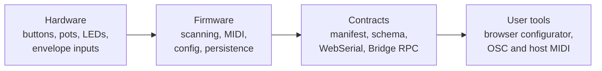

# MOARkNOBS-42

MOARkNOBS-42 (MN42) is an open, reactive MIDI/OSC performance instrument: a physical control surface, Teensy firmware,
a browser configurator, and a desktop Bridge that are designed and documented as one system.

It gives performers 42 configurable control slots, six envelope-follower inputs, profile recall, MIDI, OSC, and
browser-based editing without hiding the device contract behind proprietary software. It is closer to a small system
with a very visible control surface than “just a controller with a lot of knobs.”

[Try the browser configurator in simulator mode](https://bseverns.github.io/MN42/) without hardware, or read the
[five-minute orientation](docs/getting-started/FirstFiveMinutes.md).

## How the system fits together



Each layer reports what it knows to the next. That is why the project emphasizes schema compatibility, verified
readback, test coverage, and evidence-backed support boundaries.

## Choose your path

| Interest | Start here | You will learn... |
| --- | --- | --- |
| Performer | [Quickstart for Performers](docs/getting-started/QuickstartForPerformers.md) | How to connect, configure, recall profiles, and prepare a rig. |
| Builder | [Quickstart for Builders](docs/getting-started/QuickstartForBuilders.md) | How to inspect, flash, bring up, and validate a board. |
| Contributor | [Contributing](CONTRIBUTING.md) | The build, test, documentation, and review gates. |
| Technical Evaluator | [Hardware-Test Readme](HARDWARE_TEST_README.md) | What the current prototype evidence proves—and does not prove. |

For a conceptual tour, use [Start Here](docs/getting-started/StartHere.md). For a complete source-tree map, use
[Repository Contents](docs/project/RepositoryContents.md).

## What is included

- **Hardware:** a Teensy 4.0 control surface with buttons, pots, LEDs, MIDI I/O, OLED feedback, and six reactive inputs.
- **Firmware:** scheduling, control scanning, MIDI behavior, modulation, configuration, and generation-checked persistence.
- **Browser configurator:** direct WebSerial setup, monitoring, staged edits, verified Apply, profiles, and a hardware-free simulator.
- **Bridge:** local browser console, OSC routing, virtual/host MIDI routing, and an App-over-Bridge transport.
- **Documentation and evidence:** contracts, build guides, validation procedures, and dated bench receipts.

## Quick start without hardware

1. Open the [hosted configurator](https://bseverns.github.io/MN42/).
2. Select **Start simulator** from the Configure screen.
3. Change a slot, inspect the staged diff, and apply it to the simulated device.

The simulator demonstrates the browser workflow. It does not validate physical controls, timing, MIDI wiring, or
electrical behavior.

## Build and test

The PlatformIO project root is `firmware/`; always pass `-d firmware` from the repository root:

```bash
pio run -d firmware -e teensy40_main
pio test -d firmware -e teensy40_unity -vvv
```

Run the grouped repository checks before proposing a change:

```bash
python3 tools/doctor.py --full
```

See [Contributing](CONTRIBUTING.md) for the scoped test matrix and the custom Unity transport rules.

## Current project boundary

MN42 is at the hardware-test stage. The prototype boards and software paths are useful for bring-up and evaluation,
but the repository does not claim a public v1.0 release, an orderable fabrication package, universal host/browser
support, or a signed desktop installer.

Current hardware observations, board photos, test status, and the exact evidence still needed are kept in the
[Hardware-Test Readme](HARDWARE_TEST_README.md) and [Current Build](hardware/CurrentBuild.md)—not on this landing page.

## Documentation

- [Documentation site](https://bseverns.github.io/MOARkNOBS-42/)
- [System Map](docs/getting-started/SystemMap.md)
- [Connectivity Guide](docs/getting-started/ConnectivityGuide.md)
- [Documentation Truth Map](docs/reference/DocumentationTruthMap.md)
- [Testing](docs/validation/TESTING.md)
- [Release and reproducibility](REPRODUCIBILITY.md)

If two documents disagree, the [Documentation Truth Map](docs/reference/DocumentationTruthMap.md) defines the tie-break
rules. Historical wiki pages are frozen; canonical maintained documentation lives in this repository and the generated
documentation site.

## Contact and feedback

- Reproducible bugs and public questions: [GitHub Issues](https://github.com/bseverns/MOARkNOBS-42/issues)
- Security-sensitive reports: [Security policy](SECURITY.md)
- Pilot-run inquiries: [severns3@gmail.com](mailto:severns3@gmail.com)

Never put credentials, private device data, or other secrets in a public issue.
