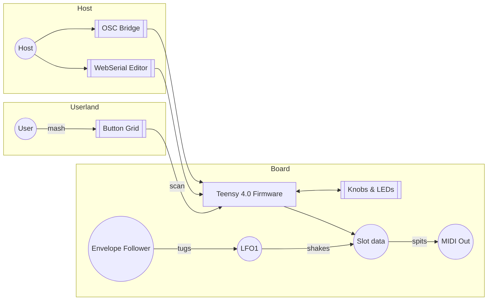

# MOARkNOBS-42

> The button-mashing, knob-twisting controller that refuses to behave.

## What this is

MOARkNOBS-42 is a microcontroller-based MIDI/OSC controller built as a critical instrument—an interface you 
can audit, rebuild, and modify to test how control, authorship, and embodiment shape sound and musical labor. 
It is open, meaning you can fork, sell, remix—just credit and share like I have.

This repo is like a studio notebook that mashes firmware, some software, hardware, and docs, into one place.
This top-level README stays intentionally barebones—treat it like a quick map, then raid the README in each
folder for the gritty context, wiring diagrams, and experiments.

## Quick Map

| Path | What's in it |
| --- | --- |
| [docs/](docs/README.md) | Build notes, history and assorted rants |
| [docs/TESTING.md](docs/TESTING.md) | Test gauntlet from polite to brutal |
| [docs/PinMap.md](docs/PinMap.md) | Every MCU pin's dirty secret |
| [docs/EEPROMLayout.md](docs/EEPROMLayout.md) | Where config bytes crash at night |
| [firmware/](firmware/README.md) | Teensy 4.0 codebase. Tables for [buttons](firmware/include/ButtonManager/README.md#button-map), [filters](firmware/include/EnvelopeFollower/README.md#filter-types), [arp settings](firmware/include/Arpeggiator/README.md#arp-settings), [MIDI types](firmware/include/MIDIHandler/README.md#supported-message-types), [ARG methods](firmware/include/EnvelopeFollower/README.md#arg-methods) and [display hooks](firmware/include/DisplayManager/README.md#key-methods) live here |
| [hardware/](hardware/README.md) | Schematics, BOM, enclosure bits and the [Parts & Rationale](hardware/Parts.md) cheat sheet |
| [bridge/](bridge/README.md) | Node.js bridge docs for OSC + virtual MIDI setup, command reference, and troubleshooting |
| [tools/](tools/README.md) | Bench toys and test‑rig scripts—start with the [SerialToCsv logger](tools/serial_logger/README.md) |

## Highlights

- 42 virtual slots and six envelope followers ready to hijack any MIDI stream.
- Built‑in arpeggiator and filter playground.
- WebSerial editor and OSC bridge for remote tweaking.
- Button grid that refuses to behave—short, long, double and combo presses are all mapped in the [ButtonManager cheat sheet](firmware/include/ButtonManager/README.md#button-map).
- MIDI chops, ARG math, and OLED tricks are mapped out in their own module tables.
- Dual MIDI jacks—5‑pin DIN for the old heads and 1/8" TRS Type‑A for anyone who left their big cables at home.

## Fresh to MIDI or DSP?

Need a refresher? Bounce to the [MIDI + DSP 101 Primer](docs/Primers/MIDI-DSP101.md) for a tour of channels, CCs, NRPN/RPN sorcery, SysEx etiquette, envelope follower guts, and the biquad math we abuse. It links out to the canonical specs and street-level explainers so you can ramp from zero to firmware-ready without leaving the repo.

## Firmware Stack Crash Course

If you’re new to embedded firmware or just curious why this rig leans so hard on
references and pointers, the freshly annotated source tree doubles as a guided
tour. Start with [`firmware/src/firmware_main.cpp`](firmware/src/firmware_main.cpp)
to see how each manager gets injected and why globals buy us deterministic boot
order on a real-time microcontroller. From there:

- [`ARGMixer.cpp`](firmware/src/ARGMixer.cpp) walks through how envelope
  followers feed arithmetic mash-ups, including the guard rails that keep byte
  enums from going feral when you hand-edit EEPROM dumps.
- [`PotentiometerManager.cpp`](firmware/src/PotentiometerManager.cpp) explains
  why we smooth ADC reads, how we select mux banks, and what the MIDI callback
  signature really delivers (hint: both mapped values *and* raw readings).
- [`MIDIHandler.cpp`](firmware/src/MIDIHandler.cpp) calls out the transport
  layers and the serial queueing tricks that keep DIN and USB outputs in lock
  step without starving the main loop.
- [`WebSerial.cpp`](firmware/src/WebSerial.cpp) documents the JSON payloads the
  browser expects so you can hack the UI without reverse engineering blobs.

Each file has links to the relevant README tables if you want the cheat sheets
instead of spelunking the code—perfect fodder for a classroom lab or a late
night builder jam.

### Annotated Source Field Guide

The comment pass is more than hype—it’s a breadcrumb trail. Use this cheat sheet
when you’re running a workshop or mentoring a new builder:

| File | What to zero in on |
| --- | --- |
| [`firmware/src/firmware_main.cpp`](firmware/src/firmware_main.cpp) | Dependency graph narrated in real time: why globals matter for deterministic boot, how task schedulers, managers, and telemetry wire together. |
| [`firmware/src/ButtonManager.cpp`](firmware/src/ButtonManager.cpp) | Debounce state machines, mux settle delays, and how human gestures translate into slot updates, MIDI calls, and WebSerial pushes. |
| [`firmware/src/ConfigManager.cpp`](firmware/src/ConfigManager.cpp) | EEPROM schema migrations, pointer-safe handoffs, and the checksum rituals that keep corruption from bricking rigs. |
| [`firmware/src/EnvelopeFollower.cpp`](firmware/src/EnvelopeFollower.cpp) | Filter maths laid bare: shaping curves, ARG pair logic, and how we keep ADC reads deterministic without extra allocations. |
| [`firmware/src/MIDIHandler.cpp`](firmware/src/MIDIHandler.cpp) | Queues, transport arbitration, and why serial writes run through explicit FIFOs instead of ad‑hoc `Serial.print` calls. |
| [`firmware/src/LEDManager.cpp`](firmware/src/LEDManager.cpp) | Dirty-flag batching, DMA lane juggling, and the color math that makes sense to students when you explain CRGB vs CHSV. |
| [`firmware/src/PotentiometerManager.cpp`](firmware/src/PotentiometerManager.cpp) | Multiplexer walkthrough plus the callback contract that hands both raw ADC and MIDI-scaled data back to the caller. |
| [`firmware/src/WebSerial.cpp`](firmware/src/WebSerial.cpp) | JSON schema primer: see how slot metadata gets massaged so browser UIs stay in sync with firmware realities. |

The tl;dr: every manager owns its own buffers, globals just publish shared
intent, and comments name the trade-offs so you can narrate the code like a
zine. Treat it like a studio notebook, pull apart the sections live, and reroute
the rig when you want to teach a different angle on pointers or data flow.

>EasyEDA won't recognized my shifted 3D models for all my parts, but trust me. All parts simulate correctly.

## Why these specific parts?

Chasing the SparkFun-backed part rationales? Skip down to the [docs index](docs/README.md#why-these-specific-parts) for the full bullet tour, then hit [hardware/Parts.md](hardware/Parts.md) when you want sourcing receipts.

## Diagram Dump

> Because ascii tables only go so far. Here's how the beast actually routes its noise.

### One Big Flow

For an even grimier wiring map, the [systemflow docs](docs/sketch/systemFlow/hw/) tear down each hardware module—button matrix, display guts, envelope front-end—so you can trace every signal like a true knob punk.

## Quick Start

Ready to shred? Here's the bare minimum to get the beast humming, provided you have the completed board in-hand.
Want the soup-to-nuts path? Check the [Process Overview](docs/ProcessOverview.md)—and if you want a guided lap through the full pipeline, run the [slot tweak lab](docs/ProcessOverview.md#hands-on-lab-tweak-a-slot-ship-it-watch-it-scream).

1. **Prep the dev rig**
   - `pip install -r requirements.txt`
   - `npm --prefix bridge ci`
   - Node 20 LTS and PlatformIO need to be on your PATH.
   - More setup lore lives in the [Builder's Handbook](docs/BuildersHandbook.md).

2. **Flash the brain**
   - `pio run -t upload -e teensy40_main`
   - The [firmware README](firmware/README.md) digs into build flags and alternate targets.

3. **Say hello over serial**
   - Plug it in, crack a terminal or the [bridge](bridge/README.md).
   - Type `HELLO` and the board coughs up `{"hello":"mn42"}`.
   - Want the whole WebSerial rant? See [docs/WebSerial.md](docs/WebSerial.md).

4. **Beat it up**
   - `./test.sh` slams the Unity and bridge checks, or see [docs/TESTING.md](docs/TESTING.md) for the full ritual.

Intent: make noise, learn something, and share what you tweak. Don't forget the hardware license obligations.

Want the deep cuts? The full chronicles live in [docs/](docs/README.md) and
the gritty firmware lore is in [firmware/](firmware/README.md).

## Firmware architecture

- `firmware/src/SystemState.cpp` now owns every shared object that used to live in `firmware_main.cpp` so the boot driver stays small while the rest of the code still reaches the same globals via `FirmwareState.h`.
- `Protocol`, `Modes`, `UI`, and `Runtime` each expose an `initialize*()` helper so `setup()` only needs to call four things in a predictable order; each helper is responsible for its own devices (serial framing + JSON RPC, envelope/LFO profiles, OLED/buttons, timer callbacks, etc.).
- `CommandQueue` owns the serial buffer/ring queue for text commands while `processCommandQueue()` lives in the protocol module so those responsibilities stay grouped with the parser.
- `Scheduler` registers the high/mid/low tasks—the MIDI tick, envelope/LFO sampling, the serial poll/command pair, and the display/LED updates—so we can keep the scheduler wiring next to the modules that drive each task instead of in `firmware_main.cpp`.
- `Runtime` delegates the LED pulse diagnostic hooks, MIDI handler wiring, and Timer1 ISR to the new scheduler and state modules, making the runtime loop focused on yielding to the schedulers and servicing button/pot sweeps.

The high-level idea is simple: `setup()` boots each layer, `loop()` ticks the schedulers and handles pots/buttons, and the heavy lifting lives in dedicated modules that can be read, documented, and tested independently.

### Runtime handshake & UX guardrails

- **Manifest + schema** – `HELLO` is still the gateway, but the desktop/web app now immediately follows up with `GET_MANIFEST` so it knows the firmware build, schema version, pot/slot/LED counts, and memory headroom before accepting any edits. `GET_SCHEMA` still returns the JSON schema for offline editors, while `GET_CONFIG` feeds the UI a complete dump of pots, slots, envelope routing, ARG/filter choices, and LED settings. `GET_ALL` is still in the codebase, but it only fires when `SERIAL_LOGGING` is enabled for legacy logs—the manifest/config pair are the canonical sources for production builds.
- **Profiles live in EEPROM** – Four profile slots (A–D) now store the entire runtime snapshot: arpeggiator settings, LED brightness/color, every LFO shape/route, and each slot’s MIDI channel plus EF payload. Ping `GET_PROFILE,<id>` to fetch that JSON payload (defaults to the active slot) or `SET_PROFILE,<id>,<JSON>` to stage a new snapshot. The WebSerial editor uses those RPCs to implement Load/Save/Reset buttons, so you can roll back to the last saved profile even after a crash.
- **Dual routed LFOs** – Two oscillators run in the high-priority scheduler, each exposing configurable shape, depth, bipolar mode, and MIDI clock sync ratios. They fan out internally to LED brightness, arp swing, and EF gain trim while also being routable to MIDI/OSC/OSC callbacks, and their normalized outputs land in `g_lfoValues` so the OLED, telemetry, and WebSerial stream can paint identical waveforms. The same LFO state travels with profiles, so loading a slot restores the modulation matrix exactly.
- **LED behavior** – The WS2812 strip mirrors slot values via `LEDManager`, but the `led` object in `GET_CONFIG` (brightness + RGB + hex code) and the `SET_LED`/`GET_LED` commands let you treat the whole pool as a single color capstone. When diagnostics counters tick (UART overruns, dropped MIDI, slow loops), the status LED pulses and the JSON stream emits the event so you can spot pressure without a scope. The LFO routes above can modulate the LED brightness, so visual cues stay in sync with what the oscillators are doing.

### Config recovery feedback
If the boot loader detects EEPROM corruption it now shows a one-shot OLED message so you know what kind of recovery just happened:
1. **“Config restored from backup”** – the primary block failed CRC/magic but the backup block was valid. Firmware continues from the backup data, so you can keep playing, rerun `GET_CONFIG`/`GET_PROFILE`, and optionally save the profile again to refresh both slots.
2. **“EEPROM corrupted defaults loaded”** – both primary and backup were invalid, so the firmware reset the pot→channel map, CC map, and LED defaults. Reload a profile or redo your slot/channel assignments and save once everything looks right.
Treat these messages as subtle warnings—if you see one, check the WebSerial snapshot or run the slot mapping routine before you return to performance mode.

## License: MIT. 
See [LICENSE](LICENSE).

## Contributing

I'd love to see what you thought you could fit in here. Bring it, just format the code so it looks pretty like the rest of it. And make comments! That's how we all get better!

Need the fine print? The [CONTRIBUTING guide](CONTRIBUTING.md) spells out the repo contract and patch etiquette.

## Accessibility

- Every image rolls with descriptive alt text so screen readers don't get ghosted.
- Headings climb in order and tables have headers—no maze, just straight lines.
- Labels and LEDs keep contrast high and feedback loud for eyes and ears alike.

## Method (how we work).

- **Reproducible by design**: The repo ships with annotated schematics, a bill of materials, firmware, and a parameter map (what each control does).
- **Documentation as output**: Build notes, versioned change logs, and an assumption ledger (known limits, thresholds, what we never do) are first-class artifacts.
- **Modular & testable**: You can assemble a minimal 4-control version or the full 42-control build; each stage has a bench test so you can verify function before enclosure.
- **Critique-by-rebuild**: We encourage forks and remixes; issues and PRs that include measurements, audio/video traces, and diffs are preferred.
- **Bench data**: see `docs/bench/latency/latency.csv` and `docs/bench/noise/adc_idle.csv`. Methods in each folder explain how to reproduce the numbers.

- ## Ethics (what we optimize for).

- **Access & equity**: Parts are commonly available; we publish alternatives and cost ranges. Labels, spacing, and grip are designed for readability and different motor abilities.
- **Agency & authorship**: The layout makes mappings legible; users can re-map without reflashing (runtime tables), and we document trade-offs between fixed and assignable control.
- **Privacy & data**: The instrument does not capture personal data in any way; it emits MIDI/OSC only talks to other MIDI/OSC friends. No analytics, no hidden telemetry.
- **Safety & repair**: Power and enclosure choices follow basic electrical safety; off-the-shelf components keep repairs local and affordable.
- **Licensing & credit**: Hardware/design files and firmware are open-licensed; please cite the release tag you used so results are comparable.
