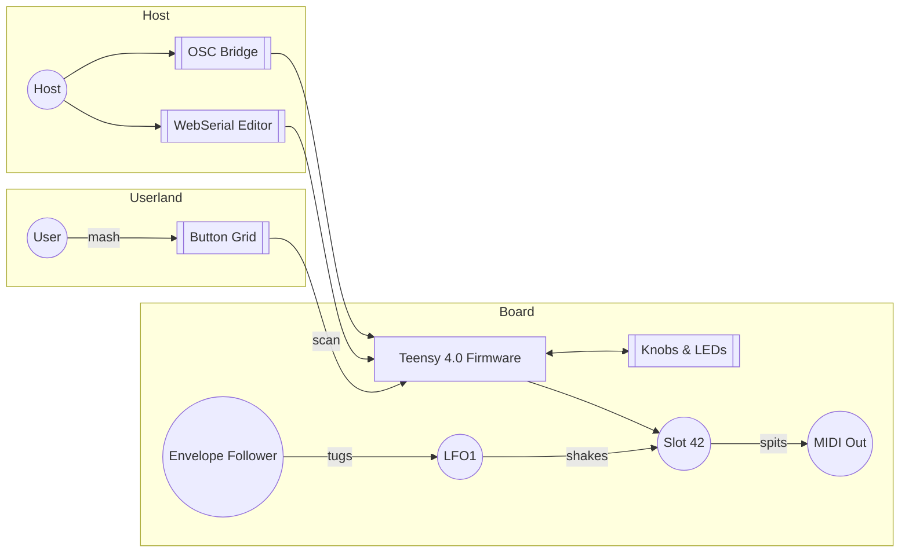

# MOARkNOBS-42


> The button-mashing, knob-twisting controller that refuses to behave.

This repo mashes firmware, hardware, docs, and a scrappy bridge into one place.
The top README is intentionally barebones—poke the READMEs in each folder for
the full scoop.

## Quick Start

Ready to shred? Here's the bare minimum to get the beast humming.

### Dependencies

- Python bits: `pip install -r requirements.txt`
- Node 20 for the bridge (LTS or bust)
- PlatformIO on your PATH
- Bridge deps:

   ```bash
   npm --prefix bridge ci
   ```

### Firmware build

```bash
pio run -e teensy40_main
```

### Test run

```bash
pio -d firmware test -e teensy40_unity -vvv
npm --prefix bridge test
```

## Quick Install & First Boot

This misfit box exists to teach you how far a Teensy and a dream can go. The hardware ships under the CERN Open Hardware Licence v2 – Strongly Reciprocal, so if you fab the board or tweak it, publish your changes and keep the credits (scope the [hardware README](hardware/README.md#license) for the fine print).

1. **Prep the dev rig**
   - `pip install -r requirements.txt`
   - `npm --prefix bridge ci`
   - Node 20 LTS and PlatformIO need to be on your PATH.
   - More setup lore lives in the [Builder's Handbook](docs/BuildersHandbook.md).

2. **Flash the brain**
   - `pio run -t upload -e teensy40_main`
   - The [firmware README](firmware/README.md) digs into build flags and alternate targets.

3. **Say hello over serial**
   - Plug it in, crack a terminal or the [bridge](bridge/README.md).
   - Type `HELLO` and the board coughs up `{"hello":"mn42"}`.
   - Want the whole WebSerial rant? See [docs/WebSerial.md](docs/WebSerial.md).

Intent: make noise, learn something, and share what you tweak. Don't forget the hardware license obligations.

### Release builds

Cut a tag and publish it on GitHub and the [release workflow](.github/workflows/release.yml)
will crank out a fresh `firmware.hex` and a `sysreport.json` ripped from
`sys::report()`, then slap both onto the release page. Want to go DIY? Run
`./release.sh <version>` and haul the bits yourself.

### Publishing a Release

1. **Bump the numbers** – tweak the version strings in `firmware/include/Globals.h` and any other stragglers so the code owns the new tag.
2. **Stamp it** – `git tag -a vX.Y.Z -m "vX.Y.Z"` so Git knows this is the real deal.
3. **Push and brag** – `git push origin vX.Y.Z` and then hop over to GitHub to draft the release. CI will sling the `.hex` and `sysreport.json` for you.

Want the deep cuts? The full chronicles live in [docs/](docs/README.md) and
the gritty firmware lore is in [firmware/](firmware/README.md).

## Quick Map

| Folder | What's in it |
| --- | --- |
| [docs/](docs/README.md) | Build notes, history and assorted rants |
| [firmware/](firmware/README.md) | Teensy 4.0 codebase. Tables for [buttons](firmware/include/ButtonManager/README.md#button-map), [filters](firmware/include/EnvelopeFollower/README.md#filter-types), [arp settings](firmware/include/Arpeggiator/README.md#arp-settings), [MIDI types](firmware/include/MIDIHandler/README.md#supported-message-types), [ARG methods](firmware/include/EnvelopeFollower/README.md#arg-methods) and [display hooks](firmware/include/DisplayManager/README.md#key-methods) live here |
| [hardware/](hardware/README.md) | Schematics, BOM and enclosure bits |
| [bridge/](bridge/README.md) | Node.js shim that slings serial into OSC/WebMIDI |

## Highlights

- 42 virtual slots and six envelope followers ready to hijack any MIDI stream.
- Built‑in arpeggiator and filter playground.
- WebSerial editor and OSC bridge for remote tweaking.
- Button grid that refuses to behave—short, long, double and combo presses are all mapped in the [ButtonManager cheat sheet](firmware/include/ButtonManager/README.md#button-map).
- MIDI chops, ARG math, and OLED tricks are mapped out in their own module tables.
- Dual MIDI jacks—5‑pin DIN for the old heads and 1/8" TRS Type‑A for anyone who left their big cables at home.

## Diagram Dump

> Because ascii tables only go so far. Here's how the beast actually routes its noise.

### One Big Flow



Need the dirt? Dive into the sub-READMEs and get lost.

License: MIT. See [LICENSE](LICENSE).

## Contributing

Want in on the mayhem? `pre-commit` now guards the gates with `clang-format`,
ESLint and Prettier. Run `pre-commit install` once and it'll slap your changes
into shape every commit.

