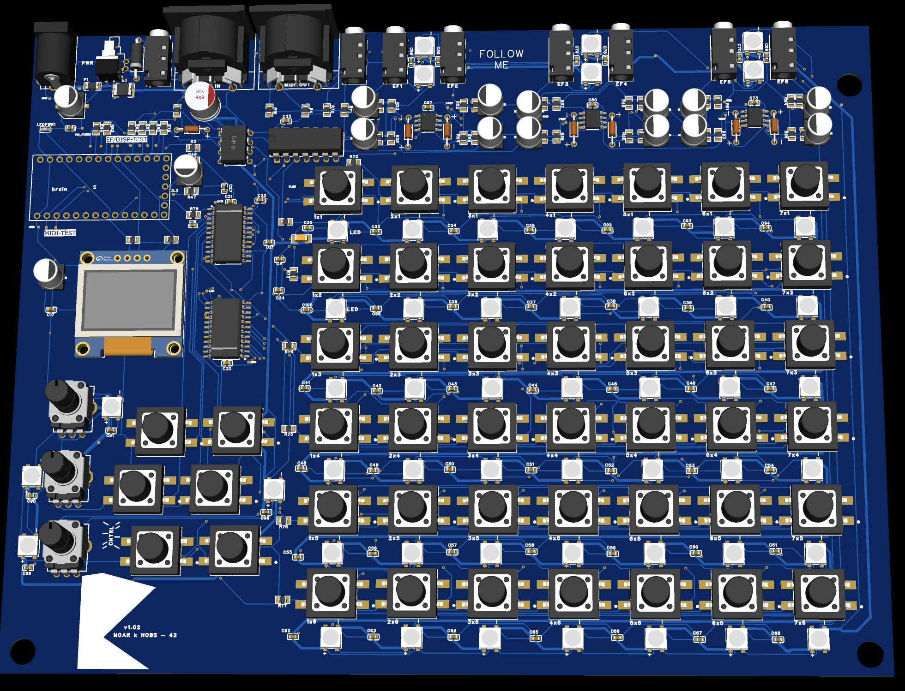
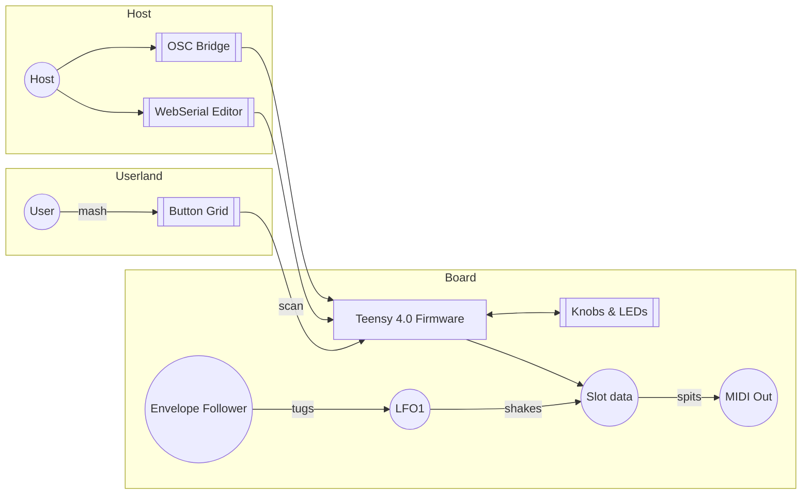

# MOARkNOBS-42


> The button-mashing, knob-twisting controller that refuses to behave.

##What this is

MOARkNOBS-42 is a microcontroller-based MIDI/OSC controller built as a critical instrument—an interface you 
can audit, rebuild, and modify to test how control, authorship, and embodiment shape sound and musical labor.

This repo is like a studio notebook that mashes firmware, some software, hardware, and docs, into one place.
The top README is intentionally barebones—poke the READMEs in each folder (there's lots of 'em) for
the full scoop.

## Quick Map

| Folder | What's in it |
| --- | --- |
| [docs/](docs/README.md) | Build notes, history and assorted rants |
| [firmware/](firmware/README.md) | Teensy 4.0 codebase. Tables for [buttons](firmware/include/ButtonManager/README.md#button-map), [filters](firmware/include/EnvelopeFollower/README.md#filter-types), [arp settings](firmware/include/Arpeggiator/README.md#arp-settings), [MIDI types](firmware/include/MIDIHandler/README.md#supported-message-types), [ARG methods](firmware/include/EnvelopeFollower/README.md#arg-methods) and [display hooks](firmware/include/DisplayManager/README.md#key-methods) live here |
| [hardware/](hardware/README.md) | Schematics, BOM and enclosure bits |
| [bridge/](bridge/README.md) | Node.js shim that slings serial into OSC/WebMIDI |

## Highlights

- 42 virtual slots and six envelope followers ready to hijack any MIDI stream.
- Built‑in arpeggiator and filter playground.
- WebSerial editor and OSC bridge for remote tweaking.
- Button grid that refuses to behave—short, long, double and combo presses are all mapped in the [ButtonManager cheat sheet](firmware/include/ButtonManager/README.md#button-map).
- MIDI chops, ARG math, and OLED tricks are mapped out in their own module tables.
- Dual MIDI jacks—5‑pin DIN for the old heads and 1/8" TRS Type‑A for anyone who left their big cables at home.

## Ethics (what we optimize for).

- **Access & equity**: Parts are commonly available; we publish alternatives and cost ranges. Labels, spacing, and grip are designed for readability and different motor abilities.
- **Agency & authorship**: The layout makes mappings legible; users can re-map without reflashing (runtime tables), and we document trade-offs between fixed and assignable control.
- **Privacy & data**: The instrument does not capture personal data in any way; it emits MIDI/OSC only talks to other MIDI/OSC friends. No analytics, no hidden telemetry.
- **Safety & repair**: Power and enclosure choices follow basic electrical safety; off-the-shelf components keep repairs local and affordable.
- **Licensing & credit**: Hardware/design files and firmware are open-licensed; please cite the release tag you used so results are comparable.


>EasyEDA won't recognized my shifted 3D models for all my parts, but trust me. All parts simulate correctly.

## Method (how we work).

- **Reproducible by design**: The repo ships with annotated schematics, a bill of materials, firmware, and a parameter map (what each control does).
- **Documentation as output**: Build notes, versioned change logs, and an assumption ledger (known limits, thresholds, what we never do) are first-class artifacts.
- **Modular & testable**: You can assemble a minimal 4-control version or the full 42-control build; each stage has a bench test so you can verify function before enclosure.
- **Critique-by-rebuild**: We encourage forks and remixes; issues and PRs that include measurements, audio/video traces, and diffs are preferred.

## Why these specific parts?

> The silicon misfits that make this controller tick and be the magic little disco ball that it can be.

- **Teensy 4.0** — 600 MHz ARM core with native USB MIDI. SparkFun's [Teensy 4.0 Hookup Guide](https://learn.sparkfun.com/tutorials/teensy-40-hookup-guide) walks through pinout, power rails, and flashing without bricking.
- **CD74HC4067 analog mux** — collapses forty‑two buttons into one ADC read. The [16‑Channel Mux Breakout Guide](https://learn.sparkfun.com/tutorials/16-channel-analogdigital-multiplexer-breakout-cd74hc4067-hookup-guide) shows how to fan-in a forest of switches and breadboard it before spinning copper.
- **SN74HCT245 level shifter** — keeps the 5 V button grid and LED strip from punching the 3 V3 brain. SparkFun's [Logic Level Shifting 101](https://learn.sparkfun.com/tutorials/logic-level-shifting) explains the voltage‑translation sleight of hand.
- **MCP6002 op‑amp** — rectifies and smooths incoming audio for the envelope followers. SparkFun's [Op-Amp Basics](https://learn.sparkfun.com/tutorials/op-amps/all) covers precision rectifiers and bias tricks.
- **6N138 optocoupler** — gives MIDI IN its own electrical bubble. SparkFun's [MIDI Tutorial](https://learn.sparkfun.com/tutorials/midi-tutorial/all) breaks down current loops, DIN vs. TRS jacks, and why opto‑isolation matters.
- **WS2812 LEDs** — one data pin, a riot of color on 52 diodes. SparkFun's [WS2812 Breakout Hookup Guide](https://learn.sparkfun.com/tutorials/ws2812-breakout-hookup-guide) dives into timing and power decoupling so you don't brown‑out the strip.

## Diagram Dump

> Because ascii tables only go so far. Here's how the beast actually routes its noise.

### One Big Flow



Need the dirt? Dive into the sub-READMEs and get lost.

For an even grimier wiring map, the [systemflow docs](docs/sketch/systemFlow/hw/) tear down each hardware module—button matrix, display guts, envelope front-end—so you can trace every signal like a true knob punk.

## Quick Start

Ready to shred? Here's the bare minimum to get the beast humming.
```

1. **Prep the dev rig**
   - `pip install -r requirements.txt`
   - `npm --prefix bridge ci`
   - Node 20 LTS and PlatformIO need to be on your PATH.
   - More setup lore lives in the [Builder's Handbook](docs/BuildersHandbook.md).

2. **Flash the brain**
   - `pio run -t upload -e teensy40_main`
   - The [firmware README](firmware/README.md) digs into build flags and alternate targets.

3. **Say hello over serial**
   - Plug it in, crack a terminal or the [bridge](bridge/README.md).
   - Type `HELLO` and the board coughs up `{"hello":"mn42"}`.
   - Want the whole WebSerial rant? See [docs/WebSerial.md](docs/WebSerial.md).
```

Intent: make noise, learn something, and share what you tweak. Don't forget the hardware license obligations.

Want the deep cuts? The full chronicles live in [docs/](docs/README.md) and
the gritty firmware lore is in [firmware/](firmware/README.md).

License: MIT. See [LICENSE](LICENSE).

## Contributing

I'd love to see what you thought you could fit in here. Bring it, just format the code so it looks pretty like the rest of it. And make comments! That's how we all get better!

