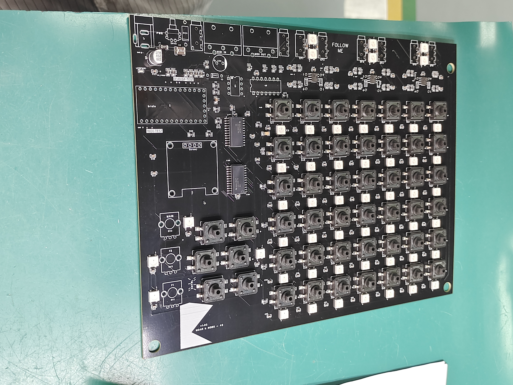
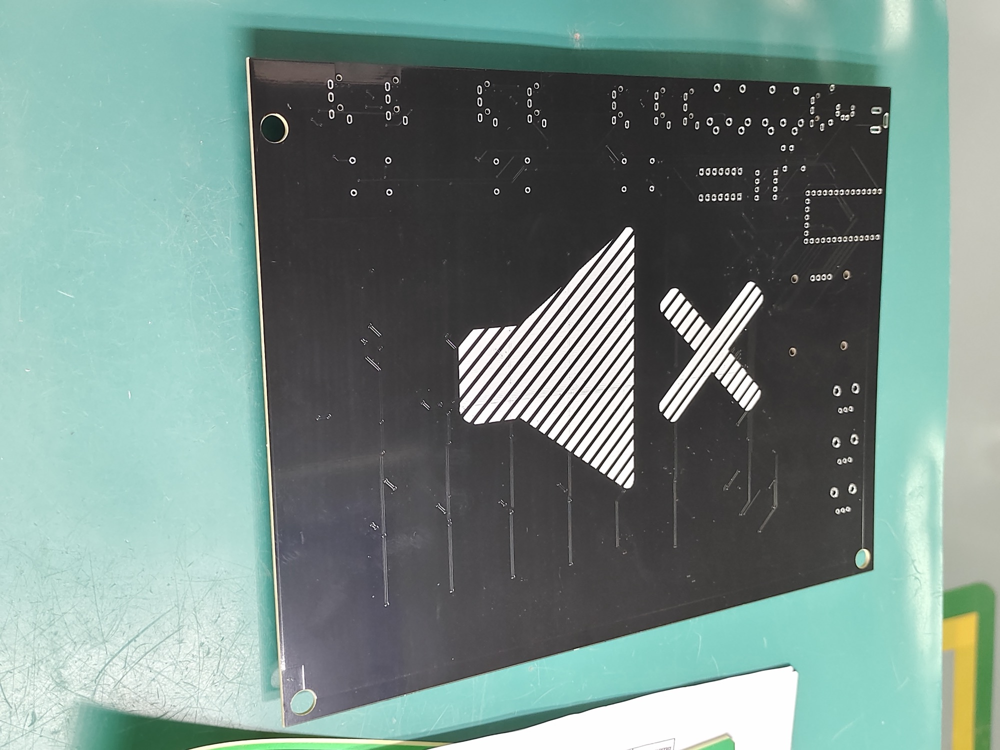
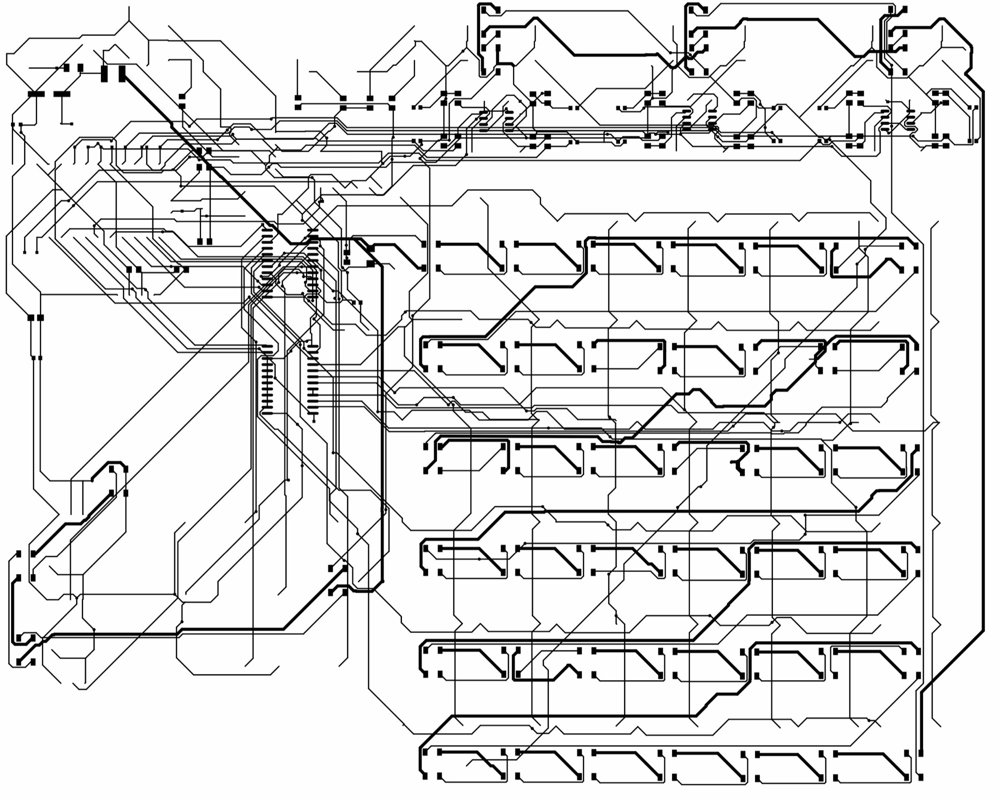
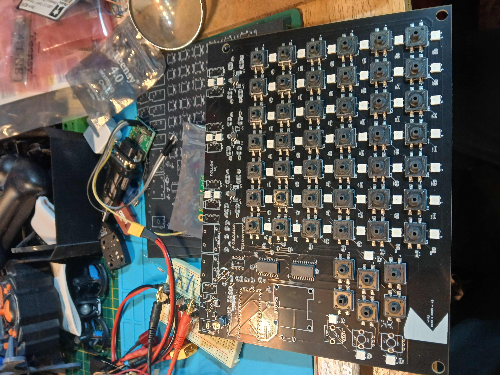
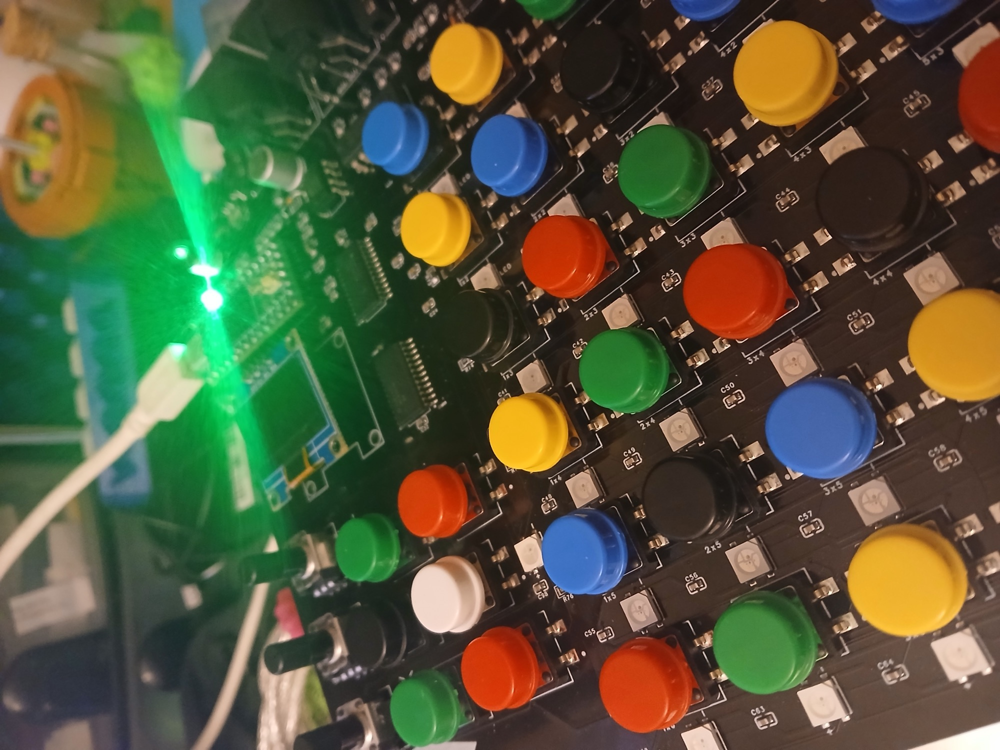

# MOARkNOBS-42 Hardware-Test Package

This repository is currently packaged as a hardware-test bundle for the MOARkNOBS-42 prototype.

It is not a public v1.0 release.
It is not an orderable fabrication package.
No verified Gerber, NC-drill, or release BOM bundle is enclosed.

MN42 is a hardware-test-stage open MIDI/OSC performance instrument ecosystem: prototype hardware, Teensy firmware,
browser configurator, Bridge, and validation docs moving together toward a supported small-batch instrument.

Start with [HARDWARE_TEST_README.md](HARDWARE_TEST_README.md) for the current hardware-test flow.
For a repo-level contents map, see [docs/project/RepositoryContents.md](docs/project/RepositoryContents.md).

## Current Hardware-Test Status

The prototype PCB run has moved MN42 from design-file speculation into physical bring-up evidence. Current boards have
been received and are now part of the hardware-test loop for power rails, OLED/display behavior, controls, MIDI paths,
LED load, envelope followers, WebSerial App connectivity, and Bridge connectivity.

The current boards appear useful for probing, assembly review, trace inspection, and bring-up. Current faults and
caveats are being treated as design and integration findings unless later bench evidence points to fabrication quality.
The canonical hardware status page is [hardware/CurrentBuild.md](hardware/CurrentBuild.md).

## PCB Progress Snapshot

This is the current public breadcrumb trail for the fabricated prototype boards, not a release claim. The boards are being
inspected and validated against the hardware references below, and fabrication packages will stay clearly labeled until a
revision has completed release-level checks and the remaining design findings are resolved.

PCBWay's prototype support gave MN42 a real board set to inspect and bring up. The useful claim at this stage is
specific: the boards arrived cleanly enough for the current bench review, and the 0.5 mm test pads are usable for
probing.







The static PCB photos are now paired with bench-context photos. These show the board entering the practical bring-up loop:
parts on the bench, power attached, controls populated, and visible status LEDs. Treat them as story and inspection context,
not as release-level pass/fail receipts.





## Hardware Test Review Snapshot

| Area                    | Current observation                                                                                            | Status               | Next evidence needed                                                                                           |
| ----------------------- | -------------------------------------------------------------------------------------------------------------- | -------------------- | -------------------------------------------------------------------------------------------------------------- |
| PCB fabrication quality | Boards arrived cleanly enough for probing, assembly review, and trace inspection. 0.5 mm test pads are usable. | Useful prototype run | Add measured inspection notes and dated rail measurements                                                      |
| Power rails             | Bring-up testing in progress. No release-level rail validation claimed yet.                                    | Under review         | Capture voltage/current/thermal receipt - current testing indicates a mis-routing in the design on input fuses |
| OLED/display            | Needs dedicated validation through hardware-test lanes.                                                        | Under review         | Record display bring-up pass/fail notes - after power surgery                                                  |
| Controls                | Board is now suitable for button/pot/control validation.                                                       | Under review         | Capture control scan and MIDI output receipt on DIN/USB                                                        |
| MIDI paths              | MIDI testing is part of the current bring-up target.                                                           | Under review         | Capture filmed MIDI validation receipt via transport                                                           |
| LEDs/load               | LED behavior and current draw still require bench evidence once power routing is made solid.                   | Under review         | Capture LED load/power receipt                                                                                 |
| Fabrication readiness   | No orderable fabrication package is enclosed.                                                                  | Not ready            | Verified Gerber/NC-drill/BOM release bundle                                                                    |

## What This Prototype Run Enabled

This prototype PCB run moved MN42 from design-file speculation into real bench review. It gives the project a stable
physical target for:

- probing
- assembly checks
- trace inspection
- power-rail validation
- control testing
- MIDI-path verification
- LED-load testing
- envelope follower bring-up
- WebSerial App and Bridge host connectivity
- profile-backed arpeggiator pattern length through `SET_ARP` and `SET_PROFILE`

## What Is Not Claimed Yet

> This prototype run is useful evidence, not manufacturing sign-off.
>
> This repository does not currently include an orderable fabrication package, a verified Gerber / NC-drill / release BOM
> bundle, release-level rail or power validation, or any public v1.0 claim.

## Next Evidence To Capture

- filmed MIDI validation receipt
- power-rail receipt
- display/control bring-up receipt
- host-connectivity receipt
- revision findings list

## PCB Fabrication Notes

- Existing board photos live under [docs/assets/board](docs/assets/board).
- Current hardware status lives in [hardware/CurrentBuild.md](hardware/CurrentBuild.md).
- Fabrication folder status lives in [hardware/fabrication/README.md](hardware/fabrication/README.md).
- Current package limits are summarized in [docs/hardware-test/KnownIssues.md](docs/hardware-test/KnownIssues.md).
- Fabhouse experience note: the boards arrived cleanly enough that current prototype faults are being treated as design
  and integration findings unless future evidence says otherwise. That is what this prototype run needed to answer.

## Choose Your Path

- **Validating prototype hardware:** start with [HARDWARE_TEST_README.md](HARDWARE_TEST_README.md), then follow
  [docs/hardware-test/Bringup.md](docs/hardware-test/Bringup.md) and
  [docs/hardware-test/TestMatrix.md](docs/hardware-test/TestMatrix.md).
- **Changing firmware:** use [firmware/README.md](firmware/README.md) for PlatformIO lanes and
  [CONTRIBUTING.md](CONTRIBUTING.md) for the build/test contract.
- **Using the controller musically:** start with
  [docs/getting-started/QuickstartForPerformers.md](docs/getting-started/QuickstartForPerformers.md), then use
  [docs/getting-started/GuidedRoutes.md](docs/getting-started/GuidedRoutes.md) when you want the broader docs map.
- **Configuring over USB, OSC, or a DAW:** compare the direct and Bridge paths in
  [docs/getting-started/ConnectivityGuide.md](docs/getting-started/ConnectivityGuide.md), then use the
  [App README](App/README.md) or [Bridge README](bridge/README.md) for the chosen lane.
- **Checking fabrication or release readiness:** read [hardware/CurrentBuild.md](hardware/CurrentBuild.md) before treating
  any hardware artifact as orderable or release-ready.

## Package Entry Points

- [HARDWARE_TEST_README.md](HARDWARE_TEST_README.md) explains what the package is, what it is not, and the expected bring-up flow.
- [docs/hardware-test/Bringup.md](docs/hardware-test/Bringup.md) is the first-boot checklist.
- [docs/hardware-test/TestMatrix.md](docs/hardware-test/TestMatrix.md) lists supported test lanes and commands.
- [docs/hardware-test/KnownIssues.md](docs/hardware-test/KnownIssues.md) records current package limits.
- [docs/project/RepositoryContents.md](docs/project/RepositoryContents.md) maps current source, evidence, generated, and archive areas.

## Primary Build Command

Run PlatformIO from the repo root with `-d firmware`; the repo root itself is not the PlatformIO project:

```bash
pio run -d firmware -e teensy40_main
```

## Hardware Reference Files Present

These match the current hardware status page in [hardware/CurrentBuild.md](hardware/CurrentBuild.md).

| Item                   | Path                                                              | Status    | Use in this package                                         |
| ---------------------- | ----------------------------------------------------------------- | --------- | ----------------------------------------------------------- |
| Schematic reference    | `hardware/MN42-machineDrawings/SCH_MOAR_Schematic_2025-08-30.pdf` | present   | Current schematic reference for bench validation            |
| PCB overview PDF       | `hardware/MN42-machineDrawings/PCB_MOAR_Board_2025-09-03.pdf`     | present   | Current board drawing overview for bench validation         |
| PCB drawing detail set | `hardware/MN42-machineDrawings/PCB_MOAR_Board_2025-09-03/`        | present   | Reference PDFs for inspection and review, not fab outputs   |
| Fabrication directory  | `hardware/fabrication/README.md` only                             | note only | States that no orderable fabrication package is enclosed    |
| Physical board photos  | `docs/assets/board/`                                              | present   | Public breadcrumb images for current prototype board review |

No current BOM file is tracked in `hardware/fabrication/`, and no verified Gerber / NC-drill archive is present or
claimed. Use the files above as bench-validation references only.
