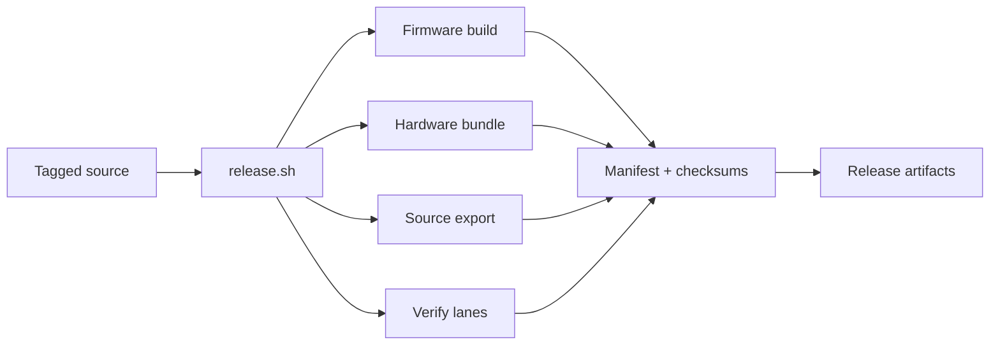

# Reproducibility Playbook

> No magic smoke. No shrug emoji. Just a cranky, repeatable build pipeline you can audit and rerun.

MOARkNOBS-42 publishes hardware-test artifacts *and* receipts. This guide walks through the exact commands used to
rebuild a prerelease bundle, record the toolchain version, and verify the artifacts with hashes. For version `<tag>`,
the outputs use the `mn42_<tag>_hardware-test_*` names defined by `release_build.sh`.



## TL;DR — clone, install, release

```bash
# 1. Grab the repo
git clone https://github.com/<your-fork-or-upstream>/MOARkNOBS-42.git
cd MOARkNOBS-42

# 2. Install PlatformIO in your current Python env
python -m pip install --upgrade pip
pip install platformio

# 3. Run the scripted release ritual (replace v0.0.0 with your tag)
FW_VERSION=v0.0.0 ./release.sh v0.0.0

# 4. Inspect the receipts
ls dist
jq '.' dist/mn42_v0.0.0_hardware-test_manifest.json
```

Everything lands in `dist/`: the versioned firmware hex, hardware reference bundle, deterministic source export zip,
release verification summary, license docs, and a manifest that ties all of it to tool versions and git state.

_A simple file-tree image of `dist/` would help here, because the artifact bundle is easier to understand visually than as a sentence._

## Historical `beta0.6.0` artifact provenance

The 2026-04-20 `beta0.6.0` distribution predates the current versioned hardware-test naming convention. Its
`dist/manifest.json` named `mn42_beta0.6.0.hex`, `mn42_beta0.6.0_source.zip`, `hardware_reference.zip`,
`THIRD_PARTY_LICENSES.md`, and `release_verification.json`; artifact consumers must pair it with
`dist/SHA256SUMS.txt`.

That verification receipt recorded `optional_skipped_no_port`: `TEST_PORT` was unset, and HIL Unity, App, Bridge, and
full-stack system suites were not run for that package. The manifest also recorded commit
`5ce01706482a59838e2f1dc390cbdb3b72287577` with `dirty: true` because `.release_verification.json` was untracked at
packaging time. It is documented provenance, not a clean tagged or HIL-verified release claim.

The old `hardware_reference.zip` remains a bench/reference bundle, not an orderable fabrication package. Historical or
local `dist/` files that are absent from the matching manifest and checksum list are not release artifacts.

## Step-by-step with commentary

### 1. Reset the playing field

The release script pins PlatformIO’s caches inside the repo (`.pio-home/` and `.pio-cache/`) so different
machines don’t pollute each other. If you’ve run a build before and want a squeaky-clean rerun, wipe them:

```bash
rm -rf .pio-home/ .pio-cache/ dist/
```

Fresh clones can skip that nuke—there’s nothing to clean yet.

### 2. Run the release lanes

`release.sh` is the single source of truth for local releases *and* the GitHub workflow. The firmware
metadata that lands in `GET_MANIFEST` is stringized in `firmware/include/version.h`, while
`firmware/scripts/version.py` emits the `-DFW_VERSION` / `-DGIT_SHA` build flags. That is why the local
invocation below exports `FW_VERSION=<tag>` before it runs the script.

_A step-by-step pipeline graphic would help here: clean tree, HIL/app/bridge verification, firmware build, bundle, manifest, checksums._

The script does the following in order:

1. exports `PLATFORMIO_HOME_DIR`, `PLATFORMIO_PACKAGES_DIR`, etc. so every PlatformIO package lives inside
   the repo rather than your global cache;
2. runs `release_verify_hil.sh` and writes `.release_verification.json`:
   - the bridge and app suites always run;
   - Unity HIL and the full-stack system runner run when `TEST_PORT` is set or auto-detected;
   - `REQUIRE_HIL=1` fails hard if no hardware port is available;
3. cleans the Teensy build output (`pio run -t clean -e teensy40_main`);
4. rebuilds the firmware (`pio run -e teensy40_main`);
5. copies `mn42_<version>_hardware-test_firmware.hex` into `dist/`;
6. creates `mn42_<version>_hardware-test_hardware-reference.zip` with an explicit prototype/reference boundary,
   the tracked fabrication boundary note, current hardware notes, and available local machine drawings;
7. creates a deterministic source export zip from tracked files only;
8. copies license docs;
9. copies `mn42_<version>_hardware-test_verification.json` into `dist/`; and
10. calls `tools/generate_release_manifest.py` to capture hashes, git metadata, PlatformIO info, the
    verification summary, and the exact commands executed.

You trigger the whole dance with:

```bash
FW_VERSION=v0.0.0 ./release.sh v0.0.0
```

Swap `v0.0.0` for whatever tag you intend to cut.

### 3. Audit the manifest

`dist/mn42_<version>_hardware-test_manifest.json` is the reproducibility ledger. It contains:

- git commit + branch + dirtiness
- PlatformIO core/Python versions from `pio system info`
- the command strings for clean/build
- the firmware version string that was injected at build time
- verification truth from `dist/mn42_<version>_hardware-test_verification.json` (what ran vs what was skipped)
- SHA-256 hashes and byte sizes for the release artifacts
- the raw output of `pio pkg list` so you know which packages were installed

Peek at the interesting bits:

```bash
jq '{version, git, platformio: {system_info, home}, artifacts}' dist/mn42_v0.0.0_hardware-test_manifest.json
```

Re-run the hash check and compare to the manifest:

```bash
sha256sum dist/mn42_v0.0.0_hardware-test_firmware.hex
sha256sum dist/mn42_v0.0.0_hardware-test_hardware-reference.zip
```

Both digests should match the `artifacts` block in the manifest exactly.

### 4. Flash or ship with confidence

With the manifest and hashes in hand you can:

- flash the board locally using `pio run -d firmware -t upload -e teensy40_main`
- attach the versioned hardware-reference ZIP for schematic tracing and bench review, while keeping its embedded
  warning that it is not an orderable fabrication package
- archive the versioned manifest anywhere that expects a software BOM or build log

## How CI mirrors this

`.github/workflows/release.yml` runs `./release.sh` from tagged/manual inputs, plus a bridge packaging
matrix (`pkg`) for:

- `node24-macos-x64`
- `node24-macos-arm64`
- `node24-linux-x64`
- `node24-win-x64`

That keeps firmware artifacts on the same scripted path as local releases while adding deterministic bridge outputs.
The workflow always stores bundles as workflow artifacts and uploads assets to a GitHub release only when that tag's
release already exists. Core uploaded assets are:

- `mn42_<tag>_hardware-test_firmware.hex`
- `mn42_<tag>_hardware-test_hardware-reference.zip`
- `mn42_<tag>_hardware-test_source.zip`
- `mn42_<tag>_hardware-test_verification.json`
- `mn42_<tag>_hardware-test_manifest.json`
- `mn42_<tag>_hardware-test_SHA256SUMS.txt`
- the bundled license docs (`THIRD_PARTY_LICENSES.md` and the `LICENSES/` directory)

Bridge uploads (when release exists) include:

- per-target bridge binaries
- per-target SHA256 checksum files
- `bridge/THIRD_PARTY_LICENSES.md`
- `bridge/THIRD_PARTY_LICENSES.json`

Unsigned bridge workflow artifacts are internal evidence only. For beta/public bridge binaries, package with
`REQUIRE_BRIDGE_SIGNING=1` and provide signing/notarization credentials or hooks before attaching assets outward.

Important: the hosted CI release lane uses `REQUIRE_HIL=0` by default, so HIL may be skipped unless a
runner has `TEST_PORT` configured. That skip/execute state is recorded in the versioned verification receipt
and mirrored into the versioned manifest.

Inspect the manifest in CI logs or download it from workflow artifacts or the release page to verify the run.

## Troubleshooting vibes

- **Missing PlatformIO** — make sure `platformio` resolves in your shell (`pio --version`). If it doesn’t,
  your Python install path probably isn’t on `PATH`.
- **Firmware reports `0.0.0` after a release build** — you probably forgot to export `FW_VERSION=<tag>`
  before running `./release.sh`. Re-run with the version env var set so the build helper emits the right flag.
- **Verification is skipped** — check the versioned `dist/mn42_<tag>_hardware-test_verification.json` and manifest test records.
  If you need hard hardware proof, rerun with `REQUIRE_HIL=1 TEST_PORT=<device>`.
- **Hash mismatch** — ensure you didn’t edit artifacts after the fact. Re-run `./release.sh` to regenerate
  clean copies.

Document the weirdness if you hit new edge cases. Reproducibility only gets sharper when we log the dirt.
