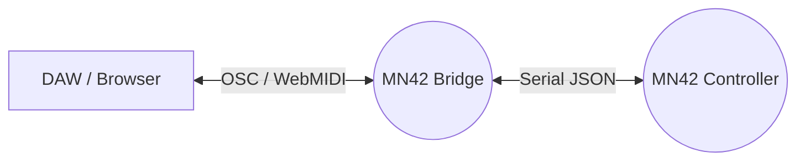

# MN42 Bridge

Welcome to the scrappy little Node.js sidecar that lets your **MOARkNOBS-42** talk trash on modern networks.

## System context

~~Think of this as the surly middle manager between the MN42 controller and whatever OSC-aware DAW you're torturing.~~ It listens on `/dev/ttyACM0` at 31,250 baud, shovels controller dumps out to `/mn42/slots` and `/mn42/envelopes`, and waits on `/mn42/cmd` for anything you want shot back over serial. Outbound OSC screams at `--host`:`--osc`; inbound commands land on the `--osc-listen` port (default 9000).

Want to see where this misfit sits in the whole rig? Peep the [systemflow docs](../docs/sketch/systemFlow/hw/) for the bigger wiring saga.



```bash
oscsend localhost 9000 /mn42/cmd '{"cmd":"SET_POT","slot":2,"value":99}'  # OSC -> serial sets pot 2 to 99
```

## What's the gig?

- **Serial** in at 31,250 baud.
- **OSC** blasts out on `/mn42/slots` and `/mn42/envelopes` (aimed at the `--osc` port, default 9000).
- **Virtual MIDI** mirror so WebMIDI punks can jam along.
- Shoot back commands like `SET_POT` over OSC or MIDI and they hitch a ride over serial.

## CLI

```bash
node mn42_bridge.js \
  --serial /dev/ttyACM0 \
  --osc 9000 \
  --osc-listen 9000 \
  --host 127.0.0.1 \
  --bind 127.0.0.1 \
  --midi "MN42 Bridge"
```

<!-- TODO: screenshot: run `node mn42_bridge.js` with above flags, then `oscsend localhost 9000 /mn42/cmd s {"cmd":"SET_POT","slot":2,"value":99}`; capture `/mn42/slots` update and matching MIDI CC echo. -->

Flags:

- `--serial` (`-s`) – which serial port to sniff.
- `--osc` (`-o`) – remote UDP port to scream OSC at.
- `--osc-listen` – local UDP port soaking up `/mn42/cmd` (default 9000).
- `--host` (`-H`) – where to fling outbound OSC. Defaults to `127.0.0.1`.
- `--bind` (`-b`) – IP we listen on for inbound OSC. Defaults to `127.0.0.1` to keep rando packets out.
- `--midi` (`-m`) – label for the virtual MIDI port.

### Split send/receive ports

Feeling fancy? Send OSC out one port and listen on another:

```bash
node mn42_bridge.js --serial /dev/ttyACM0 --osc 7000 --osc-listen 8000
oscsend localhost 8000 /mn42/cmd s '{"cmd":"SET_POT","slot":2,"value":10}'
```

The bridge screams updates at port **7000** while soaking inbound commands on **8000**.

Safety bumpers:

- The bridge ignores OSC/MIDI JSON that doesn't spell out `cmd`, `slot`, and a numeric `value`. No half-baked packets make it to serial.
- Packets over **128 bytes** get tossed in the pit.
- `slot` only rides **0–41** and `value` only **0–127**; outside that, the bridge laughs and drops it.

The test suite (`cmd_validation.test.js`) hammers those limits—run `npm test` to watch bogus commands get choked out.

## Teaching moment

The bridge waits for `{"hello":"mn42"}` from the controller before it starts spewing data. Each JSON line from the serial port is parsed and shotgunned to both OSC and MIDI. Incoming OSC or MIDI messages get repackaged as JSON and fired back at the controller.

## Install

This miscreant only rolls with **Node.js 20**. Anything older is a poser and won't even get past the door. Check your version:

```bash
node --version
# v20.x.x or bust
```

Once you're speaking fluent v20, yank the deps back in with a clean slate—this repo refuses to babysit `node_modules/`, so every build pulls them fresh:

```bash
npm ci
```

Release builds travel light—no `node_modules` directory is ever bundled. If one slinks into version control, you're expected to torch it and let `npm ci` rebuild the pile.

If it whines about missing modules, run `npm install` once to refresh `package-lock.json` and try again.

## Code style

Linting isn't optional—it keeps this sidecar from steering into a ditch. Use
`npm run lint` to sniff out nonsense and `npm run format` when the code needs a
trim. The `pre-commit` hook will bark if you forget.

## Testing vibes

This repo doesn't ship with a hardware mock. To prove the script at least boots and dies gracefully when the wire's pulled:

```bash
npm test
```

The test pokes a fake serial port so you can watch the bridge complain and keep its cool. If you've got the real controller, open an OSC monitor and a WebMIDI client, twiddle a pot, and watch the packets fly.

## Example Session

Need proof this gremlin works? Try this slam-dunk walkthrough.

1. Kick the bridge to life:

   ```bash
   node mn42_bridge.js --serial /dev/ttyACM0 --osc 9000 --osc-listen 9000 --host 127.0.0.1 --bind 127.0.0.1 --midi "MN42 Bridge"
   ```

2. In another terminal, eavesdrop on the OSC noise:

   ```bash
   oscdump 9000
   ```

3. Sniff the MIDI echo too:

   ```bash
   aseqdump -p "MN42 Bridge"
   ```

4. Now hurl a `SET_POT` command at slot 2:

   ```bash
   oscsend localhost 9000 /mn42/cmd s '{"cmd":"SET_POT","slot":2,"value":95}'
   ```

   The hardware's slot 2 should snap to 95. `oscdump` spits back a `/mn42/slots` update and `aseqdump` coughs up a matching Control Change. That's the round trip—OSC in, MIDI out, and the rig obeys.

### Command/response cycle

Want to see every hop in gory detail? Here's the full loop.

1. Lob a `SET_POT` grenade over OSC:

   ```bash
   oscsend localhost 9000 /mn42/cmd s '{"cmd":"SET_POT","slot":2,"value":99}'
   ```

   ```json
   { "cmd": "SET_POT", "slot": 2, "value": 99 }
   ```

2. The bridge belches back `/mn42/slots` so you know it stuck:

   ```bash
   oscdump 9000
   # /mn42/slots 0 99 0 ...
   ```

   ```json
   {"slots":[0,99,0,...]}
   ```

3. Same trick, voiced in MIDI:

   ```bash
   amidi -p "MN42 Bridge" -S 'B0 02 63'  # CC on ch1, slot 2 => 99
   ```

   ```json
   { "cmd": "SET_POT", "slot": 2, "value": 99 }
   ```

## License

This scrappy sidecar rides under the [MIT License](../LICENSE). Peep the root file for the full legal riff.
