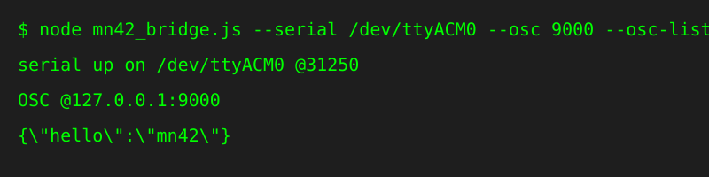

# MN42 Bridge

> **Doc class:** Contract doc. This is the Bridge-facing behavior and support boundary for desktop host/session work; use the linked receipts before treating a host setup as broadly verified.

The MN42 Bridge is the desktop-side companion to `App/`. It still preserves the original CLI and the raw WebSocket/serial debug lane, but it now also keeps a cached device session with manifest, schema, live config, staged config, dirty state, apply results, and power-safety identity.

For document tie-break rules, see [Documentation Truth Map](../docs/reference/DocumentationTruthMap.md).
For a map of performer, console, contract, packaging, and evidence Bridge docs, see [Bridge Docs Map](../docs/bridge/BridgeDocsMap.md).

Use the browser configurator first if you only need direct USB setup and profile editing. Use the bridge when you need OSC routing, host MIDI routing, a desktop session cache, or an App-over-bridge lane that does not depend on browser WebSerial support. Start with [docs/ConnectivityGuide.md](../docs/getting-started/ConnectivityGuide.md) if you are deciding between them.

Current support boundary:

- the Bridge fallback manifest and simulator advertise schema 8 to match current firmware and App profile modulation persistence
- the Bridge simulator advertises `arp_profile_assignments` and preserves profile arp `assigned_slots`; recalling a profile arms those slots without implying live arp startup
- strongest repo evidence for this tool: Node.js 24 desktop host plus the browser console or CLI
- documented but still setup-specific: OSC-host and DAW routing behavior after the bridge is running
- package scripts intentionally pin Node to `>=24 <25`; widening that floor needs explicit test evidence first
- CI currently generates unsigned bridge artifacts only; those bundles now carry both a CLI binary and a console/server binary, but this repo still does not claim a signed/public installer path
- not claimed here: broad DAW-by-DAW certification or a production installer/export story

See [Host Compatibility](../docs/reference/HostCompatibility.md) for the conservative matrix. Host setup recipes live in [Known Good Host Recipes](../docs/reference/KnownGoodHostRecipes.md), and host-specific recipe receipts live in [docs/bench/bridge-host-recipes/README.md](../docs/bench/bridge-host-recipes/README.md). Recipes are setup guides; only receipt-backed combinations should be treated as repo evidence for a specific host/app/version path. The bridge session/runtime transport is documented in [Bridge Transport Contract](../docs/bridge/BridgeTransportContract.md). Bench receipts for bridge HIL lanes live in [docs/bench/bridge/README.md](../docs/bench/bridge/README.md).
Bridge write-lane boundaries are documented in [Bridge Write Lanes](../docs/bridge/BridgeWriteLanes.md).
App transport-mode truth and UI labeling rules live in [App Transport Truth Table](../docs/app/AppTransportTruthTable.md).
Non-developer operator walkthrough and screenshots live in [Bridge Console Tour](../docs/bridge/BridgeConsoleTour.md).

## Operating paths

- `CLI path`
  `node bridge/mn42_bridge.js ...` stays the lowest-level operator lane and remains line-oriented.
- `Browser-console path`
  `npm --prefix bridge start` serves the local console at `http://127.0.0.1:8787/`.
- `App-over-bridge path`
  `/app/` now prefers the structured bridge session/runtime and falls back to the raw bridge WebSocket lane for compatibility. The App-side transport labels for that split are documented in [App Transport Truth Table](../docs/app/AppTransportTruthTable.md).
- `Raw debug transport`
  `/ws` keeps the newline-oriented serial bridge for back-compat and debugging.
- `Structured bridge transport`
  `/api/device/*` plus `/ws/events` expose cached session state and named bridge/device events for App-facing or tooling-facing consumers.

It does four things:

- reads JSON telemetry from the controller over USB serial,
- publishes that data as OSC and MIDI,
- accepts OSC or MIDI control messages and forwards them back to the controller,
- maintains a desktop-side device session so staged apply and operator tooling do not have to infer state from raw lines alone.

The bridge remains bidirectional:

- MIDI in can rebroadcast as typed OSC events and still feed the firmware live-control lane.
- OSC typed events can emit host MIDI messages.
- A settings file can add custom inbound MIDI CC -> OSC address mappings for host-specific patches.
- The cached device session validates both incoming device exports and revisioned staged config against the bundled App schema, awaits serial write acceptance and drain for each bulk frame, and promotes it only after verified device truth.
- Firmware telemetry is mirrored beyond raw slot/envelope values: current slot, LFOs, EF status, ARG chunks,
  diagnostics, clock state, note dynamics, jitter, and active profile are available over OSC and structured events.
- Manifest-backed hardware health is cached in the session so the console can show OLED status, brownouts, EEPROM copy
  state, memory headroom, and power-safety identity without making the operator parse raw JSON.

Important boundary: the OSC/MIDI `SET_SLOT_VALUE` path and typed event writes are live performance control, not staged config mutation. Bridge-side staged changes use revisioned `/api/device/stage` plus `/api/device/apply`; ambiguous transmitted outcomes remain exclusive until authoritative readback resolves them. See [Configuration Transaction Model](../docs/reference/ConfigurationTransactionModel.md).


Bridge console walkthrough and screenshots: [Bridge Console Tour](../docs/bridge/BridgeConsoleTour.md).

## Quick start (browser console)

### 1) Install prerequisites

- Node.js 24.x (`node --version` must report `v24.*`)
- MN42 connected over USB

From repo root:

```bash
npm --prefix bridge ci
```

Or from `bridge/`:

```bash
npm ci
```

### 2) Start the local bridge console

From repo root:

```bash
npm --prefix bridge start
```

Or from `bridge/`:

```bash
npm start
```

By default the console is served at <http://127.0.0.1:8787/>.

Security note: the HTTP console is loopback-only by default. Each launch creates a random control token and opens the console with it in the URL; privileged `POST` API requests require it as a Bearer token and both `/ws` and `/ws/events` require it as a query parameter. Treat that URL as a local credential. Binding the bridge HTTP server to a public interface requires the explicit `--unsafe-network-http` flag and intentional network protection.

If you want stable settings across launches, copy [`settings.example.json`](settings.example.json) to your own file and start the bridge with `--config`:

```bash
npm --prefix bridge start -- --config ./bridge/settings.example.json
```

### 3) Open the bridge console in your browser

Use the browser page to:

- choose or type the serial port,
- pick a known-good host recipe,
- set OSC send/listen ports,
- set the MIDI port label,
- start or stop the bridge,
- inspect cached session health in Stage mode,
- keep raw serial, route traces, and state JSON in Advanced mode,
- launch the full configurator over the bridge transport.

The configurator opened from this page uses the bridge session (`/api/device/*` and `/ws/events`) instead of WebSerial, retaining raw `/ws` for compatibility and live RPCs while OSC and MIDI routing stay active.
See [Bridge Console Tour](../docs/bridge/BridgeConsoleTour.md) for Setup, Stage, and Advanced console screenshots captured from a real ready-session host, with operator-oriented explanations.

### 4) Confirm it is live

After startup, the bridge sends `HELLO`, `GET_MANIFEST`, and `GET_SCHEMA`, then chooses `GET_CONFIG_CHUNKED` when the manifest advertises `capabilities.chunked_reads.config` (otherwise `GET_CONFIG`). Chunked responses are checksum-verified and reassembled before the config cache is updated.

```json
{ "hello": "mn42" }
```

When `HELLO`, manifest, and schema are cached and the normalized config export passes the bundled App schema, the browser console reports the device session as ready. A failed export remains outside `liveConfig`, degrades the handshake, emits a `device_config_schema_invalid` alert, and is shown as an invalid config export in Stage mode.
The Stage snapshot keeps firmware identity, power-safety fields such as `power_profile`, `led_brightness_cap`, and `rail_topology_verified`, plus plain-language config-validation, device-authority, draft, telemetry-freshness, and last-apply state. Only currently active alerts appear in its Active alerts list; cleared alert history remains available in snapshots and diagnostic state.

## Quick start (CLI)

### 1) Find your serial port

- macOS: `ls /dev/cu.usbmodem*`
- Linux: `ls /dev/ttyACM* /dev/ttyUSB*`
- Windows PowerShell: `Get-CimInstance Win32_SerialPort | Select-Object DeviceID,Name`

### 2) Start the bridge

From repo root:

```bash
node bridge/mn42_bridge.js --serial /dev/ttyACM0 --osc 9000 --osc-listen 9000 --host 127.0.0.1 --bind 127.0.0.1 --midi "MN42 Bridge"
```

Or from `bridge/`:

```bash
node mn42_bridge.js --serial /dev/ttyACM0 --osc 9000 --osc-listen 9000 --host 127.0.0.1 --bind 127.0.0.1 --midi "MN42 Bridge"
```

Replace `/dev/ttyACM0` with your device path.

If you want the CLI/server to boot with a saved profile of host settings:

```bash
node mn42_bridge.js --config ./settings.example.json
node mn42_bridge_server.js --config ./settings.example.json
```

CLI flags still win over the file when both are provided.

## Settings file

The bridge now accepts `--config path/to/settings.json` in both entrypoints. The file is plain JSON and can include:

- transport settings: `serialName`, `oscHost`, `oscPort`, `oscListen`, `oscBind`, `midiLabel`
- runtime guardrails: `allowFeedbackLoops`, `feedbackWindowMs`, `rtP95TargetMs`, `rtJitterP95TargetMs`, `alertSuppressionMs`
- custom inbound MIDI CC -> OSC mappings: `midiToOscMappings`

Example:

```json
{
  "serialName": "/dev/ttyACM0",
  "oscHost": "127.0.0.1",
  "oscPort": 9000,
  "midiLabel": "MN42 Bridge",
  "midiToOscMappings": [
    {
      "id": "layer1-opacity",
      "kind": "cc",
      "channel": 1,
      "controller": 20,
      "address": "/layer1/opacity",
      "valueMode": "normalized"
    }
  ]
}
```

Current custom mapping support is intentionally narrow:

- `kind` is currently `cc`
- `controller` selects the inbound CC number
- `channel` is optional; omit it to match any channel
- `address` is the outbound OSC address to emit
- `valueMode` is `raw` (`0..127`) or `normalized` (`0.0..1.0`)

## Everyday workflows

### OSC workflow (TouchOSC, Max, Pd, custom apps)

1. Start the bridge.
2. In your OSC app, listen on your outbound port (`--osc`, default `9000`).
3. Send control commands to `/mn42/cmd` (legacy slot lane) or `/mn42/event/*` (typed lane) on the inbound port (`--osc-listen`, default `9000`).

Example command (liblo/oscsend):

```bash
oscsend localhost 9000 /mn42/cmd s '{"cmd":"SET_SLOT_VALUE","slot":2,"value":95}'
```

That sets slot 2 to value 95.

Typed note example:

```bash
oscsend localhost 9000 /mn42/event/note_on s '{"channel":1,"note":60,"velocity":110}'
```

### DAW workflow (host MIDI)

1. Create or enable a host MIDI loopback port.
   - macOS: open **Audio MIDI Setup > Window > Show MIDI Studio > IAC Driver**, enable **Device is online**, then add or name a bus such as `MN42 Bridge`.
   - Windows/Linux: use an installed virtual MIDI loopback driver/port and note its exact port name.
2. Start the bridge with `--midi "MN42 Bridge"` or set the browser console MIDI port label to the exact loopback port name.
3. In your DAW, enable that MIDI device.
4. Record/monitor incoming CC data or send CC data back to the bridge.

This is the documented bridge contract, not a claim that every DAW has already been bench-validated in this repo.

MIDI mapping used by the bridge:

- Channel 1 CC: slot updates (`CC 0..41`)
- Channel 2 CC: envelope follower updates (`CC 0..5`)

Inbound MIDI now also feeds typed OSC namespaces (`/mn42/event/cc`, `/mn42/event/note_on`, `/mn42/event/note_off`, `/mn42/event/pitch_bend`, `/mn42/event/channel_aftertouch`, `/mn42/event/poly_aftertouch`, `/mn42/event/program_change`, `/mn42/event/nrpn`, `/mn42/event/rpn`, `/mn42/event/sysex`).

If `midiToOscMappings` is configured, matching inbound CC events also emit user-defined OSC addresses alongside the typed `/mn42/event/cc` traffic.

Inbound MIDI CC on any channel is still converted to:

```json
{"cmd":"SET_SLOT_VALUE","slot":<cc_number>,"value":<cc_value>}
```

To prevent MIDI feedback loops by default, the bridge suppresses inbound CC events that match its own freshly emitted telemetry (`status`, `cc`, `value`) within a short guard window (`120 ms` by default). You can disable this with `--allow-feedback-loops` or retune the window with `--feedback-window-ms`.

## OSC addresses and payloads

### Outbound (bridge -> OSC)

- `/mn42/slots`
  - OSC args: 42 integers, each `0..127`
  - index 0 maps to slot 0, index 41 maps to slot 41
- `/mn42/telemetry/slots`
  - Same payload as `/mn42/slots` with a telemetry namespace for patchers that separate control from monitoring.
- `/mn42/envelopes`
  - OSC args: 6 integers, each `0..127`
- `/mn42/telemetry/envelopes`
  - Same payload as `/mn42/envelopes` with a telemetry namespace.
- `/mn42/event/<kind>`
  - Typed MIDI-style events as JSON string in arg 0.
  - `<kind>` currently includes `cc`, `note_on`, `note_off`, `pitch_bend`, `channel_aftertouch`, `poly_aftertouch`, `program_change`, `nrpn`, `rpn`, `sysex`.

### Inbound (OSC -> bridge)

- `/mn42/cmd`
  - first argument must be JSON text or object with:
    - `cmd` (string)
    - `slot` (integer `0..41`)
    - `value` (integer `0..127`)
- optional metadata fields (for bridge-local tracing only):
  - `traceId` (string)
  - `timestamp` / `timestampMs` / `ts` (number or parseable timestamp string)
- `/mn42/event/<kind>`
  - first argument must be JSON text or object matching the kind:
    - `cc`: `channel` (1..16, optional), `controller`/`cc` (0..127), `value` (0..127)
    - `note_on` / `note_off`: `channel` (optional), `note` (0..127), `velocity` (0..127)
    - `pitch_bend`: `channel` (optional), `value` (`0..16383` or signed `-8192..8191`)
    - `channel_aftertouch`: `channel` (optional), `pressure` (0..127)
    - `poly_aftertouch`: `channel` (optional), `note` (0..127), `pressure` (0..127)
    - `program_change`: `channel` (optional), `program` (0..127)
    - `nrpn` / `rpn`: `channel` (optional), `parameter` (0..16383), `value` (0..16383)
    - `sysex`: `bytes` array (`F0 ... F7`)
  - optional metadata fields:
    - `traceId`
    - `timestamp` / `timestampMs` / `ts`

Valid example:

```json
{ "cmd": "SET_SLOT_VALUE", "slot": 2, "value": 99 }
```

Rejected example:

```json
{ "cmd": "SET_POT", "slot": 2, "value": 99 }
```

## Validation and limits

The bridge drops messages that do not match the contract.

- Max command size: 128 bytes
- `cmd` must be `SET_SLOT_VALUE`
- `slot` must be `0..41`
- `value` must be `0..127`
- Missing keys (`cmd`, `slot`, `value`) are rejected
- Typed event payloads are limited to 4096-byte JSON arg payloads.
- Typed `cc` events with `controller` in `0..41` also map to the firmware live slot lane (`SET_SLOT_VALUE`).
- Browser/API state also reports drop counters:
  - `serialParseErrors`
  - `serialOversizeDrops`
  - `badOscCmdDrops`
  - `badMidiCmdDrops`
  - `feedbackSuppressed`
- Browser/API state also includes operator alerts:
  - `alerts.active` (currently active warnings/errors)
  - `alerts.recent` (bounded alert history)
- Browser/API state now includes translation trace/timing diagnostics:
  - `timing.lastSerialSourceTimestampMs`
  - `timing.lastSerialHostTimestampMs`
  - `timing.lastSerialSkewMs`
  - `lastRouteAt`
  - `lastRouteTraceId`
  - `routes` (bounded recent translation events, max 200)
- Browser/API state now includes live round-trip metrics:
  - `performance.roundTrip.sampleCount`, `pending`
  - `performance.roundTrip.lastMs`, `p50Ms`, `p95Ms`, `meanMs`
  - `performance.roundTrip.jitterP95Ms`, `jitterMeanMs`
  - `performance.health.status` (`no_data`, `ok`, `warn`) plus threshold/reason details
  - `performance.counters.completed`, `expired`
  - matching counters: `matchedByTrace`, `matchedBySlotValue`

## CLI reference

| Flag                        | Alias | Default        | Purpose                                         |
| --------------------------- | ----- | -------------- | ----------------------------------------------- |
| `--config`                  | `-c`  | none           | Load bridge settings from a JSON file           |
| `--serial`                  | `-s`  | `/dev/ttyACM0` | Serial device path                              |
| `--osc`                     | `-o`  | `9000`         | UDP port for outbound OSC                       |
| `--osc-listen`              | -     | `9000`         | UDP port for inbound OSC commands               |
| `--host`                    | `-H`  | `127.0.0.1`    | Destination host for outbound OSC               |
| `--bind`                    | `-b`  | `127.0.0.1`    | Local interface for inbound OSC listener        |
| `--midi`                    | `-m`  | `MN42 Bridge`  | Host MIDI port label                            |
| `--allow-feedback-loops`    | -     | `false`        | Disable MIDI telemetry-echo suppression         |
| `--feedback-window-ms`      | -     | `120`          | Echo-suppression match window in milliseconds   |
| `--rt-p95-target-ms`        | -     | `10`           | Warn threshold for round-trip p95 latency       |
| `--rt-jitter-p95-target-ms` | -     | `5`            | Warn threshold for round-trip jitter p95        |
| `--alert-suppression-ms`    | -     | `3000`         | Alert dedupe/suppression window in milliseconds |

## Browser console reference

The browser console uses the same bridge core and adds:

- local control page: `http://127.0.0.1:8787/`
- bundled configurator: `http://127.0.0.1:8787/app/`
- bridge transport websocket: `ws://127.0.0.1:8787/ws`

The console form also surfaces loop-guard controls (`allowFeedbackLoops`, `feedbackWindowMs`), alert cooldown tuning (`alertSuppressionMs`), and runtime counter diagnostics.
It now also surfaces recent route/timing fields (`Last route`, `Last trace`, `Source timestamp`, and `Clock skew`) so drift and trace continuity are visible during runs.
It now surfaces live round-trip diagnostics (`RT samples`, `RT pending`, `RT last`, `RT p50`, `RT p95`, `RT jitter p95`, `RT health`) derived from command→telemetry acknowledgments.
It also surfaces active alert count and top alert message, plus a one-click clear action for operator triage.

Operator API add-on:

- `POST /api/performance/reset` clears rolling round-trip samples/counters without disconnecting transports.
- `POST /api/alerts/clear` clears currently active alerts without touching metrics history.
- `GET /api/state/snapshot` downloads a timestamped JSON snapshot of runtime metadata + current bridge state.

The console accepts the same serial/OSC/MIDI settings as the CLI, plus:

| Flag          | Default     | Purpose                                          |
| ------------- | ----------- | ------------------------------------------------ |
| `--http-host` | `127.0.0.1` | Host interface for the browser console           |
| `--http-port` | `8787`      | Port for the browser console and `/ws` transport |
| `--unsafe-network-http` | off | Permit a non-loopback HTTP host; requires network protection |

### Split send/receive ports

```bash
node bridge/mn42_bridge.js --serial /dev/ttyACM0 --osc 7000 --osc-listen 8000
```

- listen for telemetry on port `7000`
- send `/mn42/cmd` commands to port `8000`

## Troubleshooting

### Bridge starts but no updates

- Confirm serial path is correct.
- Confirm controller responds to `HELLO`.
- Ensure firmware serial baud matches `115200`.

### OSC commands are ignored

- Confirm command is sent to `/mn42/cmd`.
- Ensure JSON has `cmd`, `slot`, `value` with `cmd` set to `SET_SLOT_VALUE`.
- Confirm `slot` and `value` are in range.

### DAW cannot find `MN42 Bridge`

- Confirm the host MIDI loopback port exists before starting the bridge.
- In the browser console, check **Detected MIDI ports** and copy the exact matching port label.
- Restart the DAW after enabling or renaming the loopback port.
- Check the bridge log for the available input/output names if MIDI still fails.

### Port in use errors

- Change ports with `--osc` / `--osc-listen`.
- Keep `--bind 127.0.0.1` if you only need local access.

## Packaging status (for non-command-line users)

Current state: unsigned bridge binaries are built automatically in
`.github/workflows/release.yml` for:

- `node24-macos-x64`
- `node24-macos-arm64`
- `node24-linux-x64`
- `node24-win-x64`

Each per-target bundle now includes:

- one packaged bridge CLI binary
- one packaged bridge console/server binary
- a SHA-256 checksum file
- a per-target `README.txt`
- bundled third-party license notices
- `bridge_artifact_manifest.json` with target, commit SHA, checksum paths, node target, packaged program roles, timestamp, `releaseBoundary.stage: "hardware-test"`, `signingStatus: "unsigned-ci-artifact"`, and a nested `signing` metadata object

The release workflow now also boots the packaged console binary and checks:

- `/` serves the bridge browser console,
- `/app/` serves the packaged App shell,
- `/api/presets` returns the bundled host recipes,
- `/api/device/session?warm=1` can load the bundled App-derived schema authority,
- `/api/device/stage` rejects bad requests with a machine-readable error body.

Without a real device handshake, the packaged smoke test only proves warmed schema authority and fail-closed staged-write behavior. Accepting a valid staged config still requires a cached device manifest and live config from hardware.

When a GitHub release already exists for the tag, the workflow uploads those unsigned bundles as hardware-test/prerelease release assets with matching GitHub asset labels. That is an evidence/distribution convenience, not a claim that the bridge is now a signed public installer.

The top-level `signingStatus` field is retained for existing readers. New tooling should prefer the manifest's `signing` object, which records status, identity when provided, notarization status, and a support-boundary note.

The macOS package path now emits a double-clickable `.app`, DMG, and signing-verification receipt. Packaged console binaries open the browser by default; pass `--no-open-browser` for headless smoke checks. Beta/public builds still require real Developer ID credentials and notarization before release.

As time passes, this is the practical path:

1. Prove the macOS signing/notarization path with release credentials.
2. Add the equivalent signed Windows installer.
3. Keep advanced flags available for power users.

Until then, this README is the canonical runbook for daily use.

For rollout planning, see [`docs/BridgePackaging.md`](../docs/release/BridgePackaging.md).
For signing readiness, see [`docs/release/BridgeSigningPlan.md`](../docs/release/BridgeSigningPlan.md).
For a show-day quick reference, see [`docs/BridgeForPerformers.md`](../docs/guides/BridgeForPerformers.md).

## Development

From `bridge/`:

```bash
npm run ci
npm run release:prep
npm run lint
npm run format
# optional packaging step
npm run package:bridge
# after building macOS raw binaries
npm run package:macos
# macOS-only package structure check
npm run test:package:macos
```

`npm run ci` runs the split bridge coverage lanes plus both entrypoint smoke checks. `release:prep` uses the same path before packaging.

## License

MIT, same as the repository root: [../LICENSE](../LICENSE).
