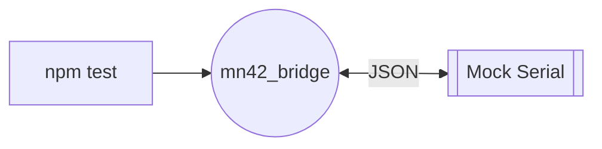

# MN42 Bridge Test Rig

~~Before you smash that keyboard, make sure you've knocked out the setup in the [bridge README](../README.md).~~ Node 24, deps installed, the whole prep talk.



## Running the suite

This scrappy test pile lives under `npm test`.

```bash
npm test
```

Run it from inside `bridge/` and watch each script light up. It's the fastest way to prove the bridge still boots, screams OSC, and whines when the serial line ghosts it.

For tighter feedback loops, the package scripts are split by responsibility:

- `npm run test:cli` checks help output and missing-port handling.
- `npm run test:transport` checks serial-to-OSC, OSC/MIDI-to-serial, validation, and reconnect behavior.
- `npm run test:browser` checks the browser-driven bridge server, `/app/` serving, raw `/ws` transport, structured session API, and `/ws/events`.
- `npm run smoke` runs entrypoint smoke checks for both `mn42_bridge.js` and `mn42_bridge_server.js`.

### Command validation cage match

Need to make sure the bridge slams the door on garbage? `cmd_validation.test.js` hurls oversized JSON and off-the-rails slot/value pairs to confirm anything sketchy gets dropped before it can fry your rig.

## What's with the mocks?

The tests hijack modules so you don't need the real controller dangling off USB:

- `mock_serial.js` spins up `SerialPortMock` with a canned handshake and a few slot values. Use it when you want serial JSON to spill over into OSC without touching hardware.
- `mock_serial_close.js` fakes a flaky cable by dropping the port once and shouting whenever the bridge claws its way back. Perfect for verifying reconnect logic.
- `mock_jzz.js` muzzles the `jzz` MIDI driver so ALSA stays quiet and tests don't go spelunking for hardware.

## Rolling your own serial saga

Got a fresh nightmare to simulate? Wire up a new mock:

1. Write a module that replaces `serialport` with your custom class or `SerialPortMock` setup. Peek at the existing mocks for reference.
2. In your test, preload the mock with `node -r ./test/my_mock.js mn42_bridge.js ...` or `require()` it before booting the bridge.
3. Script the drama—spew fake JSON, drop connections, or count writes—and assert the bridge keeps its cool.

Keep it loud, keep it lean, and remember: real hardware is the enemy of deterministic CI.
