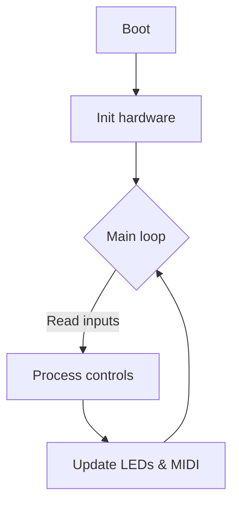
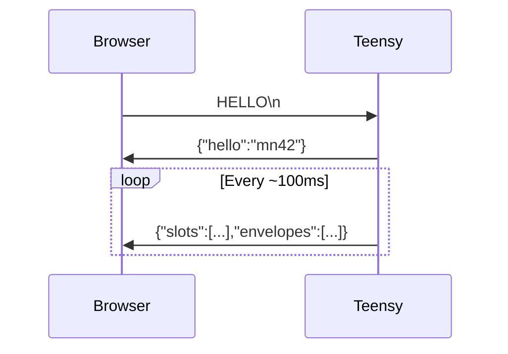

# Builder's Handbook

Welcome to the MOARkNOBS-42 build bible—the fast-and-loose guide for wiring, flashing, and taming this misfit controller. If you're holding a soldering iron and a dream, you're in the right place.

## Wire It Up

Start with the bare essentials. We'll keep the spaghetti minimal:

1. **Power** – Feed the Teensy 5 V through `VUSB` and ground everything like your sanity depends on it.
2. **LED Data** – Run Teensy pin `6` through a ~330 Ω resistor into the first WS2812's `DIN`. Chain the rest like dominoes.
3. **Buttons/Encoders** – Follow the pin labels on the board. Short wires = less noise.

### Why this matters

Mess up the power or data line and the board either sulks or smokes. A clean wiring job saves you hours of "why is nothing blinking?".

## Flash the Brain

1. **Install PlatformIO** – `pip install -r requirements.txt` or use the VS Code add-on. Old‑school? Arduino IDE with Teensyduino works too.
2. **Plug in the Teensy 4.0** over USB.
3. **Build and upload** the main firmware from the `firmware/` directory:
   ```bash
   pio run -t upload -e teensy40_main
   ```
   The loader will yell success when it's done.
4. **Local library stash** – We archive FastLED and the Adafruit display libs under `firmware/lib/`.
   PlatformIO grabs these first, so builds don't choke when you're offline or the registry glitches.
   To refresh them, pull the latest release from upstream, drop it in that folder, and keep the license file.

### Firmware Flow



### Why this matters

Knowing the firmware loop helps you predict how fast the box reacts and where to poke when hacking features.

## First-Run Tests

Once the firmware's on board, make sure the basics don't flake out:

1. **Blink test** – Drop this mini sketch in `firmware/test/` and upload it the same way:
   ```cpp
   #include <FastLED.h>
   #define LED_PIN 6
   #define NUM_LEDS 1
   CRGB leds[NUM_LEDS];
   void setup(){ FastLED.addLeds<WS2812, LED_PIN, GRB>(leds, NUM_LEDS); }
   void loop(){
     leds[0]=CRGB::Green; FastLED.show(); delay(500);
     leds[0]=CRGB::Black; FastLED.show(); delay(500);
   }
   ```
   If that lone pixel blinks, you're in business.
2. **Button sanity** – Build the hardware test suite:
   ```bash
   pio run -e teensy40_full_system
   ```
   Follow the serial prompts to poke every switch and LED.

### Why this matters

Catching a dead LED or flaky button now beats reflowing it after the enclosure's buttoned up.

## Button Controls

Need a crash course in front‑panel mayhem? Here's how the six control buttons misbehave. *EF = Envelope Follower.*

| Button | Short Press | Long Press | Double Press |
| ------ | ----------- | ---------- | ------------ |
| #0 | Toggle EF | Calibrate EF baseline | Cycle EF filter forward |
| #1 | Next Slot | Reload profile from EEPROM | Cycle EF filter backward |
| #2 | Cycle EF assignment | Toggle Slot Active | Cycle MIDI Type (CC/Note/etc) |
| #3 | Cycle MIDI Channel | Reset EEPROM | — |
| #4 | Cycle registry number (CC/NRPN/RPN) | Save config | — |
| #5 | Tap BPM | — | — |

**Slot Buttons (0–41):**
Short press selects the slot. Long press assigns or cycles the Envelope Follower and flips it on; once it’s awake, jab Control 0‑5 to lock to a specific EF.

### Why this matters

Learning the combos early means you perform tricks live instead of digging through docs mid‑set.

## WebSerial in the Wild

The Teensy screams JSON snapshots over WebSerial so the browser can watch the synth wiggle in real time.



### Why this matters

WebSerial lets you tweak patches from a browser without custom software. It's quick feedback with zero driver drama.

## What Could Go Wrong?

- **No common ground** – LEDs ghost or don’t light. Tie every ground together like you mean it.
- **Wrong pin** – LED data on any pin but 6? Enjoy the dark.
- **Power sag** – feeding 52 WS2812s from a wimpy supply causes brownouts and swearing.
- **Missing libraries** – PlatformIO fails fast if dependencies vanish. Check `platformio.ini` before blaming the hardware.
- **Bootloader naps** – if the Teensy doesn’t auto‑program, hit its button to jolt the bootloader awake.

### Why this matters

These classics ruin weekends. Keep them in mind and you'll spend more time making noise than troubleshooting.

## Profiles: stash three setups

The rig hoards three full configuration profiles in EEPROM. Each profile is a 256‑byte bunker storing your pot maps, LED vibe, and envelope tricks.

- **Jump profiles** – mash **Ctrl1 + Ctrl2** to hop to the next profile. It wraps after the third.
- **Save the chaos** – long‑press **Ctrl4** once you've mangled the knobs to taste.
- **Panic reload** – long‑press **Ctrl1** (with the confirm jab) to yank the active profile from EEPROM.

### Why this matters

Profiles let you keep live, studio, and "what if I break everything" setups without re‑flashing.

## Manual Hardware Tests

Compile the test environments when you want to verify the board outside of the main firmware:

```bash
pio run -e teensy40_full_system      # or teensy40_unified_test, etc.
# Unity harness flexes a different muscle:
pio test -e teensy40_unity
```

Available environments:

- `teensy40_full_system` – step-through checks of each subsystem
- `teensy40_unity` – Unity-driven automated tests (run with `pio test -e teensy40_unity`)
- `teensy40_unified_test` – full integration test
- `teensy40_biquad_test` – biquad filter calibration
- `teensy40_eeprom_persistence` – EEPROM backup/restore test
- `teensy40_slot_verify` – verifies MIDI slot storage

### Why this matters

Running the test rigs lets you trust the hardware before you haul it on stage.

