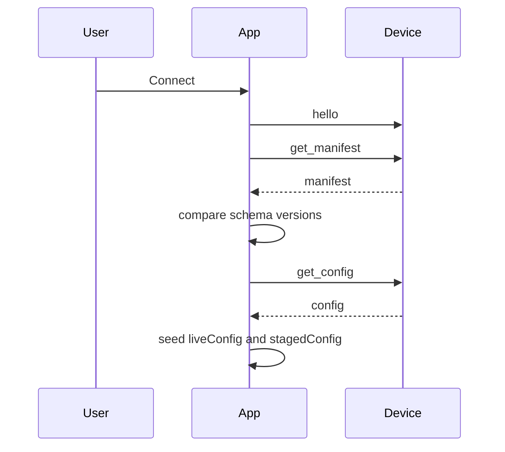
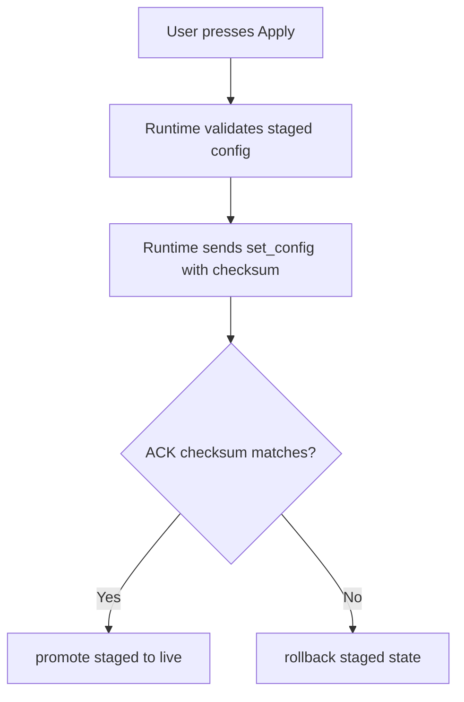

# Configurator Tour

The browser app is not just a remote control. It is the safest place to understand the firmware contract because it has to negotiate identity, schema compatibility, staged edits, and confirmation from the device before pretending anything changed.

## The core idea

The configurator keeps two versions of the world:

- **live config** – what the device most recently confirmed
- **staged config** – what the user is currently editing

That split is the reason the UI can show meaningful diffs, preserve local work, and roll back cleanly when the device rejects or fails to acknowledge a write.

## Connect flow

If the manifest schema does not match the app's local contract, the app raises a migration-required path before it allows live writes.

## What happens when you edit

Most controls do **not** immediately rewrite device state.

1. you change a field
2. the form system validates and clamps it against `config_schema.json`
3. the app mutates `stagedConfig`
4. the diff panel compares `stagedConfig` to `liveConfig`
5. Apply becomes available only when the staged payload is valid

Some controls can also issue field-level writes through `set_param`, but even then the runtime stages locally first so the UI never loses track of intent.

## What happens when you apply

This is the important safety behavior:

- a successful ACK means the browser can trust the device accepted the payload
- a missing or mismatched ACK means the runtime rolls back instead of leaving the UI in a fantasy state

## What the configurator helps users learn

The app is useful because it turns protocol details into visible actions:

- **manifest identity** becomes a connection banner
- **schema versioning** becomes migration warnings
- **config validity** becomes disabled Apply until the payload is legal
- **device patches** become visible live updates instead of invisible background state changes
- **transport uncertainty** becomes checksum-backed rollback instead of guesswork

## Where to go next

- Read [WebSerial Protocol](WebSerial.md) for the lower-level message model.
- Read [Testing](TESTING.md) for what the simulator and Playwright suite actually prove.
- Read [Bridge For Performers](BridgeForPerformers.md) if your interest is more live workflow than development.
