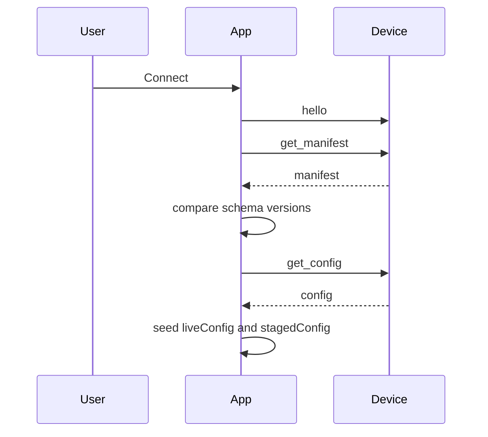
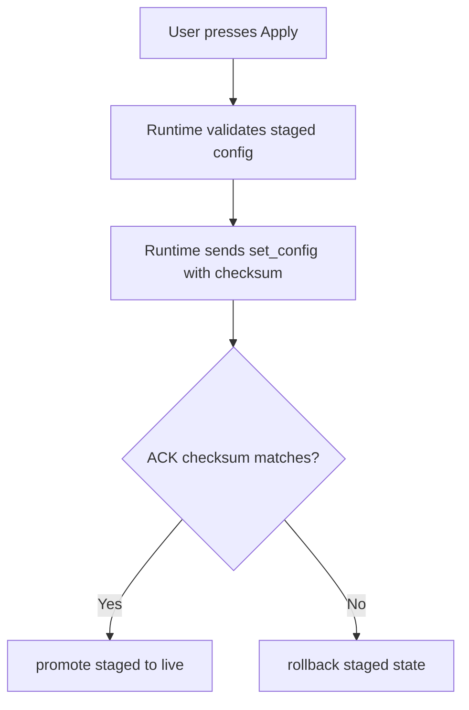

# Configurator Tour

The browser app is not just a remote control. It is the safest place to understand the firmware contract because it has to negotiate identity, schema compatibility, staged edits, and confirmation from the device before pretending anything changed.

TODO: add an annotated version of this screenshot with callouts for:

- `Connection banner` — confirms which board and firmware the configurator is actually talking to
- `Apply / Rollback` — commits staged edits to the device or discards them before they become live
- `Live Slots` — the slot-selection surface; this picks the target slot for inspection and editing
- `Selected Slot` — edits only the currently selected slot
- `Recovery & Profiles` — device profile load/save/reset plus file backup/restore
- `Utility rail` — status, diff, MIDI monitor, and scope tools used to verify truth and troubleshoot
- `Staged Diff` — browser-side edits not yet confirmed by the device
- `IM` / `PK` badge — browser-local local-response mode, not firmware-backed profile memory

## The core idea

The configurator keeps two versions of the world:

- **live config** – what the device most recently confirmed
- **staged config** – what the user is currently editing

That split is the reason the UI can show meaningful diffs, preserve local work, and roll back cleanly when the device rejects or fails to acknowledge a write.

## Connect flow

If the manifest schema does not match the app's local contract, the app raises a migration-required path before it allows live writes.

## What happens when you edit

Most controls do **not** immediately rewrite device state.

1. you change a field
2. the form system validates and clamps it against `config_schema.json`
3. the app mutates `stagedConfig`
4. the diff panel compares `stagedConfig` to `liveConfig`
5. Apply becomes available only when the staged payload is valid

Some controls can also issue field-level writes through `set_param`, but even then the runtime stages locally first so the UI never loses track of intent.

## Browser-local slot behavior: `IM` and `PK`

The live slot tiles include a tiny mode badge:

- `IM` means **Immediate local response**
- `PK` means **Browser-only pickup guard**

This is operator-side behavior, not firmware-backed config.

That means:

- changing it does not require **Apply**
- changing it does not save anything into device profiles
- it is remembered by the browser, not by the board

`IM` is the direct mode. If local control input becomes active, the configurator responds immediately.

`PK` is the guarded mode. The configurator waits until the physical control passes through the current effective value before treating it as active again, which helps prevent sudden jumps after reconnects, profile switches, or other state changes.

If you want the operator explanation instead of the contract explanation, read [Operator Tutorial](OperatorTutorial.md).

## Presets are starting points, profiles are memory

The preset picker is there to help users learn the instrument on purpose instead of by superstition.

- Picking a preset stages a candidate config in the browser.
- It does **not** persist anything until you apply it.
- It only becomes long-term device memory when you explicitly save that state into profile A, B, C, or D.

That means you can safely audition mappings, compare ideas, and keep one preset as a teaching scaffold while another becomes your actual stored performance profile.

If you want the human explanation for every shipped preset, read [Preset Library](PresetLibrary.md).

## What happens when you apply

This is the important safety behavior:

- a successful ACK means the browser can trust the device accepted the payload
- a missing or mismatched ACK means the runtime rolls back instead of leaving the UI in a fantasy state

## What the configurator helps users learn

The app is useful because it turns protocol details into visible actions:

- **manifest identity** becomes a connection banner
- **schema versioning** becomes migration warnings
- **config validity** becomes disabled Apply until the payload is legal
- **device patches** become visible live updates instead of invisible background state changes
- **transport uncertainty** becomes checksum-backed rollback instead of guesswork

## Where to go next

- Read [Operator Tutorial](OperatorTutorial.md) for the practical “how to operate this machine” walkthrough.
- Read [Profile Workflow](ProfileWorkflow.md) if you want the save/load/reset flow explained step by step.
- Read [Failure-First Guide](FailureFirst.md) if your mental model is forming through recovery cases.
- Read [WebSerial Protocol](WebSerial.md) for the lower-level message model.
- Read [Preset Library](PresetLibrary.md) for what each shipped preset is trying to teach.
- Read [Testing](TESTING.md) for what the simulator and Playwright suite actually prove.
- Read [Bridge For Performers](BridgeForPerformers.md) if your interest is more live workflow than development.
