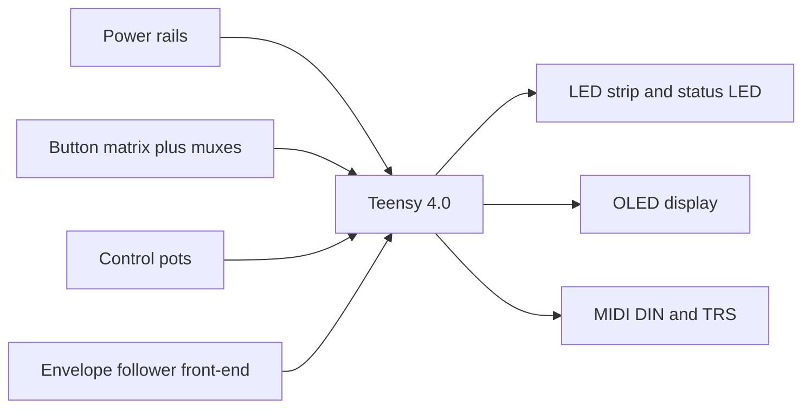
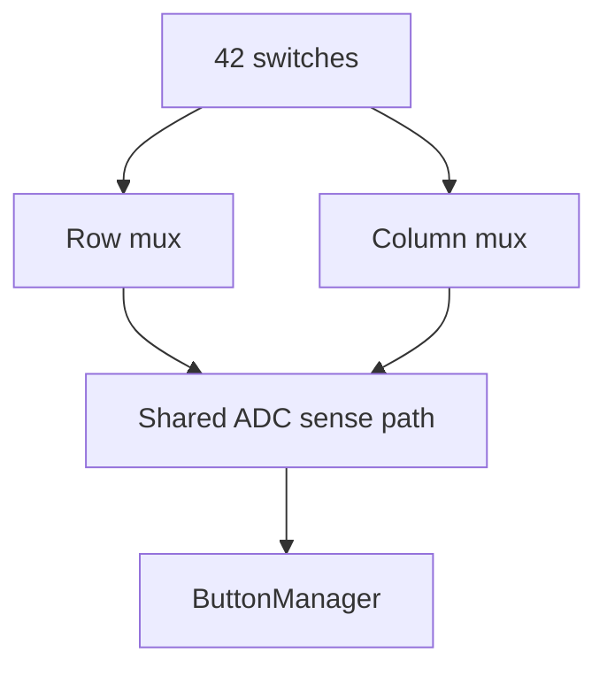

# Hardware Bring-Up Story

The hardware side of MOARkNOBS-42 makes the most sense when you stop thinking of it as a pile of parts and start thinking of it as a staged bring-up problem.

You are trying to prove, in order:

1. the board can power up safely
2. the Teensy can see its inputs
3. the LEDs and display can speak back
4. the audio-reactive front-end can become meaningful modulation

That order matters. A board that is visually exciting but electrically unstable is just a nicer failure.

## What the board is trying to do

The board combines:

- a Teensy 4.0 core
- a multiplexed button/control scanning arrangement
- WS2812 feedback LEDs
- DIN and TRS MIDI I/O
- six envelope follower inputs
- persistent configuration storage

The point is not simply "many controls." The point is to turn a compact physical interface into a controller that can remember, modulate, and report its own state clearly.

## The hardware signal story

Everything that feels "smart" in the finished instrument depends on that physical chain being quiet and legible first.

## Stage 1: prove the rails

Start here because everything else depends on it.

- confirm 5 V is where it should be
- confirm 3V3 is stable under load
- confirm the LED rail is not dragging the logic rail into brownout territory

If this step is wrong, later symptoms will lie to you. A flaky button matrix or weird OLED behavior is often just a power story wearing a different costume.

Use [Troubleshooting](Troubleshooting.md) and the bench figures there when you suspect brownout or rail sag.

## Stage 2: prove the inputs

Once the board is electrically sane, prove the controller can sense human intent.

### Button matrix

The button system is a trade: fewer MCU pins in exchange for more scanning logic.

This is why clean wiring and debounce discipline matter so much. Noise in the matrix becomes fake gestures in firmware.

### Control pots

Even though the modern stack leans on fewer physical control pots than the earliest board concept, those pots still matter disproportionately because they steer slot selection and tuning behavior. Any shimmer or cross-talk there leaks straight into the playing experience.

## Stage 3: prove the outputs

Once the Teensy can read inputs reliably, prove it can speak back.

### LEDs

The LEDs are more than decoration:

- slot state becomes visible
- diagnostic pressure becomes visible
- modulation motion becomes visible

That means LED failures are often usability failures, not just cosmetic issues.

### Display

The OLED is the shortest path from "the firmware is alive" to "the firmware is understandable." It is where boot feedback, diagnostics, and mode context all become legible.

## Stage 4: prove the modulation front-end

The envelope follower section is where the instrument stops being a controller-only device and becomes a reactive modulation machine.

Its job is not simply to detect amplitude. It has to detect amplitude consistently enough that filter shaping, ARG logic, and slot routing remain musically meaningful.

That is why the hardware docs and firmware docs keep circling the same concerns:

- baseline calibration
- filtering and noise floor
- physical grounding and analog cleanliness
- persistence of follower-related settings

## What new builders should remember

The board is not asking you to solve everything at once.

Bring it up in this order:

1. power
2. inputs
3. visible outputs
4. MIDI I/O
5. modulation front-end
6. persistence and browser-driven control

If you follow that order, the board tells a story as it comes alive. If you skip that order, everything looks broken at once and you learn much less.

## Read next

- [Builder's Handbook](BuildersHandbook.md) for the practical wiring and flashing path
- [Troubleshooting](Troubleshooting.md) for failure-first diagnostics
- [Pin Map](PinMap.md) for exact hardware assignments
- [EEPROM Layout](EEPROMLayout.md) for how physical state becomes persistent state
