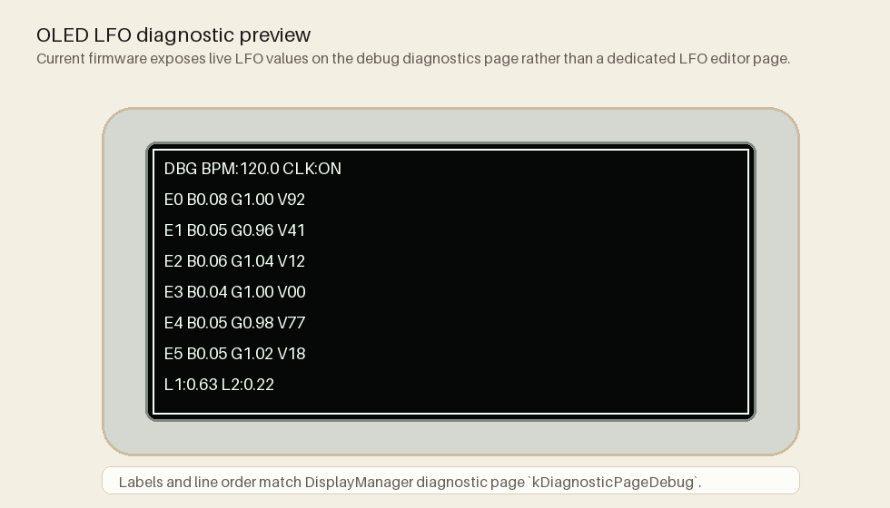

# LFO Route Guide

The LFO system becomes much easier to understand once you stop thinking "there are two LFOs" and start thinking "there are a few specific places motion is allowed to go."

This page explains those destinations in plain language.

## Start here if you are new

If you are new to routes, start with:

- one LFO
- one internal route
- moderate depth
- a visible target like LED brightness

That makes the modulation obvious before it becomes complicated.

## Route overview

The current default routing is simple on purpose: one LFO is easy to see and hear, the other changes how hard the reactive layer bites.

## The three internal targets

The current internal route targets are:

- `EfGainTrim`
- `ArpSwing`
- `LedBrightness`

These are not equivalent. Each one changes a different layer of the instrument.

## What the OLED currently shows

The current firmware does not expose a dedicated "LFO edit" page on the OLED. The closest live on-device readout is the debug diagnostics page, which prints normalized `L1` and `L2` values on the bottom row while showing envelope health above it.

That preview is based on the current `DisplayManager` debug-page strings, so it reflects what the firmware is documenting today rather than an invented UI concept.

## `LedBrightness`

This is the most legible target.

What it changes:

- the visible brightness behavior of the LED layer

Why it is good for learning:

- you can see the modulation immediately
- it does not hide in a musical side effect
- it teaches route depth clearly

Use low depth when:

- you want subtle pulse or breathing

Use high depth when:

- you want the LEDs to visibly announce the modulation cycle

Best for:

- first demos
- teaching routes
- visually linking the browser telemetry to what the hardware is doing

## `ArpSwing`

This target changes timing feel rather than color or amplitude.

What it changes:

- how straight or swung the arpeggiator timing feels

What that means musically:

- low depth gives a gentle alive-not-rigid feel
- high depth can make the groove feel dramatically uneven or unstable

Best for:

- performance experiments
- demonstrating that modulation can affect feel, not just value

Not the best first target if the player is still learning basic timing behavior.

## `EfGainTrim`

This target changes how strongly the envelope follower path bites.

What it changes:

- the effective intensity of the reactive control layer

What that means musically:

- low depth can make a reactive setup breathe
- high depth can make the follower path feel overexcited or inconsistent if the rest of the system is already complex

Best for:

- advanced reactive patches
- dynamic modulation experiments

Use carefully when teaching, because it changes the behavior of the control source itself rather than just an obvious output.

## Internal versus external routes

Routes can also go outward to MIDI CC or OSC, but the internal targets are the most important ones to learn first.

Why:

- internal targets are immediate
- they teach the modulation bus without external tooling
- they are easier to debug from the browser and hardware at the same time

Once those make sense, MIDI/OSC routes become much less mysterious.

## Safe first route progression

1. `LedBrightness`
2. `ArpSwing`
3. `EfGainTrim`

That order moves from visible, to musical, to structurally reactive.

## Depth: subtle versus extreme

Depth is where most routes either become expressive or become too much.

Use subtle depth when:

- the route should support the player
- the modulation should feel alive but not obvious

Use stronger depth when:

- you are demonstrating the route
- the modulation is meant to become part of the foreground character

The easiest mistake is to judge a target only at extreme depth. Many of these routes are most useful in the middle.

## How routes relate to profiles

Routes are part of the profile snapshot.

That means:

- loading a profile restores LFO routing
- saving a profile preserves that modulation structure
- the browser and telemetry can show the same route behavior the firmware is actually using

See: [Profile Workflow](ProfileWorkflow.md)

## Good route demos

### Best first demo

- target: `LedBrightness`
- depth: moderate
- goal: visible pulse

### Best musical demo

- target: `ArpSwing`
- depth: subtle-to-medium
- goal: show groove motion without breaking the phrase

### Best advanced reactive demo

- target: `EfGainTrim`
- depth: subtle
- goal: make the follower path feel alive without turning into noise

## Read next

- [Reactive Control Guide](ReactiveControlGuide.md) for how LFO routes fit the full motion engine
- [Profile Workflow](ProfileWorkflow.md) for how routes persist
- [Preset Library](PresetLibrary.md) for presets that make these route ideas easier to hear and see
