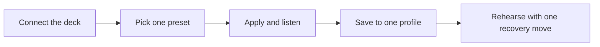

# Musician-First Guide

This page is for the person who wants to make the rig usable in rehearsal before they care how every subsystem is implemented.

You do not need to understand the whole architecture to get a playable setup. You do need a calm workflow.

## The first goal

Your first successful session should answer four questions:

1. can I connect the rig reliably?
2. can I choose a starting configuration on purpose?
3. can I save one good playable state?
4. can I recover quickly if I get lost?

This page is built around those four questions.

## The shortest useful path

*Alt text: Flowchart showing a musician-first workflow of connecting the device, choosing one preset, applying and listening, saving a good state into a profile, then rehearsing with one recovery move in hand.*

If you do only that, you already have a useful relationship to the instrument.

## Step 1: connect with the least friction

For a first rehearsal, use the browser configurator unless you already know you need OSC or DAW routing.

Why:

- it shows staged versus confirmed state clearly
- it lets you learn presets and profiles visually
- it makes recovery behavior easier to understand

Use the bridge when:

- you need OSC tooling
- you need the virtual MIDI device in a DAW
- the rehearsal is about host integration rather than mapping

See:

- [Configurator Tour](Configurator.md)
- [Bridge for Performers](BridgeForPerformers.md)

## Step 2: pick a starting point on purpose

Do not start from a blank state unless that is itself the exercise.

Use this rule:

- want the friendliest first reactive setup? choose `DEMO_A - Reactive Stack`
- want clearer contrast and a sparser map? choose `DEMO_B - Clock Contrast`
- want part/layer thinking? choose `Korg Minilogue XD - Layer Launch`
- want macro-bank performance thinking? choose `Akai MPC - Performance Grid`
- want patch-lab weirdness? choose `AE Modular - Probability Sketch`

If you are unsure, choose `DEMO_A`.

See: [Preset Library](PresetLibrary.md)

## Step 3: apply, then listen before saving

Once the preset is staged:

1. Apply it
2. play or feed signal through it
3. confirm it actually behaves the way you expect
4. only then save it into a profile

This is the musician-friendly version of the browser contract:

- preset first
- profile second

That order is what keeps you from filling A-D with half-understood experiments.

See: [Profile Workflow](ProfileWorkflow.md)

## Step 4: give each profile a role

The four device profile slots are most useful when they each have a job.

Recommended beginner layout:

| Slot | Role |
| --- | --- |
| A | safe baseline |
| B | current rehearsal map |
| C | alternate arrangement |
| D | risky experiment or song-specific variation |

This is not sacred. It is just a better starting point than "I guess I saved something somewhere."

## Step 5: learn one panic move

If you memorize only one hardware combo at first, memorize the panic-safe reset:

- `Ctrl0 + Ctrl1 + Ctrl2`

That combo:

- stops arp
- disables EF follow
- reloads the active profile baseline

If you are going to trust the instrument live, you need one reliable way back to known-good state.

See:

- [Combo Guide](ComboGuide.md)
- [Failure-First Guide](FailureFirst.md)

## What to rehearse first

Use this short rehearsal script:

1. connect the deck
2. stage `DEMO_A`
3. apply it
4. save it to slot B
5. switch to another profile and back again
6. trigger the panic combo once
7. confirm you can get back to slot B cleanly

That teaches more useful trust than twenty minutes of random exploration.

## Browser versus bridge for a musician

### Use the browser when:

- you are choosing or editing presets
- you are learning profiles
- you want visual confirmation of staged versus saved state
- you are still figuring out what the rig should do

### Use the bridge when:

- your rehearsal is in a DAW
- you need OSC targets
- the computer environment is part of the performance system

You do not have to pick one forever. The point is to use the simpler tool first.

## How to know a setup is ready for rehearsal

A setup is rehearsal-ready when all of these are true:

- you can reconnect without confusion
- you know which preset or profile you started from
- one profile slot contains the setup you actually want
- you know your panic move
- you can explain to yourself whether you are using browser state, device profile state, or bridge routing

If any of those feel fuzzy, keep the rehearsal in "learning mode" rather than "trusted performance mode."

## Suggested first-night path

If this is your first serious evening with the rig:

1. [Preset Library](PresetLibrary.md)
2. [Profile Workflow](ProfileWorkflow.md)
3. [Combo Guide](ComboGuide.md)
4. [Bridge for Performers](BridgeForPerformers.md)
5. [Failure-First Guide](FailureFirst.md)

That set is enough to become musically operational without forcing you through all the deeper system pages.

## Read next

- [Preset Library](PresetLibrary.md) for choosing a starting sound/mapping idea
- [Profile Workflow](ProfileWorkflow.md) for turning that idea into saved device memory
- [Bridge for Performers](BridgeForPerformers.md) for host/DAW workflows
- [Failure-First Guide](FailureFirst.md) for recovery habits
