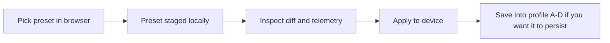

# Preset Library

The preset picker in the configurator is not a mystery box. Each entry is a small teaching artifact: a way to learn one corner of the controller without having to invent the whole mapping strategy from scratch.

This page explains what each preset is trying to teach, what kind of rig it fits, and what to tweak first so new users are not left in a trial-and-error loop.

## First distinction: presets are not profiles

The browser exposes two different ideas that are easy to blur together:

- **Presets** are staged templates loaded from the configurator picker.
- **Profiles** are the four EEPROM-backed snapshots stored on the device as slots A-D.

The normal flow is:

*Alt text: Flowchart showing a preset being chosen in the browser, staged locally, applied to the device, then optionally saved into one of the device's A-D profile slots.*

That distinction matters because the picker is safe by design. Choosing a preset does not immediately overwrite the deck. It stages a candidate config so you can review it, then decide whether to apply and archive it.

## What every preset is made of

Even though the entries feel different, the current preset collection is built from the same small vocabulary:

| Piece | What it changes | Why it matters |
| --- | --- | --- |
| `slots` | MIDI message type, channel, number, active state, labels | This is the main mapping surface. |
| `efSlots` | Which envelope follower targets which slot groups | This is where the reactive behavior starts. |
| `filter` | Envelope follower shaping | Lets the preset feel tight, smooth, bright, or restrained. |
| `arg` | Arithmetic blend mode and weights | Changes how follower signals combine. |
| `led` | Global color and brightness mood | Gives each preset an immediate visual identity. |
| `envelopeMode` | Response curve for follower motion | Changes how "physical" or "snappy" the deck feels. |

Once you learn to read those six pieces, the preset library stops looking like magic.

## Preset map at a glance

| Preset | Best for | What it teaches | Tweak this first |
| --- | --- | --- | --- |
| `DEMO_A - Reactive Stack` | First-time browser/demo use | Active-slot density plus obvious reactive motion | LED color, active slot count, ARG method |
| `DEMO_B - Clock Contrast` | Comparing timing and filter feel | Linear response and a sparser mixed CC/NRPN layout | Filter type/Q and active-slot density |
| `Korg Minilogue XD - Layer Launch` | Multi-layer synth workflows | Layer-oriented channel spread with note/CC handoff | Which labeled layers stay active |
| `AE Modular - Probability Sketch` | Patch-lab experimentation | NRPN sequencing rows mixed with note/CC lanes | Which sequence rows are pots versus triggers |
| `Akai MPC - Performance Grid` | Pad/performance rigs | Macro-bank thinking with aftertouch-heavy groupings | Which macros stay on pots and which become buttons |
| `Electribe2S Hacktribe Preset` | Advanced reference only | Older hand-authored mapping strategy | Use as a design reference, not a drop-in preset |

## The shipped picker presets

### DEMO_A - Reactive Stack

This is the friendliest "show me what the thing does" preset in the current picker.

- Dense first bank: the first 24 slots stay active, so the board feels alive immediately.
- Note plus CC mix: every sixth slot becomes a note lane while the rest stay continuous.
- Teal LED identity: the bright cyan/green color makes it obvious when the staged preset landed.
- Low-pass + `MAXX` ARG: the reactive motion is exaggerated without turning chaotic.

Use this when you want a newcomer to understand the stack quickly. It is the preset most likely to reward casual knob twisting without requiring the user to already understand the whole routing story.

What to change first:

1. active slot count if the deck feels too dense
2. LED color if you want the visual identity to match a target rig
3. ARG method if you want the reactive motion to feel less "stacked"

Related reading:

- [ARG Guide](ARGGuide.md)
- [Filter Feel Guide](FilterFeelGuide.md)

Source: [App/views/presets.js](https://github.com/bseverns/benzknober/blob/main/App/views/presets.js)

### DEMO_B - Clock Contrast

This is the companion teaching preset. It is less about density and more about contrast.

- Mixed CC/NRPN behavior introduces a more deliberate control feel.
- Fewer active lanes make the mapping easier to parse visually.
- Band-pass filter and `XABS` ARG shift the reactive feel away from the smoother DEMO_A stack.
- Linear envelope mode makes movement feel more direct and less curved.

Use this when you want to explain that the same hardware can feel materially different with only a few changes to filter shape, active-lane density, and signal blending.

What to change first:

1. filter frequency and Q to hear how the follower character changes
2. which slots stay active
3. envelope mode if you want to compare linear versus exponential response

Related reading:

- [ARG Guide](ARGGuide.md)
- [Filter Feel Guide](FilterFeelGuide.md)

Source: [App/views/presets.js](https://github.com/bseverns/benzknober/blob/main/App/views/presets.js)

### Korg Minilogue XD - Layer Launch

This preset is aimed at people who think in layers and parts rather than in raw slot numbers.

- Labeled layers (`Layer 1`, `Layer 2`, and so on) make the map legible.
- Note lanes are interleaved with CC lanes so you can treat some slots as event triggers and others as parameter control.
- The active front section gives a staged, performable subset while the later layers stay present but inactive.

Use this when the teaching goal is "how do I spread a controller across several synth parts without losing my place?"

What to change first:

1. which labeled layers remain active
2. channel assignments if your synth parts are arranged differently
3. note-lane positions if you want fewer triggers and more continuous control

Source: [minilogue-init.json](https://github.com/bseverns/benzknober/blob/main/App/presets/korg/minilogue-init.json)

### AE Modular - Probability Sketch

This is the most obviously patch-lab preset in the visible picker.

- Sequence-style NRPN lanes anchor the map.
- Note and CC lanes fill the rest of the deck with more opportunistic motion.
- The low-pass filter and `PLUS` ARG blend keep the preset lively without becoming unreadable.
- The bright green LED color gives it a very different stage identity from the demo profiles.

Use this when the user wants the deck to feel like a modular helper rather than a conventional knob bank.

What to change first:

1. which sequence rows are active
2. which lanes are pots versus event triggers
3. the NRPN row spacing if the target patch wants tighter grouping

Related reading:

- [ARG Guide](ARGGuide.md)
- [Filter Feel Guide](FilterFeelGuide.md)

Source: [App/views/presets.js](https://github.com/bseverns/benzknober/blob/main/App/views/presets.js)

### Akai MPC - Performance Grid

This preset thinks in macro clusters.

- Repeated channel groupings turn the board into six performance banks.
- Labeled `Macro 1` through `Macro 6` anchors help the user find the pattern quickly.
- Aftertouch-heavy lanes make sense for a performance rig where pressure and emphasis matter.
- Pot-enabled rows are intentionally sparse, which keeps the physical control story clearer than a full-everything map.

Use this when you want to explain how the same 42-slot surface can behave more like a set of macro scenes than a flat field of parameters.

What to change first:

1. which macro lanes stay pot-enabled
2. aftertouch versus CC choices for each bank
3. the per-bank MIDI channel spread

Source: [mpc-performance.json](https://github.com/bseverns/benzknober/blob/main/App/presets/akai/mpc-performance.json)

## The reference preset that is not currently in the picker

### Electribe2S Hacktribe Preset

There is one extra preset file on disk that is useful as documentation even though it is not currently surfaced in the live picker.

- It is older and more hand-authored than the current schema-shaped presets.
- It maps a very specific NRPN/CC story for an Electribe/Hacktribe workflow.
- It is better read as a mapping example than treated as a newcomer-friendly starting point.

This is still worth documenting because hidden files are exactly the sort of thing that create "trust me, it makes sense" architecture debt. If it lives in the repo, a learner should be able to discover what it is for.

Source: [electribe-init.json](https://github.com/bseverns/benzknober/blob/main/App/presets/korg/electribe-init.json)

## How to choose a preset on purpose

Pick by learning goal, not just by device name:

- Want the quickest "this controller is alive" proof? Start with `DEMO_A`.
- Want to compare response feel and density? Jump between `DEMO_A` and `DEMO_B`.
- Want a multi-part synth map? Start with the Minilogue preset.
- Want patch-lab energy? Start with AE Modular.
- Want performance-bank thinking? Start with the MPC preset.

Then do the same safe ritual every time:

1. stage the preset
2. inspect what changed
3. apply it to the device
4. save it into profile A-D only if it earned a permanent home

## Read next

- [Musician-First Guide](MusicianFirstGuide.md) for a rehearsal-first path through presets and profiles
- [Configurator Tour](Configurator.md) for how preset staging fits the browser workflow
- [WebSerial Walkthrough](ProtocolWalkthrough.md) for staged-versus-live state
- [WebSerial Protocol](WebSerial.md) for profile/preset payload rules
- [Demo Polish](DemoPolish.md) for how the demo profiles are used in presentation and soak testing
