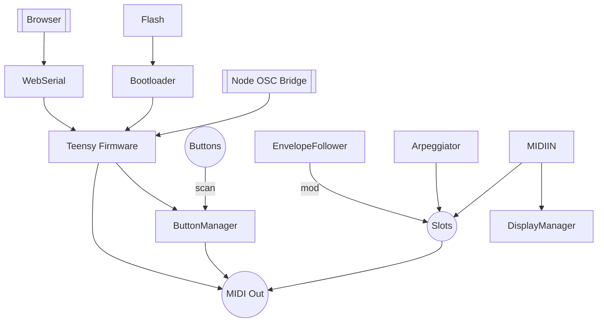

# Docs Index

> Hardware's signed off and etched in copper. This folder is the reference stash for the whole machine—schematics, firmware lore, and every misadventure we've documented.

Welcome to the MOARkNOBS-42 documentation playground. This README aims to help you navigate the library of notes, design scraps, and personal ramblings we keep around to teach ourselves and the next hacker.

## Visual Quickies

> Sketches that slap the architecture on a napkin so you don't have to squint at code.

Need to zoom past the glam shot? Dive into the raw CAD layers:

### Everything Everywhere

## System Capabilities

 - [Hardware README](../hardware/README.md#sparkfun-shortcut) — final board layout, power rails, and a SparkFun shortcut for the silicon.
- [Firmware README](../firmware/README.md) — how the code slings MIDI, wrangles envelope followers, and keeps the LEDs honest.
- Firmware reference tables: [button map & combo guide](../firmware/include/ButtonManager/README.md#button-map), [filter types](../firmware/include/EnvelopeFollower/README.md#filter-types), [arp settings](../firmware/include/Arpeggiator/README.md#arp-settings), [MIDI types](../firmware/include/MIDIHandler/README.md#supported-message-types), [ARG methods](../firmware/include/EnvelopeFollower/README.md#arg-methods), [display hooks](../firmware/include/DisplayManager/README.md#key-methods).

## Choose Your Adventure

- [BuildersHandbook.md](BuildersHandbook.md) — wire it, flash it, and smoke-test it.
- [HISTORY.md](HISTORY.md) — chronological ride through the project's evolution. Commit references, design pivots, and the "why" behind the build.
- [Options_DNI.md](Options_DNI.md) — the optional / Do Not Install cheat sheet. Use this before you lock a BOM or when you're deciding what not to solder.
- [TODO.md](TODO.md) — post-release wishlist for when the first build is out and you're itching for v2.
- [ReleaseGuide.md](ReleaseGuide.md) — full release playbook. For quick steps see [Publishing a Release](../README.md#publishing-a-release).
- [sketch/](sketch/) — raw schematics and subsystem scribbles when you need the gory details.
Highlights:
  - [buttonMatrix.md](sketch/systemFlow/hw/buttonMatrix.md) — how the 42-button grid scans its soul.
  - [display.md](sketch/systemFlow/hw/display.md) — wrangling pixels and I²C.
  - [envelopeFE.md](sketch/systemFlow/hw/envelopeFE.md) — analog envelope follower circuits.
  - Plenty more (midi opto, power antics, board PDFs) for late-night study.
- [WebSerial.md](WebSerial.md) — how the board chats with browsers.
- [OSCBridge.md](OSCBridge.md) — hurl OSC at a Node shim and let it punch MIDI into the hardware.
- [thermal/](thermal/) — keep the silicon from frying itself.

## Why these parts?

> Quick hits on why each chunk of silicon shows up and where SparkFun teaches the tricks.

- **Teensy 4.0** — horsepower with USB baked in. The [Teensy 4.0 Hookup Guide](https://learn.sparkfun.com/tutorials/teensy-40-hookup-guide) covers pinout, power, and programming basics.
- **CD74HC4067 analog mux** — collapses 42 buttons into one ADC read. The [16‑Channel Mux Breakout Guide](https://learn.sparkfun.com/tutorials/16-channel-analogdigital-multiplexer-breakout-cd74hc4067-hookup-guide) shows how to breadboard the trick.
- **SN74HCT245 level shifter** — keeps 5 V button buses from smoking the 3 V3 MCU. SparkFun's [Logic Level Shifting 101](https://learn.sparkfun.com/tutorials/logic-level-shifting) explains the voltage translation.
- **6N138 optocoupler** — isolates MIDI IN. SparkFun's [MIDI Tutorial](https://learn.sparkfun.com/tutorials/midi-tutorial/all) breaks down DIN wiring and opto‑isolation.
- **MCP6002 op‑amp** — rectifies audio for the envelope followers. SparkFun's [Op-Amp Basics](https://learn.sparkfun.com/tutorials/op-amps/all) digs into precision rectifiers and biasing.
- **WS2812 LEDs** — one data pin, full-color rage. SparkFun's [WS2812 Breakout Hookup Guide](https://learn.sparkfun.com/tutorials/ws2812-breakout-hookup-guide) covers timing and power layout.

### Lab Playlist: choose your own adventure

Warm up your brain before flashing firmware.

- [Logic Level Shifting 101](https://learn.sparkfun.com/tutorials/logic-level-shifting) — keep 5 V gear from roasting 3 V3 brains.
- [Demystifying SPI](https://learn.sparkfun.com/tutorials/serial-peripheral-interface-spi) — the bus behind future displays and flash chips.
- [UART vs. MIDI](https://learn.sparkfun.com/tutorials/midi-tutorial/all) — MIDI rides a current loop, not plain UART; this primer shows the difference.
- [Op-Amp Basics](https://learn.sparkfun.com/tutorials/op-amps/all) — build envelope followers, filters, or fuzz boxes without fear.
