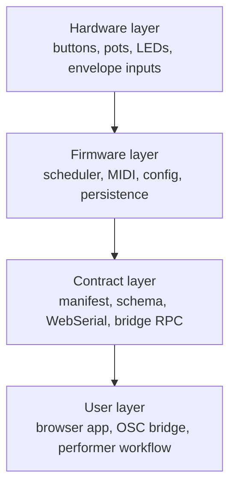

# New User Story

If you are new to MOARkNOBS-42, the easiest mistake is to think it is "just a controller with a lot of knobs." It is closer to a small system with a very visible control surface.

This page is the beginner-friendly tour: what the parts are, how they relate, and what to read next when you want to go deeper.

## The elevator version

MOARkNOBS-42 is built around four layers:

If one layer lies to the next, the whole experience gets weird fast. That is why the docs keep returning to the same ideas: contract sync, test coverage, rollback, and traceability.

## What you are looking at

### On the board

- a Teensy 4.0 running the firmware
- a button grid and control buttons for direct interaction
- LED output for visual feedback
- envelope follower inputs for audio-reactive control
- EEPROM-backed persistence so the machine remembers its state

### In the browser

- a runtime that connects over WebSerial
- a schema-driven form system
- staged edits that can be reviewed before they are applied
- checksum-backed apply/rollback behavior so the UI does not lie about what the device accepted

## The first mental model to keep

The browser does **not** own the truth by itself, and the firmware does **not** blindly trust the browser.

The normal conversation is:

1. connect to the device
2. ask for its manifest
3. compare schema versions
4. fetch the config
5. stage changes locally
6. apply changes and wait for a confirmed ACK

That is why the configurator can safely support staging, diff views, rollback, and migration warnings.

## The first practical walk

If you want the shortest route to understanding, follow this order:

### 1. Learn the high-level workflow

Read [Process Overview](ProcessOverview.md).

That page tells you the sequence from hardware prep to release without burying you in implementation details.

### 2. Learn how to recover from problems

Read [Troubleshooting](Troubleshooting.md).

The best time to understand failure modes is before the board is half-built and silent.

### 3. Learn the browser model

Read [Configurator Tour](Configurator.md), then [WebSerial Walkthrough](ProtocolWalkthrough.md).

Those pages explain how the browser thinks about staged state, manifests, patches, and apply safety.

### 4. Learn what the tests actually prove

Read [Testing Story](TestingStory.md), then [Testing](TESTING.md).

That page is where the repo stops being mystical about "tested" versus "not yet proven on real hardware."

## What to ignore on your first pass

You do **not** need to read these immediately unless you are debugging or extending the stack:

- [EEPROM Layout](EEPROMLayout.md)
- [Pin Map](PinMap.md)
- [Assumption Ledger](assumption-ledger.md)
- [SeedBox Interop](interop/seedbox.md)

They matter, but they are better after you already know the main path through the instrument.

## When you are ready for the deeper story

Once the basic workflow makes sense, read [History](HISTORY.md).

That is where the project starts to become legible as more than a collection of files. You can see when test coverage expanded, when the browser became schema-driven, when release hardening started to matter, and why the project now reads so defensively in places.
