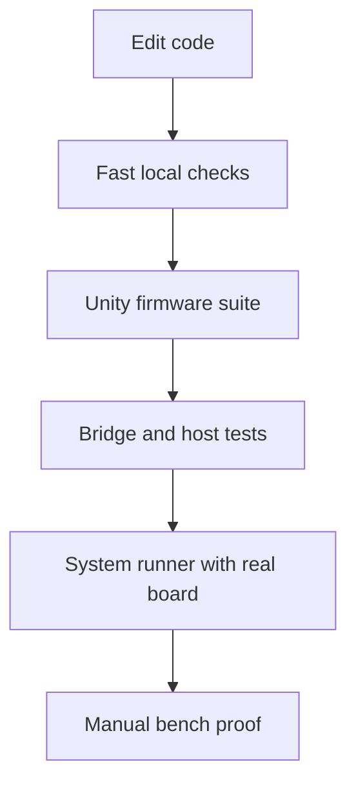

# How To Trust The Stack

Testing in MOARkNOBS-42 works best when you stop asking "did the tests pass?" and start asking "what layer of reality did this change just threaten?"

This stack has more than one truth surface:

- firmware logic that can be checked deterministically
- orchestration code that needs realistic stubs
- bridge and browser code that runs on a host machine
- real hardware behavior that only exists on a powered board

The test strategy is built around that fact. Each layer proves a different promise.

## The confidence ladder

*Alt text: Flowchart showing confidence building from local checks to Unity, then host tests, then full-system hardware runs, then manual bench proof.*

The important idea is that later layers do not replace earlier ones. They narrow different kinds of doubt.

## What each layer is really for

### Unity proves the firmware can still think

Unity is the first serious gate because it catches logic drift cheaply:

- slot math
- envelope follower helpers
- scheduler layout
- runtime orchestration
- command parsing
- WebSerial payload emission
- UI-facing helper behavior

That is why recent work focused on broadening Unity coverage into scheduler, runtime, WebSerial, UI, command queue, and interop-oriented orchestration paths. The suite now checks more of the code that used to hide between "pure logic" and "real hardware."

## Host tests prove the desktop-side tools still behave

The Node bridge tests do not pretend to prove the instrument itself. They prove the host-side control surface still parses flags, handles failure cleanly, and does not regress in obvious ways before you even plug a board in.

That makes them useful for quick CI confidence, but they are not a substitute for firmware or bench validation.

## System runs prove the contract is still alive

The system runner matters because it exercises the real conversation:

1. firmware boots on a board
2. the bridge sees it
3. the host sends real commands
4. the stack emits logs and telemetry that match expectations

That is where interface drift shows up. A unit test can tell you the serializer still emits JSON. A system run tells you the entire rig still agrees on what that JSON means.

## Manual bench work proves the physical machine

Some truths only exist on the actual instrument:

- LED chain integrity
- OLED behavior
- pot feel and analog stability
- EEPROM persistence under real power cycles
- button scan behavior with the real matrix
- envelope follower noise floor and calibration

Those are not test-suite failures waiting to be automated away. They are physical properties of the device.

## How to choose the right level

Use this rule of thumb:

| If you changed... | Start here | Then escalate to... |
| --- | --- | --- |
| math, config, routing, scheduler logic | Unity | system run if contract-visible |
| bridge CLI or host-side parsing | Node tests | system run if transport changed |
| WebSerial/runtime contract | Unity plus host checks | full system with real board |
| wiring, LEDs, display, EEPROM behavior | manual sketch or bench | full release gauntlet before shipping |

## What "tested" means in this repo

In this project, "tested" should always be read with a qualifier:

- tested in Unity
- tested in the bridge
- tested in the full-system runner
- tested on the bench

That wording matters because it keeps the repo honest. A compile-clean firmware image is not the same thing as a validated instrument, and a successful bench run is not the same thing as wide logic coverage.

## Practical newcomer path

If you are new and just want the safe order:

1. run the quick host-side checks
2. run Unity on the Teensy
3. run the system test when the firmware or protocol changed
4. touch the real board before calling it done

That sequence keeps the cheap failures early and saves the physical rig for the changes that actually need it.

## Read next

- [Testing](TESTING.md) for the full command reference and coverage map
- [Firmware Architecture Story](FirmwareArchitecture.md) for why the runtime has separate timing tiers
- [Troubleshooting](Troubleshooting.md) for what to do when a physical board disagrees with the test story
