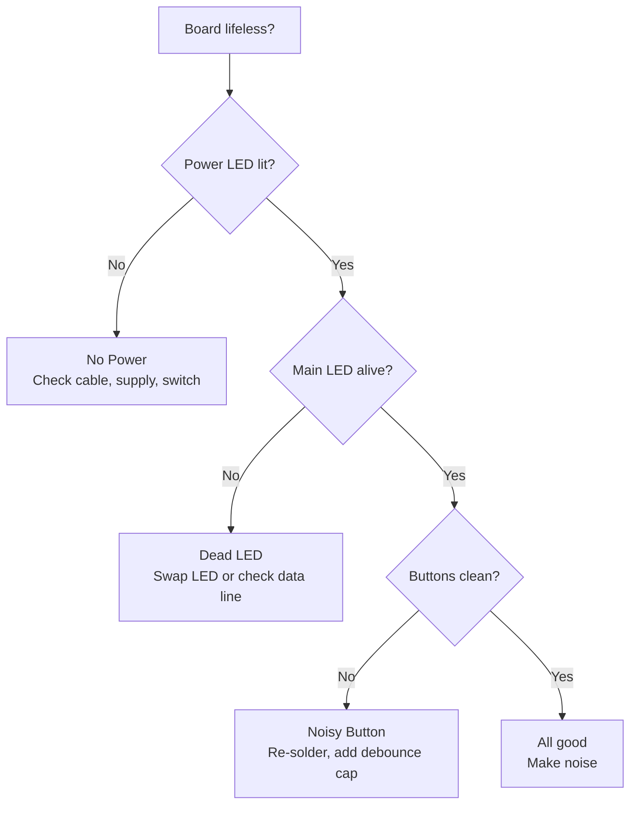

# Troubleshooting: When the Rig Refuses to Riff

If the board's gone sulky, this cheat sheet walks you through the usual suspects before you start desoldering in despair.

## Flowchart of Fail

## Hardware Horror Show

The lab camera's MIA, so we can't drop juicy fail pics yet. When you fry something spectacularly, snap it and stick it here:

- **No Power** – picture a dark board with the USB cable doing nothing.
- **Dead LED** – that one pixel flipping you off while the rest glow.
- **Noisy Button** – jittery switch bouncing like a bad punk drummer.

*Swap these bullet notes with real photos when you've got 'em.*
