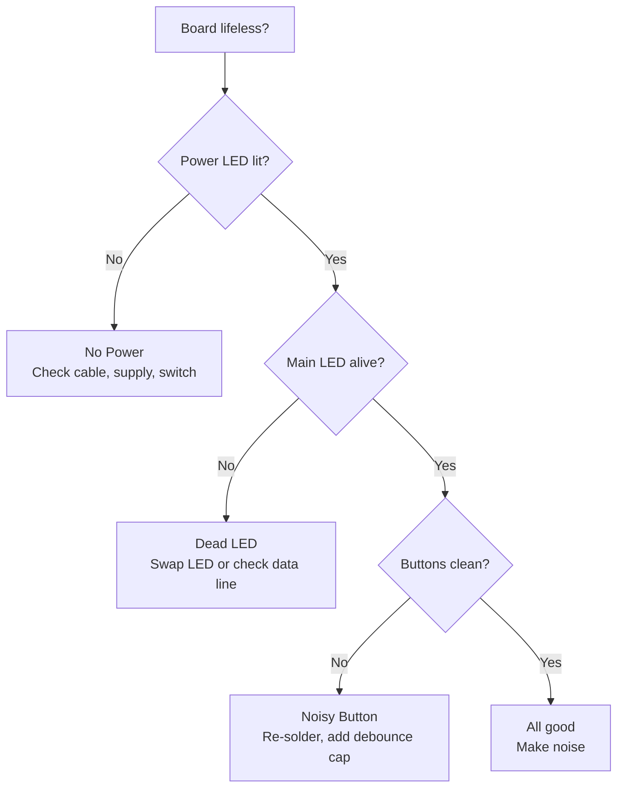
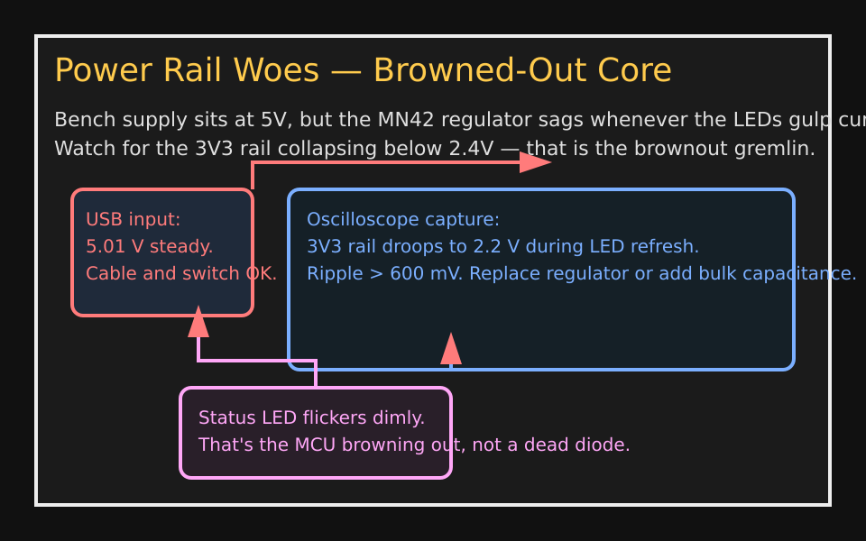
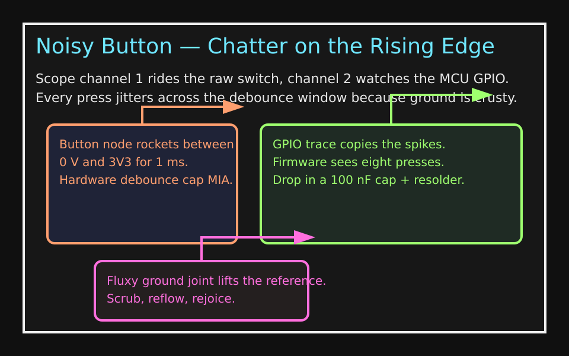
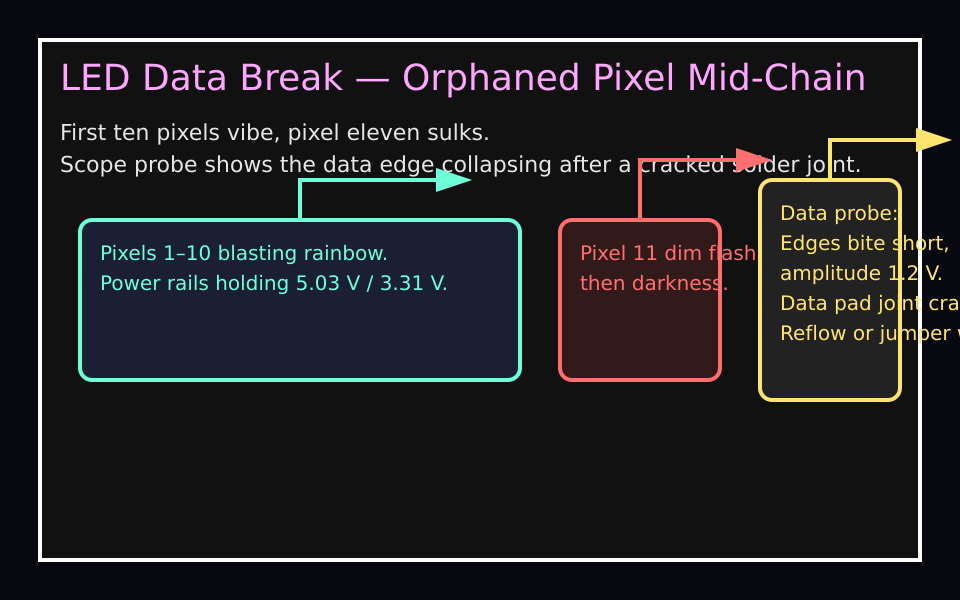

# Troubleshooting: When the Rig Refuses to Riff

If the board's gone sulky, this cheat sheet walks you through the usual suspects before you start desoldering in despair.

## Flowchart of Fail

## Hardware Horror Show

The camera finally rolled back into the bench bag, so here's a guided tour of the greatest hits that derail a MN42 bring-up session. Match what you see on your board to the cues below, then chase the fixes in order.

### Power Rail Woes (3V3 Brownout)

1. **Spot the symptom:** The USB input sits pretty at 5.0 V while the status LED barely flickers. That means the cable and power switch are fine; the trouble is downstream.
2. **Confirm the crime:** Probe the 3V3 rail. If it faceplants to ~2.2 V every time the LED bus refreshes, the regulator is browning out. Your MCU is tapping out, not dead.
3. **Fix the mess:** Swap in a known-good regulator or strap in extra bulk capacitance near the LED connector. If the dips vanish, button it up; if not, hunt for shorts on the 3V3 plane.

### Noisy Button (Switch Chatter)

1. **Spot the symptom:** Press the suspect button and watch the GPIO trace mirror a spray of spikes. Firmware thinks you're double-kicking the switch.
2. **Confirm the crime:** Measure the switch node: if it ricochets between rails for ~1 ms and sits 0.8 V above ground, the joint is cruddy and there's zero hardware debounce.
3. **Fix the mess:** Scrub the ground lug, reflow the switch, then tack on a 100 nF cap across the contacts. Firmware calms down once the waveform stops moshing.

### LED Data Break (Mid-Chain Silence)

1. **Spot the symptom:** The first ten pixels throw a rave while pixel eleven gives you a sullen red blink before going dark.
2. **Confirm the crime:** Probe the data pad after that pixel. If the edge is square-toothed and barely hits 1.2 V, the data line is fractured.
3. **Fix the mess:** Reflow the pixel's data pad. If the waveform still wheezes, bridge the data trace with a jumper wire and retest the chain from the controller end.
