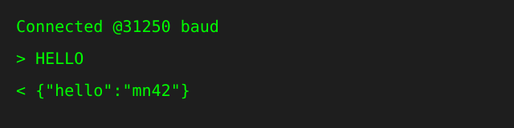

# WebSerial Groove

The Teensy screams JSON snapshots over WebSerial so the browser can watch the synth wiggle in real time. It's dead‑simple and a little rowdy.

## Handshake

1. Browser opens the serial port at **115200** baud.
2. Browser sends `HELLO\n`.
3. Teensy answers with:
   ```json
   { "hello": "mn42" }
   ```
   
4. Browser immediately fires off `GET_MANIFEST\n` so the synth and the UI agree on schema + build trivia. The Teensy replies
   with a newline-terminated JSON manifest:
   ```json
   {
     "device_name":"MOARkNOBS-42",
     "fw_version":"1.3.0",
     "git_sha":"012dead",
     "build_time":"2024-05-10 21:37:02",
     "schema_version":4,
     "slot_count":42,
     "pot_count":42,
     "envelope_count":6,
     "arg_method_count":14,
     "led_count":51,
     "free_ram":642112,
     "free_flash":1185792
   }
   ```
5. The UI diffs that manifest against its baked-in schema definition. When anything smells off, pop a non-destructive migrate dialog:
   - Offer to export the user’s current JSON before touching a byte.
   - Run any adapters found in `firmware/App/migrations/` to lift the preset forward.
   - Render the proposed patch for review; no silent rewrites.
6. Streaming begins only after both sides agree on versions. Bail out by closing the port or if the manifest validation fails.

`device_name` is intended for UI identity banners (`Connected to: ...`) so users can confirm they are editing the correct rig before applying changes.

The manifest handshake also tells the browser when it needs to fall back to the frozen `config_schema.json` that lives in the app bundle. Once the schema check passes the UI typically asks for `GET_CONFIG` instead of the old `GET_ALL` dump so it can hydrate every pot, slot, envelope, LFO route, and LED color from one well-behaved JSON line. `GET_SCHEMA` is still there for offline editors that want to compare against a stable schema without talking to hardware.

## State Messages

Every ~100 ms the firmware spits a newline‑terminated JSON blob:

```json
{
  "slots":[0,1,2,...,41],
  "envelopes":[0,0,0,0,0,0],
  "lfos":[0.0,0.0],
  "currentSlot":5,
  "argMethod":"PLUS",
  "argEnabled":true,
  "argPair":[0,1],
  "efStatus":[1,0,0,0,0,1],
  "diagnostics":{
    "uart_overruns":0,
    "midi_drops":0,
    "loop_overruns":0,
    "midi_task_overruns":0,
    "loop_max_us":812,
    "loop_last_us":742,
    "midi_isr_max_us":320,
    "midi_isr_last_us":110
  }
}
```

- `slots` – 42 MIDI‑scaled values (0‑127) for each virtual slot.
- `envelopes` – live levels from the six envelope followers, also 0‑127.
- `lfos` – normalized 0..1 outputs for each of the two routed LFO engines; the same values feed LED brightness, arp swing, and EF gain trim internally and can also be routed to MIDI/OSC so the editor can animate the modulation bus.
- `currentSlot` – which slot is currently screaming.
- `argMethod` – firmware's current ARG calculation mode.
- `argEnabled` – whether the ARG blender is live or bypassed.
- `argPair` – the two envelope followers currently feeding the ARG stage (indexes 0‑5).
- `efStatus` – array of six flags; `1` means that envelope follower is lit.
- `diagnostics` – brand-new watchdog metrics surfacing how hard the MCU is being pushed:
  - `uart_overruns` – count of DIN UART receive overruns caught in hardware.
  - `midi_drops` – messages we binned due to busted framing or unsupported types.
  - `loop_overruns` – main loop iterations that blew past the 1 ms target.
  - `midi_task_overruns` – MIDI service passes that ran longer than 1 ms.
  - `loop_max_us` / `loop_last_us` – worst and most recent loop durations in microseconds.
  - `midi_isr_max_us` / `midi_isr_last_us` – same deal for `processIncomingMIDI()`.

When any of those counters tick upward the status LED on the board pulses and the JSON stream logs an event, so you get both a visual scream and structured telemetry.

Parse each line as JSON and redraw your UI. There’s no framing besides the newline, because who needs more ceremony?

### Diagnostics panel for power users

Every state message exposes a `diagnostics` object with the watchdog counters. Build a debug panel that charts those values over time and you immediately get a profiling dashboard:

- `loop_max_us` / `loop_last_us` – how long the main `loop()` takes. If either number nudges the 1000 µs budget or `loop_overruns` starts climbing, drop the frequency of non-critical tasks (e.g., reduce LED refresh rate, move expensive updates to the mid/low scheduler) and profile again.
- `midi_isr_max_us` / `midi_isr_last_us` – ISR budget for MIDI handling. If these creep upward, throttle external MIDI bursts or trim work from `processIncomingMIDI()` so the high-priority scheduler can breathe.
- `uart_overruns`, `midi_drops`, `midi_task_overruns` – counters that scream when serial hardware or MIDI parsing falls behind. Work from these backwards: confirm the USB/DIN queues are drained (check `MIDIHandler::_txCount`) and, if the board still struggles, push some tasks into a lower scheduler or clamp unsolicited MIDI sources.

Bonus: ship the diagnostics view in the WebSerial UI as a “Loop Utilization” badge, and surface any non-zero counters as toast-level alerts. These values already flow over the same JSON channel the editor consumes, so you can draw bars, spark lines, and error rows without touching anything in firmware.

## Patch Messages

Streaming snapshots are the vibe, but the firmware also fires micro-patches whenever a single slice of state changes. These are
newline-terminated JSON blobs as well, all prefixed with a `type` field so your app can route them without guesswork.

| `type` value | When it fires | Payload notes |
| --- | --- | --- |
| `slot_patch` | Slot MIDI settings mutate (from the board or the browser) | `slot` index plus a nested `slot` object including `type`, `schema_name`, `legacy_name`, `channel`, resolved `data1`, EF routing, and active flag. New in schema 4: an `ef_payload` bundle rides shotgun with the filter type, frequency, and Q for that slot. Legacy `filter_patch` broadcasts still fire so antique dashboards stay zen. |
| `envelope_assignment` | A slot gets re-routed to a new follower | `slot` index and `envelope` index (or `-1` if unassigned). Use it to repaint routing badges. |
| `filter_patch` | Envelope follower filter tweaked live | `filter` object includes type index/name, frequency, and Q. Perfect for sliding UI knobs without yanking the full config. |
| `arg_patch` | ARG mixer mode flips or toggles | Nested `arg` object with the method index/name, enable flag, and the paired envelopes so remote editors stay in sync. |

Every patch obeys the same “don’t spam unless streaming” rule as snapshots. If WebSerial streaming is paused, patches quietly bail
so the USB line isn’t clogged when no one’s listening.

When you catch a `slot_patch`, drill into the nested `slot.ef` object if you want the new per-slot envelope follower controls. The
fields line up with `MIDISlot::EfSettings` in firmware:

- `index` – follower index or `-1` when the slot isn’t riding an envelope.
- `filter_index` / `filter_name` – one of the seven EnvelopeFollower filter shapes.
- `frequency` and `q` – the knobs that drive `EnvelopeFollower::configureFilter()`.
- `oversample` – extra ADC reads per update (1 disables the bonus noise shaping).
- `smoothing` – EWMA alpha; higher values hug new samples harder.
- `baseline` – calibration offset saved alongside the routing so quiet stays quiet.
- `gain` – post-baseline multiplier that lets a follower punch above unity.
- `mode` – EF mode selector (`PEAK`, `RMS`, `GATE`, `FOLLOWER` or enum 0-3).
- `auto_baseline` / `auto_gain` – flags for auto-calibration.
- `attack_ms` / `release_ms` / `rms_ms` – timing controls for Peak/Follower/RMS.
- `gate_threshold` / `gate_hysteresis` – gating thresholds in 0-127.
- `activity_threshold` / `baseline_tau_ms` / `gain_tau_ms` / `gain_target` – auto-cal settings.

Leave the object alone if you only care about routing. You can still rely on the legacy `ef_index` scalar for backward-compatible
hosts, but the nested settings are the real playground for browser editors.

## Text Commands

Spying is fun, but sometimes you gotta bark orders. Hurl plain‑text commands
terminated with a newline and the firmware snaps back with either `OK` or `ERR`.

### Command Roster

This table mirrors the shout list in `firmware_main.cpp` so the code and docs
never fall out of sync.

| Command | Arguments | What it pokes |
| --- | --- | --- |
| `HELLO` | – | start WebSerial streaming |
| `GET_SCHEMA` | – | dump config schema. If the device ghosts you, the HTML app drags out its baked-in `config_schema.json`. |
| `GET_BROWNOUTS` | – | number of brownouts seen |
| `GET_MANIFEST` | – | confirm firmware build + schema, plus free RAM/flash stats |
| `GET_CONFIG` | – | dump the live configuration: pots, slots, `efSlots` follower routing (including multi-slot targets), ARG/filter state, LEDs, and LFO info |
| `SET_POT` `<slot>,<chan>,<cc>` | ints | bind slot to channel+CC |
| `SET_ALL` `<payload>` | JSON or bulk CSV | mass update slots/LED |
| `GET_ALL` | – | legacy dump of slots + LED (only available when `SERIAL_LOGGING` is enabled) |
| `SET_LED` `<bri>,<r>,<g>,<b>` | 0‑255 each | paint LED strip |
| `GET_LED` | – | return `bri,r,g,b` |
| `SET_ARGMETHOD` `<n>` | 0‑13 | choose ARG blend |
| `GET_ARGMETHOD` | – | spit current ARG blend |
| `SET_EF` `<slot>,<ef>` | slot 0‑41, ef 0‑5 | patch slot→follower routing (repeat to map one follower across many slots) |
| `GET_EF` `<slot>` | slot 0‑41 | see follower mapped |
| `CAL_ENVS` | – | recalibrate all followers |
| `GET_PROFILE` `<id>` | 0‑3 | dump profile payload JSON (arp/LFO/LED/EF/midi channel/routes/slots) |
| `SET_PROFILE` `<id>,<payload>` | 0‑3, JSON | store profile payload JSON into EEPROM (partial payloads merge) |
| `SET_FILTER` `<type>,<freq>,<q>` | type 0‑?, floats | blast the legacy global filter (and mirror those values into every slot payload for backward compatibility) |
| `GET_FILTER` | – | return `type,freq,q` using the legacy global stash |
| `SET_SLOT_FILTER` `<slot>,<type>,<freq>,<q>` | slot 0‑41, type 0‑?, floats | surgically edit one slot’s envelope payload without touching the others |
| `GET_SLOT_FILTER` `<slot>` | slot 0‑41 | read back one slot’s envelope payload as `type,freq,q` |
| `SET_ARGPAIR` `<on>,<envA>,<envB>` | 0/1,0‑5,0‑5 | wire two envelopes for ARG |
| `GET_ARGPAIR` | – | echo pair config |

### Profiles & modulation snapshots

`GET_PROFILE <id?>` (defaults to the active EEPROM slot) streams the JSON-safe snapshot the firmware keeps for each profile. The response contains:

- `profile` / `stored` – the slot index and whether a saved snapshot lived in EEPROM or the response is just a live capture.
- `arp` / `led` – the arpeggiator settings and the LED brightness/RGB that the profile last recorded.
- `lfos` – two records describing each LFO’s shape, frequency, depth, bipolar flag, and clock sync state.
- `routes` – the active route table that maps an LFO to an internal target, MIDI CC7/CC14, or the OSC callback (type, depth, target, MIDI channel, CC pair).
- `slots` – per-slot MIDI channel and envelope follower (via the nested `ef` object) so an editor can repaint everything without poking each pot.

Send `SET_PROFILE <id>,<payload>` with newline-terminated JSON to stage a new snapshot. The parser accepts partial payloads: include only the keys you changed (`led`, `lfos`, `routes`, `slots`, `arp`, etc.), and the firmware will merge them into the current snapshot before persisting to EEPROM. A successful store returns `OK`, and when you `SET_PROFILE` the active slot the firmware immediately applies the snapshot (LEDs, routes, envelopes, and MIDI channels update without needing a reboot).

Use these RPCs to implement Load/Save/Reset buttons in your UI, and remember that the four EEPROM slots behave like dedicated profiles (A–D) so you can stage live tweaks, snapshot them, and recall them on stage.

### LED + LFO telemetry

The same `led` object that shows up in `GET_CONFIG` (brightness, RGB, and hex) also rides along with profile payloads. Use `SET_LED` and `GET_LED` to control the strip’s global color/brightness bond; `SET_ALL` respects `{"led":{"color":"#RRGGBB"}}` fragments so you can push a whole palette from one payload.

Both the status LED and WS2812 strip follow the new LFO bus: the internal routes modulate LED brightness while another route nudges the arpeggiator swing and EF gain trim. Watch the 0..1 values from the `lfos` field in each state message and feed them into your UI’s scope or animators so the desktop mirrors exactly what the firmware is outputting.

### Paint the LEDs

```
SET_LED <brightness>,<r>,<g>,<b>
GET_LED
```

`SET_LED` dials the strip’s brightness and RGB vibe (all 0‑255). `GET_LED`
returns the current `brightness,r,g,b` quartet. Feeling lazy? You can also chuck a
colour hex into `SET_ALL` like `{"led":{"color":"#00ffee"}}` and the board
will wake up wearing that shade.

### Pick an ARG Method

```
SET_ARGMETHOD <n>
GET_ARGMETHOD
```

ARG mode can mash signals in fourteen different ways. Toss an index `0‑13` at
`SET_ARGMETHOD` to lock one in; `GET_ARGMETHOD` spits the stored index back.

### Rewire an Envelope Follower

```
SET_EF <slot>,<ef>
GET_EF <slot>
```

Patch an envelope follower to a slot with `SET_EF`. Repeat it for each slot if
you want the same follower routed to multiple slots. Ask who’s riding shotgun
with `GET_EF`, which replies with the follower number or `-1` if nobody showed.

When you need the whole wiring diagram, `GET_CONFIG` is the firehose. It prints
one JSON line mirroring the firmware’s in-RAM state—slot definitions, pot CC
bindings, envelope routing, ARG selections, filter coefficients, and LED mood.
Follower routing lives under `efSlots`: each entry can include `slots` (array)
or legacy `slot` (single index).
Parse it once and drive your UI off that single source of truth.

## Why So Barebones?

Less baggage means faster feedback. This protocol exists so you can patch in a browser, twist a pot, and immediately see the numbers jump. Fork it, abuse it, or teach it to do bigger tricks.

## See It in Action

Want a live demo? Fire up the [WebSerial configuration app](../App/README.md) and watch the slots and envelopes shimmy while you tweak settings. For philosophy and troubleshooting, peep the [App README](../App/README.md).

The configurator lets you twist:

- MIDI type
- channel
- data bytes
- EF routing (including multi-slot follower targets)
- ARG settings
- LED colours

## Editor Contract Upgrades

These are the ground rules for keeping a responsive UI without bricking rigs on stage. Think of it as a pact between firmware, browser, and the human in the loop.

### Single Source of Truth Handshake

- Treat the manifest response as sacred. Cache it per session and surface a status pill that shouts where you stand: `Disconnected → Handshake → Live`. Flip to `Dirty` whenever staged edits drift from what the device most recently confirmed.
- If the schema diff fails, throw the migrate dialog mentioned above. The only destructive action allowed is a deliberate “Apply Migration” click.

### Atomic Apply with Commit/Rollback

- Stage every tweak locally (Redux store, Svelte store, whatever keeps you honest).
- Clicking **Apply** should pack the pending diff into one message (`SET_ALL` payload or chunked frames with sequence IDs).
- Firmware validates and replies with `{ "checksum": "deadbeef" }`. Only then do you commit locally.
- When the checksum doesn’t match expectations, auto-rollback your local state and show a diff panel so the player knows what the device actually accepted.

### Bidirectional Throttling

- **Inbound**: Buffer device updates and paint them on `requestAnimationFrame` or `setTimeout(..., 16)`. Reflowing the DOM on every line will tank performance.
- **Outbound**: Debounce knobs and sliders to at least 16–24 ms and batch bursts so the Teensy’s USB write locks don’t starve the UI thread.
- Slot streaming at 30–60 Hz keeps things lively without choking browsers or MIDI bandwidth.

### Schema-Versioned Presets

- Every exported preset should include `"schema_version": <int>` at the top-level.
- Stash migration scripts in `/migrations/` as pure JavaScript transforms: `(preset) => nextPreset`.
- When someone drags in a vintage preset, detect the version mismatch, show the migration plan, and let them preview the transformed diff before writing it to the device.

### Deterministic Control IDs

- Represent every control as `{id, human_label, type, range, target}`.
- Only ship IDs and machine-readable targets over the wire. Labels live purely in the UI so you can rename things without breaking stored presets or firmware expectations.

### UX Guardrails

- Connection status pill (Disconnected / Handshake / Live / Dirty) lives in the header.
- Inline validators clamp ranges, show friendly tooltips, and link to the tables in `docs/` (filters, ARG, MIDI types) for context.
- Surface a read-only **Device Monitor** sidebar that streams the manifest, firmware build info, free RAM/flash, and current profile.

### Safe Writes for Pots vs. Encoders

- Encoders nudge values in real time—write as the player twists.
- Potentiometers snap. Keep their live writes behind an explicit **Take Control** toggle so you don’t surprise someone mid-set.

### Teaching + QA Mode

- Ship a WebSerial simulator that mimics the Teensy protocol for classrooms, CI screenshots, and unit tests.
- Mocking the serial layer lets you verify migrations, diff previews, and throttling without hardware on every desk.

### Accessibility + Layout

- Headings stay sequential, controls get explicit labels, and hit areas stay chunky enough for shaky hands.
- Keyboard navigation mirrors hardware muscle memory: arrow keys step values, `Shift` toggles coarse/fine adjustments.
- Document the shortcuts inside the UI so folks using assistive tech don’t have to guess.
