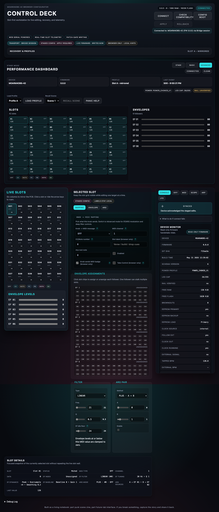

# App Bench Summary: App Over Bridge Session

Date/time: 2026-05-31 21:55 CDT (`logs/app-bridge-session-20260531-215356.json` captured at `2026-06-01T02:55:22.786Z`)
Git commit/tag: `f15aa3a64848e379133e9d7c37234cab1aa76283`
Host OS: macOS 26.5 (build 25F71)
Browser: Playwright Chromium 141.0.7390.37 (headless)
Node version: `v24.13.0`
Bridge mode: source (`npm --prefix bridge start`)
App URL: `http://127.0.0.1:8787/app/`
Bridge console URL: `http://127.0.0.1:8787/`
Firmware env flashed: unknown/not captured
Firmware git_sha: `f15aa3a`
Schema version: `6`
Board revision: unknown/not captured
Board rework state: unknown/not captured
Serial port: `/dev/cu.usbmodem192460701`
Transport mode reported by App: `bridge-session`
Raw fallback used: no
Artifact paths: local run artifact `logs/app-bridge-session-20260531-215356.json`, committed screenshot [app-bridge-session-live.png](../../images/app-bridge-session-live.png)

## Exact test actions

1. Started the Bridge console from source with `npm --prefix bridge start`.
2. Connected the Bridge to serial `/dev/tty.usbmodem192460701` with MIDI label `IAC 1 Bus 1`.
3. Waited for Bridge `ready` and cached session hydrate over `HELLO`, manifest, schema, and config.
4. Opened `/app/` from the Bridge-served origin and clicked `Connect`.
5. Verified the App showed `Transport · Bridge session` and the banner text `via Bridge session`.
6. Recorded the hydrated App state:
   - firmware `MOARkNOBS-42` / `0.0.0`
   - firmware git `f15aa3a`
   - schema source `device`
   - `filter.freq = 20`
   - power summary `POWER_CHOKED_V1`, LED cap `26`, rail `UNVERIFIED`
7. Used the Filter panel number input to stage `filter.freq` from `20` to `21`.
8. Confirmed the dirty badge appeared and the staged diff contained only `filter.freq: 20 -> 21`.
9. Clicked `Apply` and waited for `Synced`.
10. Recorded the acknowledged checksum `d547b21086c23f5f7998817ad168e985bb7c0ea714f3866209c9c388f38a5cb4`.
11. Confirmed live and staged config both reported `filter.freq = 21` with no remaining diff.
12. Restored `filter.freq` from `21` to `20` through the same Filter input.
13. Clicked `Apply` again and waited for `Synced`.
14. Recorded the cleanup checksum `2fd405dc6bb8fd86b9758f5db2cbd3f8ac189b7055c10d113601c265fc41b18e`.
15. Confirmed live and staged config both returned to `filter.freq = 20` with no remaining diff.

## Result

PASS

## Proven

- Bridge console starts and reaches a real ready session with the attached board.
- `/app/` opens from the Bridge-served origin.
- App reports Bridge session mode, not raw Bridge fallback.
- Manifest, schema, and config hydrate succeeds from the structured Bridge session.
- One safe staged config edit (`filter.freq`) is visible in the App diff surface before apply.
- Apply succeeds with checksum-backed ACK and promotes staged state only after the acknowledged write.
- Cleanup restores the original config and returns the App to a clean no-diff state.

## Caveats

- This receipt proves the Bridge-served App path only. It is not direct WebSerial proof.
- The browser was Playwright headless Chromium on one macOS host. Do not read this as a broad browser compatibility claim.
- Firmware env, board revision, and board rework state were not encoded in the live manifest and were not separately captured during this pass.
- The screenshot was taken after the first successful apply while `filter.freq` was still `21`; the cleanup apply returned it to `20` afterward.

## Supporting evidence

- Supporting bridge receipt: [2026-05-30-structured-bridge-session-summary.md](../bridge/2026-05-30-structured-bridge-session-summary.md)
- Supporting firmware receipt: unknown/not captured

## Artifact notes

- JSON artifact: local run artifact `logs/app-bridge-session-20260531-215356.json` (not committed to the repo)
- Screenshot artifact: [app-bridge-session-live.png](../../images/app-bridge-session-live.png)
- The JSON artifact includes the initial hydrated App state, the pre-apply diff, the first apply checksum, the cleanup checksum, and a Bridge `/api/state` subset captured at the end of the run.
