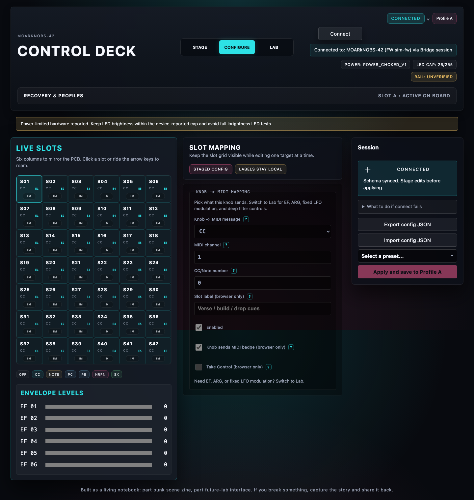

# App Surface Capture: Bridge Session Simulator

Date: 2026-08-03

This is a current UI capture of the modified App surface served by Bridge and connected to the repository's MN42 device simulator. It is not a board-backed validation receipt and does not replace the historical live-session evidence.

Capture details:

- App origin: Bridge-served `/app/`
- Transport shown by App: `Bridge session`
- Device identity: `MOARkNOBS-42` / `sim-fw` / schema `8`
- Simulator serial path: `/dev/simulated-mn42`
- Power boundary displayed: `POWER_CHOKED_V1`, LED cap `26`, rail `unverified`

The capture verifies the document-facing surface can render a structured Bridge session with the current App layout. Re-run a board-backed HIL session before making firmware, transport, or hardware claims.
