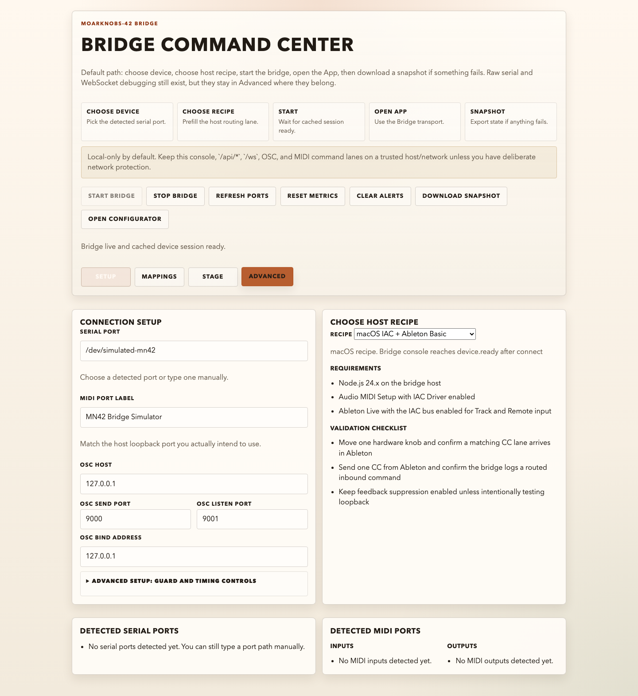
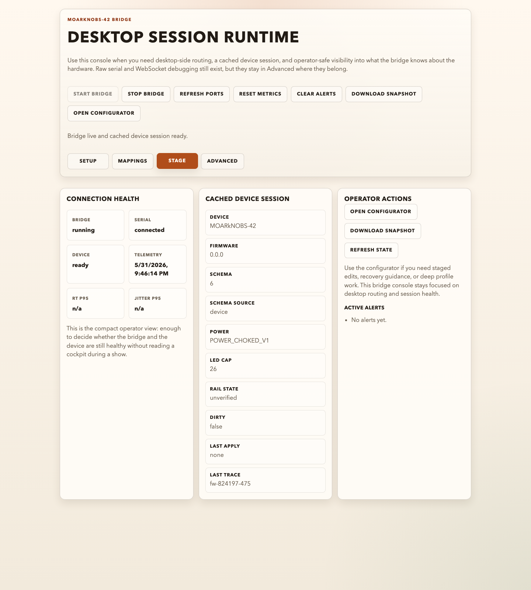
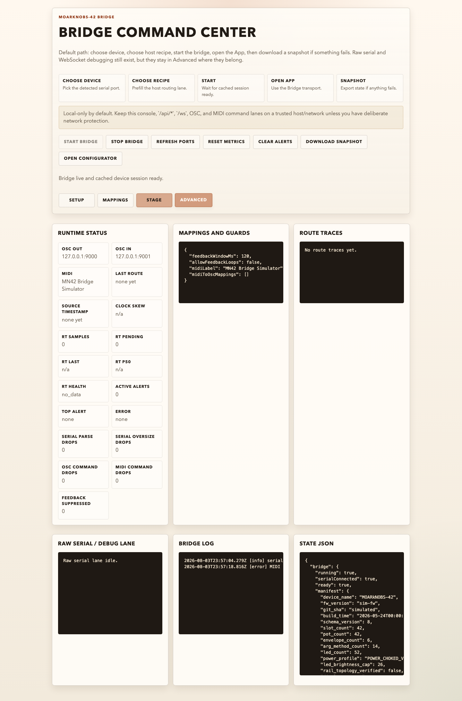

# Bridge Console Tour

The Bridge console is the operator-facing desktop view for `MN42 Bridge`. Use it when you need desktop OSC/MIDI routing, a cached device session, or an App-over-bridge path that does not depend on browser WebSerial support.

For the full Bridge doc split, see [Bridge Docs Map](BridgeDocsMap.md).
For transport and support-boundary tie-breaks, see [Bridge README](https://github.com/bseverns/MOARkNOBS-42/blob/main/bridge/README.md), [Bridge Transport Contract](./BridgeTransportContract.md), and [Bridge Write Lanes](./BridgeWriteLanes.md).

## Before You Start

- Start the console with `npm --prefix bridge start`.
- Open `http://127.0.0.1:8787/`.
- Use Node `24.x` only; the Bridge package still pins `>=24 <25`.

Screenshot note: the images below were recaptured on 2026-08-03 from the local Bridge console against the repository's MN42 device simulator. They show the current operator labels and a complete cached Bridge session, but are UI documentation—not hardware validation evidence.

Simulator session example from this capture:

- serial path: `/dev/simulated-mn42`
- firmware identity: `MOARkNOBS-42` / schema `8` / git `simulated`
- power boundary: `POWER_CHOKED_V1`
- LED cap: `26`
- rail state: `unverified`

## Setup Mode

Setup mode is where a non-developer operator should start.

This capture shows a complete setup path, including the simulator serial path, a simulator MIDI label, and the top-line `Bridge live and cached device session ready.` status after the operator has started the Bridge.

- `Serial port` is the firmware USB path. Pick a detected entry from the list or type it manually if the detector missed it.
- `MIDI port label` should match the host loopback port you intend to use.
- `OSC host`, `OSC send port`, `OSC listen port`, and `OSC bind address` define where the Bridge publishes and listens.
- `Feedback guard` and `alert suppression` tune operator safety and log noise; leave them at defaults unless you have a documented host reason to change them.
- `Known-good recipe` prefills documented host settings and shows a short checklist. It is the fastest safe path for an operator who is not debugging custom routing.
- `My Performance Setups` saves named copies of computer/rig routing, destination names, mappings, optional notes, and an advisory suggested device profile in this browser. Loading a setup only fills the form; it never starts or restarts routing or changes firmware state. Use JSON export/import to back up the collection or move it to another browser.
- `Start bridge` launches the desktop runtime. `Stop bridge` remains available in every mode, is visually marked as destructive, and asks for confirmation before disconnecting the serial/MIDI/OSC runtime. `Refresh ports` rescans serial and MIDI devices.

Performance Setups are personal operator convenience, not known-good recipes or host-validation evidence. When routing is already running, stop and start the Bridge deliberately after loading a setup whose MIDI or OSC transport values should take effect.

### Serial Port Selection

The serial chooser is intentionally simple:

- Prefer the detected list first.
- If the board appears as `/dev/tty.*` on macOS, the console will prefer the matching `/dev/cu.*` path for you.
- If nothing is detected, you can still type the port path manually and start the Bridge.

## Mappings Mode

Mappings mode provides a guided, passive MIDI-learn path for custom MIDI CC → OSC routing:

1. Start the Bridge and select `Listen for MIDI CC`.
2. Move one knob, fader, or pedal. The console captures its channel and CC number from the inbound route trace; feedback-suppressed echoes are ignored.
3. Choose a recently observed custom outbound OSC address or type the destination required by your host patch. The learner excludes the reserved `/mn42/*` namespace because those addresses have documented payload contracts.
4. Review the inline mapping summary and select `Confirm and add mapping`.

Learning does not emit MIDI, OSC, or device writes. Adding or removing a confirmed mapping updates the live Bridge routing configuration without restarting transports. A custom mapping is additive: its inbound CC still follows the existing typed OSC and device-control lanes. Custom mappings remain intentionally limited to MIDI CC input and OSC output; use the Advanced route trace when you need to verify a more complex typed-event path.

## Stage Mode

Stage mode is the compact operator view. It is meant to answer “is the Bridge healthy?” without exposing raw debugging detail.

In the screenshot above, the simulated device is connected, `Device` is `ready`, and the cached session shows the simulator's `POWER_CHOKED_V1` boundary with `LED cap 26` and `rail state unverified`.

- `Bridge`, `Serial`, and `Device` show whether the desktop runtime is running, whether the serial link is up, and whether the device session is actually ready.
- `Telemetry` reports `live`, `delayed`, `stale`, or the relevant stopped/disconnected state instead of presenting an old timestamp as current activity. `RT p95` and `Jitter p95` summarize whether round-trip timing is staying inside configured targets.
- `Routing heartbeat` shows the most recent Device → OSC, Device → MIDI, OSC → Device, and MIDI → Device routes. Recently observed lanes pulse; older lanes report how long ago they were seen.
- `Cached device session` shows the last known firmware identity, schema version/source, power profile, LED cap, rail state, config-export validation, device truth, draft state, and last apply result.
- `Operator actions` keeps only the show-safe actions visible:
  - `Open configurator`
  - `Download snapshot`
  - `Refresh state`

When validation fails, a draft is staged, or device authority differs from the candidate, Stage changes the App action to `Open App to resolve` and explains why the cached state needs attention.

### Passive Soundcheck

`Start passive soundcheck` is write-free. It captures a live slot-telemetry baseline, asks the performer to move one stable, unmodulated hardware control, detects the next slot-value change, and checks whether matching route traces reached OSC and MIDI. It does not generate MIDI notes, OSC commands, slot writes, or synthetic device movement. LFO or envelope modulation can also change slot telemetry, so use a stable slot when you want the result to correspond to a deliberate physical move.

The result reports OSC and MIDI independently. A missing lane means only that the Bridge did not observe that route during the check; confirm the selected host recipe, destination availability, and Advanced route trace before treating it as a hardware fault.

### What “Session Ready” Means

The console reports the session as ready only after the Bridge has cached all of the following:

- `HELLO`
- `GET_MANIFEST`
- `GET_SCHEMA`
- `GET_CONFIG`

Until then, Stage mode may show `awaiting HELLO`, `awaiting handshake`, or empty cached-session fields. That is expected during startup or after a reconnect.

In the screenshots for this tour, `ready` means the Bridge has already cached device identity, schema authority, a live config snapshot, and conservative power-boundary fields. Confirm those values on attached hardware before relying on them for a release or performance decision.

### App Launch

`Open configurator` launches `/app/` through the Bridge server, not through direct browser WebSerial.

That means:

- the App prefers the structured Bridge session when available
- the App can still fall back to raw Bridge `/ws` compatibility if structured session setup fails
- desktop OSC/MIDI routing can stay active while the operator uses the configurator

## Advanced Mode

Advanced mode is the diagnostic view. It is still operator-usable, but it assumes you need evidence rather than a quiet status board.

This simulator capture shows three useful student-facing examples at once:

- the runtime and cached session are present
- the raw serial/debug lane and route trace surfaces are available for diagnosis
- the state JSON includes the same cached power and firmware identity fields shown in Stage mode

- `Runtime status` expands the performance and error counters: OSC/MIDI endpoints, last route, source timestamp/skew, round-trip samples, parse drops, command drops, and feedback suppression counts.
- `Mappings and guards` shows the active MIDI-to-OSC mapping snapshot and guard settings.
- `Route traces` shows recent routed events at a human-readable level.
- `Raw serial / debug lane` is the direct line-oriented device feed. Use it only when you need to confirm exactly what the firmware emitted.
- `Bridge log` is the console/service log stream.
- `State JSON` is the most complete machine-readable snapshot of what the Bridge currently believes.

## Student Demo Path

For a classroom walk-through, use the same order the console uses:

1. Start in `Setup` and point out the exact serial port and MIDI label the host will use.
2. Switch to `Stage` and wait for `Device` to become `ready`.
3. Call out the cached session facts that matter most:
   - firmware identity
   - schema version/source
   - power profile / LED cap / rail state
   - dirty state and last apply result
4. Open `Advanced` only after the students understand that `Stage` is the operator truth surface and `Advanced` is the evidence/debug surface.

That sequence keeps the lesson anchored on operator decisions first, then on lower-level traces.

## Warnings And Alerts

Warnings surface in two places:

- the top summary line and status cards
- the `Active alerts` list in Stage mode, which contains only unresolved alerts rather than cleared alert history

Use Advanced mode's `Clear alerts` when you intentionally want a fresh operator slate after acknowledging an issue. It asks for confirmation and warns that unresolved conditions may raise again. Do not clear alerts just to hide an unresolved fault.

Typical meanings:

- `awaiting handshake` or `awaiting HELLO`: serial link exists, but the device session is not ready yet
- `Draft state: draft staged`: staged Bridge config differs from live config and has not been promoted by a verified ACK
- `Config export: invalid`: the normalized device export failed the bundled App schema and was not accepted as live truth
- `Device truth: device differs from draft` or `apply outcome uncertain`: the operator must not infer that the candidate became live state
- `RT health` degraded or alert count rising: route timing or command health is outside the configured target window

## Snapshot, Disconnect, And Recovery Actions

The Bridge console exposes these operator actions today:

- `Stop bridge`: the practical disconnect action for the desktop runtime; it remains visible in all modes and requires confirmation
- `Download snapshot`: saves the current Bridge/session state for evidence or support review; Stage provides its own contextual copy
- `Refresh state`: re-reads current Bridge state into the console
- `Reset metrics`: an Advanced-only action that clears accumulated round-trip metrics so you can measure a fresh run
- `Clear alerts`: an Advanced-only acknowledgement action that requires confirmation

There is no dedicated Bridge-console `panic` button today. If you need deeper recovery guidance or staged-config recovery tools, use `Open configurator` and work from the App’s recovery surfaces.

## Raw Serial / Debug Lane Boundary

The raw serial pane is useful, but it is not the primary operator lane.

- Use `Stage` first for health decisions.
- Use `Advanced` only when you need evidence, traces, or direct line-level confirmation.
- Do not infer staged-config success from raw lines alone when the cached session/apply state is available; the Bridge’s structured session is the authoritative operator surface for staged/live/apply state.
