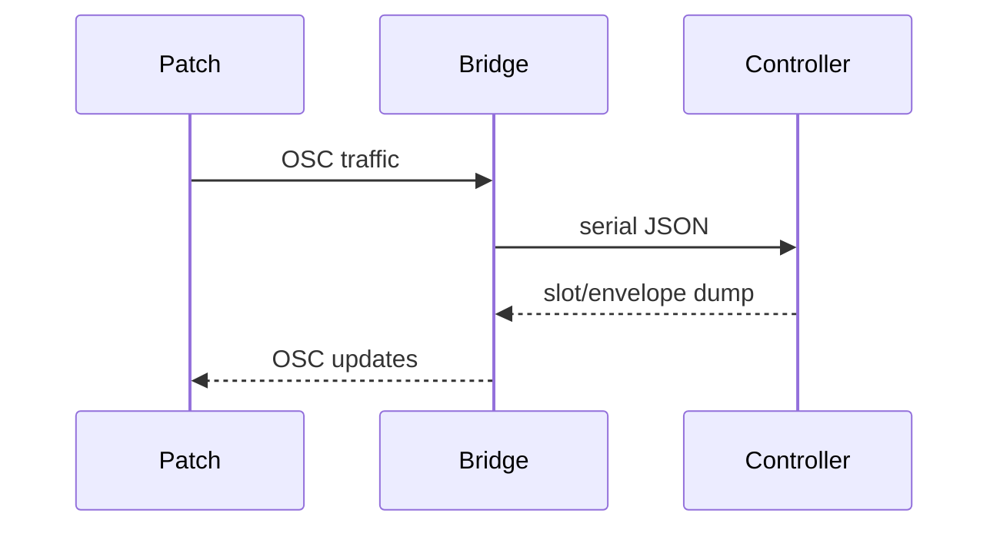

# Example Patches

These example patches show how to monitor MN42 data over OSC once the bridge is running.



## Boot the bridge

1. Plug the controller in over USB.
2. From repo root run:
   ```bash
   node bridge/mn42_bridge.js --osc 9000 --osc-listen 9000
   ```
3. Open one of the patches below.

If bridge setup is new to you, start with [`docs/OSCBridge.md`](../OSCBridge.md) and then check the full reference in [`bridge/README.md`](../../bridge/README.md).

## Pick your poison

- [max/](max/) - Max patch for slot/envelope OSC monitoring.
- [puredata/](puredata/) - same idea in Pure Data.

These are reference patches: validate routing, inspect payloads, then customize.
