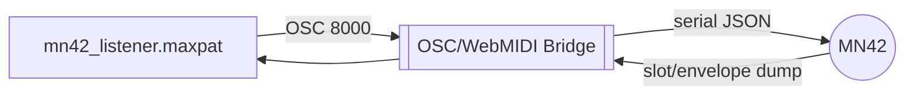

# Max Listener Patch

~~`mn42_listener.maxpat` is a bare-knuckle example of how to tap the controller from Max.~~
Kick it while the bridge howls and watch slot values and envelopes stream in.



## Run It

1. Start the [OSC/WebMIDI bridge](../../OSCBridge.md) if it's not already
   screaming:
   ```bash
   node bridge/mn42_bridge.js
   ```
2. Open `mn42_listener.maxpat` in Max.
3. The patch's `udpreceive 8000` object will snarf the OSC messages and spit
them into number boxes.

From there you can reroute the data, map it to UI, or feed it into whatever
sound mayhem you're building. Tear it apart; it's just a starting block.
