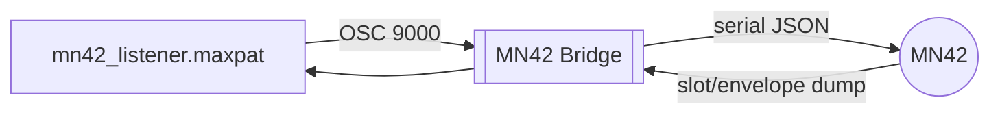

# Max Listener Patch

`mn42_listener.maxpat` is a minimal monitor patch for bridge OSC output.



## Run it

1. Start the bridge:
   ```bash
   node bridge/mn42_bridge.js --osc 9000 --osc-listen 9000
   ```
2. Open `mn42_listener.maxpat` in Max.
3. The patch's `udpreceive 9000` object receives `/mn42/slots` and `/mn42/envelopes`.

Use it as a starting point for mapping, visuals, or DAW control.
