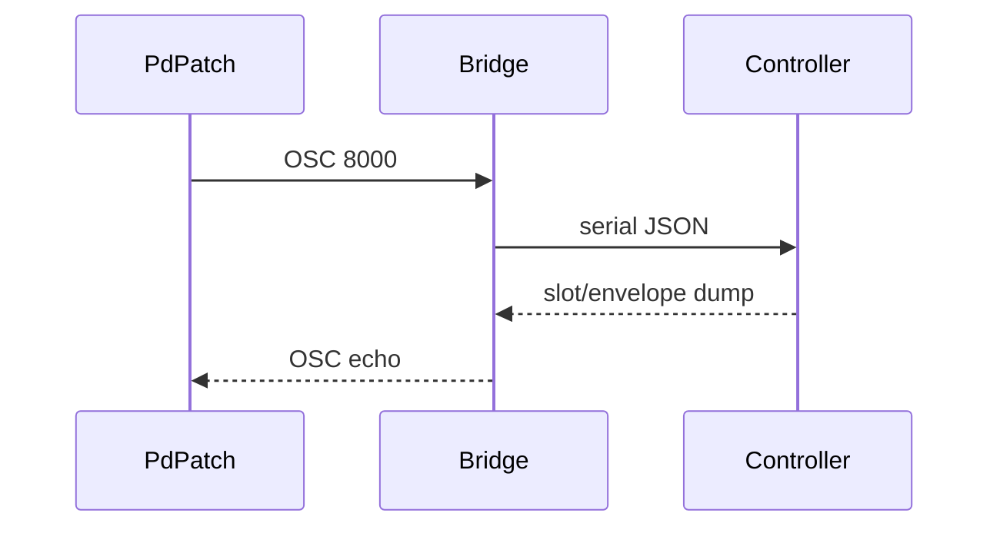

# Pure Data Listener

~~`mn42_listener.pd` does the same trick as the Max patch but keeps it free and open.~~
It listens on port `8000`, dumping slot and envelope numbers without a price tag.



## Spin It Up

1. Kick on the [OSC/WebMIDI bridge](../../OSCBridge.md):
   ```bash
   node bridge/mn42_bridge.js
   ```
2. Launch Pure Data and open `mn42_listener.pd`.
3. The `netreceive -u -b 8000` object waits for the OSC stream and routes the
   slot/envelope data to the rest of the patch.

Hack it to route CVs, drive visuals, or whatever madness you need. It's a
reference point—take it further.
