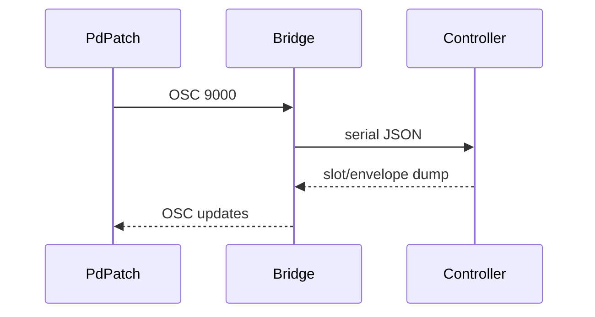

# Pure Data Listener

`mn42_listener.pd` is the Pure Data version of the OSC monitor patch.



## Run it

1. Start the bridge:
   ```bash
   node bridge/mn42_bridge.js --osc 9000 --osc-listen 9000
   ```
2. Open `mn42_listener.pd` in Pure Data.
3. The `udpreceive 9000` object receives `/mn42/slots` and `/mn42/envelopes`.

From there, route the values anywhere in your patch graph.
