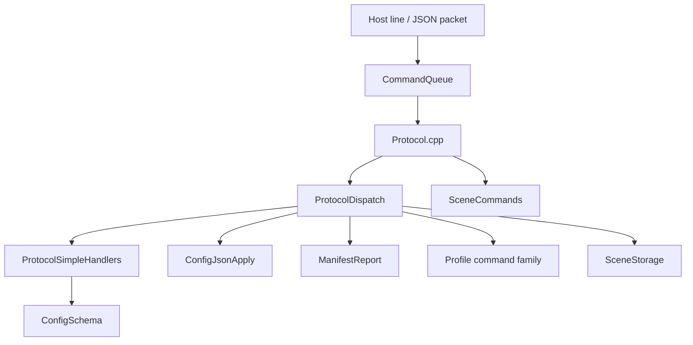

# Protocol Stack Reading Path

This is an orientation doc. For document tie-break rules, see
[Documentation Truth Map](../reference/DocumentationTruthMap.md).

The protocol stack is the firmware's host-facing machine.

If `Runtime.cpp` answers "how does the instrument keep running?", the protocol
stack answers "how does a host connect, inspect state, and request safe
changes?"

Use this guide when you want to understand the configurator/debug lane as a
machine instead of reading protocol files in arbitrary order.

## The Core Questions

Read the stack in this order if you want to keep answering these questions:

1. How does one host line enter the firmware?
2. How is that line split into command name and payload?
3. Which submachine owns this command family?
4. Is this a direct live read/write, a bulk config apply, or a stored-state
   operation?
5. Which file should I read next?

## Start Here

Begin with [`firmware/include/Protocol.h`](https://github.com/bseverns/MOARkNOBS-42/blob/main/firmware/include/Protocol.h)
and [`firmware/src/protocol/Protocol.cpp`](https://github.com/bseverns/MOARkNOBS-42/blob/main/firmware/src/protocol/Protocol.cpp).

That pair defines the public host surface and the top-level execution flow.

Read it as:

1. boot-time protocol bring-up
2. command queue processing
3. handler fan-out into smaller protocol submachines

`Protocol.cpp` should answer:

- how does serial/configurator traffic enter?
- what gets initialized before the runtime boots?
- which handler family owns a given command next?

## The Stack Shape

_Alt text: Flowchart showing host traffic entering the command queue, passing
through Protocol.cpp, and then fanning into dispatch, scene JSON handling,
simple handlers, schema construction, bulk config apply, manifest reporting,
profile commands, and scene storage._

## Read The Submachines In This Order

### 1. `ProtocolDispatch`

Files:

- [`firmware/include/protocol/ProtocolDispatch.h`](https://github.com/bseverns/MOARkNOBS-42/blob/main/firmware/include/protocol/ProtocolDispatch.h)
- [`firmware/src/protocol/ProtocolDispatch.cpp`](https://github.com/bseverns/MOARkNOBS-42/blob/main/firmware/src/protocol/ProtocolDispatch.cpp)

Question answered: how does one complete line get routed?

This is the command-router submachine:

- `ParsedCommand` measures command name versus payload
- the compact handler table maps names to handler families; lookup scans the
  table so a handler remains reachable even if a future edit changes its order
- unknown commands fall back to the focused `LegacyConfigCommands` compatibility
  handler only after the named command table misses

Read this before the deeper handlers so you know the routing policy first.

### 2. `ConfigJsonApply`

Files:

- [`firmware/include/protocol/ConfigJsonApply.h`](https://github.com/bseverns/MOARkNOBS-42/blob/main/firmware/include/protocol/ConfigJsonApply.h)
- [`firmware/src/protocol/ConfigJsonApply.cpp`](https://github.com/bseverns/MOARkNOBS-42/blob/main/firmware/src/protocol/ConfigJsonApply.cpp)

Question answered: how does `SET_ALL` become a safe whole-machine mutation?

This is the bulk-config apply submachine:

- chunk assembly
- checksum/config ID handling
- full JSON parse
- live state mutation
- ACK discipline

This is the heaviest protocol path because it is the full staged-apply lane.

### 3. `ProtocolSimpleHandlers`

Files:

- [`firmware/include/protocol/ProtocolSimpleHandlers.h`](https://github.com/bseverns/MOARkNOBS-42/blob/main/firmware/include/protocol/ProtocolSimpleHandlers.h)
- [`firmware/src/protocol/ProtocolSimpleHandlers.cpp`](https://github.com/bseverns/MOARkNOBS-42/blob/main/firmware/src/protocol/ProtocolSimpleHandlers.cpp)

Question answered: which host requests are simple direct reads/writes?

This family is best read in its own internal order:

1. deprecated compatibility shims
2. identity/config export reads
3. live runtime inspection reads
4. direct live-control writes

This is where most narrow `GET_*` and `SET_*` commands live.
`GET_SCHEMA` delegates its host-contract construction to
`protocol/ConfigSchema.cpp`. That adapter returns the generated device
projection in `protocol/GeneratedConfigSchema.h`; the machine source is
`App/config_schema.json` plus the projection rules in
`interop/mn42_contract.json`. Schema generation is not a persistence concern.

### 4. `ProtocolErrors`

Files:

- [`firmware/include/protocol/ProtocolErrors.h`](https://github.com/bseverns/MOARkNOBS-42/blob/main/firmware/include/protocol/ProtocolErrors.h)
- [`firmware/src/protocol/ProtocolErrors.cpp`](https://github.com/bseverns/MOARkNOBS-42/blob/main/firmware/src/protocol/ProtocolErrors.cpp)

Question answered: how are host-visible error packets formatted consistently?

This is a small support submachine, but it matters because it keeps protocol
failure language stable.

### 5. `ManifestReport`

Files:

- [`firmware/include/protocol/ManifestReport.h`](https://github.com/bseverns/MOARkNOBS-42/blob/main/firmware/include/protocol/ManifestReport.h)
- [`firmware/src/protocol/ManifestReport.cpp`](https://github.com/bseverns/MOARkNOBS-42/blob/main/firmware/src/protocol/ManifestReport.cpp)

Question answered: how does the firmware describe its identity and capabilities
to hosts?

This is where:

- firmware identity
- counts and schema version
- capability gating
- brownout / EEPROM health
- free RAM / flash telemetry

become one host-visible manifest.

### 6. The Profile Family

Files:

- [`firmware/include/protocol/ProfileCommands.h`](https://github.com/bseverns/MOARkNOBS-42/blob/main/firmware/include/protocol/ProfileCommands.h)
- [`firmware/src/protocol/ProfileCommands.cpp`](https://github.com/bseverns/MOARkNOBS-42/blob/main/firmware/src/protocol/ProfileCommands.cpp)
- [`firmware/include/protocol/ProfileSetHandler.h`](https://github.com/bseverns/MOARkNOBS-42/blob/main/firmware/include/protocol/ProfileSetHandler.h)
- [`firmware/src/protocol/ProfileSetHandler.cpp`](https://github.com/bseverns/MOARkNOBS-42/blob/main/firmware/src/protocol/ProfileSetHandler.cpp)
- [`firmware/include/protocol/ProfileMacroHandlers.h`](https://github.com/bseverns/MOARkNOBS-42/blob/main/firmware/include/protocol/ProfileMacroHandlers.h)
- [`firmware/src/protocol/ProfileMacroHandlers.cpp`](https://github.com/bseverns/MOARkNOBS-42/blob/main/firmware/src/protocol/ProfileMacroHandlers.cpp)

Question answered: how do stored profile slots and macro snapshots interact
with live runtime state?

Read these in order:

1. `ProfileCommands`
   this is the slot lifecycle layer: save/load/reset
2. `ProfileSetHandler`
   this is the structured JSON patch lane for `SET_PROFILE`
3. `ProfileMacroHandlers`
   this is the host-command wrapper family for profile reads, macro snapshots,
   and arp utility commands

### 7. The Scene Family

Files:

- [`firmware/include/protocol/SceneCommands.h`](https://github.com/bseverns/MOARkNOBS-42/blob/main/firmware/include/protocol/SceneCommands.h)
- [`firmware/src/protocol/SceneCommands.cpp`](https://github.com/bseverns/MOARkNOBS-42/blob/main/firmware/src/protocol/SceneCommands.cpp)
- [`firmware/include/protocol/SceneStorage.h`](https://github.com/bseverns/MOARkNOBS-42/blob/main/firmware/include/protocol/SceneStorage.h)
- [`firmware/src/protocol/SceneStorage.cpp`](https://github.com/bseverns/MOARkNOBS-42/blob/main/firmware/src/protocol/SceneStorage.cpp)

Question answered: how does the firmware capture and restore whole-machine
snapshots outside the profile-slot model?

Read these in order:

1. `SceneCommands`
   JSON front door for `GET_SCENES`, `SAVE_SCENE`, `RECALL_SCENE`
2. `SceneStorage`
   whole-machine snapshot capture/apply plus scene and macro persistence.
   Runtime-only restoration during a failed durable apply is write-free: it
   restores live state without mutating storage.

## A Useful Mental Split

The protocol stack becomes much easier to hold in your head if you split it
into three host-facing lanes:

### 1. Identity and inspection

Examples:

- `HELLO`
- `GET_MANIFEST`
- `GET_SCHEMA`
- `GET_CONFIG`
- `GET_CLOCK`
- `GET_JITTER`

These tell the host what the firmware is and what it is doing now.

### 2. Direct live writes

Examples:

- `SET_SLOT_VALUE`
- `SET_USB_MIDI`
- `SET_NOTE_DYNAMICS`
- `SET_CLOCK`

These mutate live runtime state directly without pretending they are the full
staged configuration contract.

### 3. Whole-state and stored-state writes

Examples:

- `SET_ALL`
- `SET_PROFILE`
- `SAVE_PROFILE`
- `LOAD_PROFILE`
- `SAVE_SCENE`
- `RECALL_SCENE`

These are the heavier paths where persistence, snapshots, and whole-machine
state become important.

## Where This Stack Meets The Rest Of The Firmware

The protocol stack is not isolated. It crosses into:

- [`FirmwareState.h`](https://github.com/bseverns/MOARkNOBS-42/blob/main/firmware/include/FirmwareState.h) for live managers
  and runtime objects
- [`Modes.h`](https://github.com/bseverns/MOARkNOBS-42/blob/main/firmware/include/Modes.h) for profile/state rehydration
- [`ConfigManager.h`](https://github.com/bseverns/MOARkNOBS-42/blob/main/firmware/include/ConfigManager.h) for persistence
- [`Runtime.h`](https://github.com/bseverns/MOARkNOBS-42/blob/main/firmware/include/Runtime.h) indirectly through live state
  changes the runtime then consumes

That means protocol code is best understood as an adapter into the rest of the
machine, not as a sealed subsystem.

## Read Next

- [Firmware Main Reading Path](FirmwareMainReadingPath.md) for the full
  firmware entry path
- [Protocol Source README](https://github.com/bseverns/MOARkNOBS-42/blob/main/firmware/src/protocol/README.md) for the local
  source-folder order
- [Protocol Header README](https://github.com/bseverns/MOARkNOBS-42/blob/main/firmware/include/protocol/README.md) for the
  local declaration-first path
- [Protocol Walkthrough](../guides/ProtocolWalkthrough.md) for the host-facing
  narrative rather than the source layout
