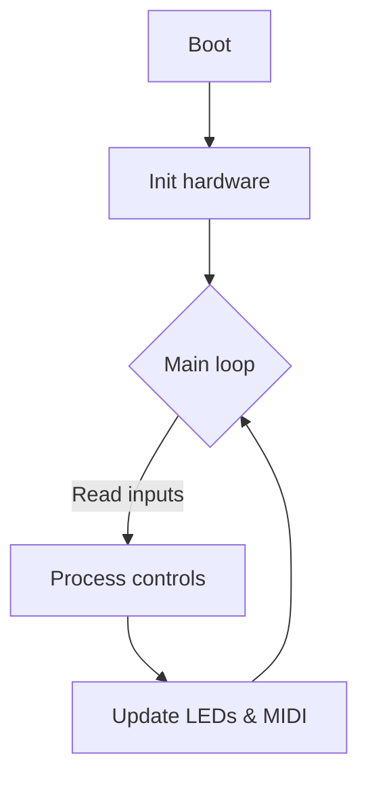
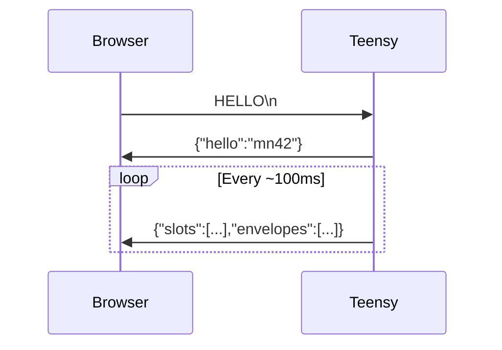

# Builder's Handbook

Welcome to the MOARkNOBS-42 build bible—the fast-and-loose guide for wiring, flashing, and taming this misfit controller. If you're holding a soldering iron and a dream, you're in the right place.

If the board throws a tantrum, consult the [Troubleshooting](../validation/Troubleshooting.md) page before you reach for the fire extinguisher.

## Wire It Up

Start with the bare essentials. We'll keep the spaghetti minimal:

1. **Power** – Feed the Teensy 5 V through `VUSB` and ground everything like your sanity depends on it.

   
   _Teensy getting 5 V on VUSB, all grounds bonded._

2. **LED Data** – Run Teensy pin `6` through a ~330 Ω resistor into the first WS2812's `DIN`. Chain the rest like dominoes.

   
   _Pin 6 hits a resistor before feeding DIN. If it looks like this, you're golden._

3. **Buttons/Encoders** – Follow the pin labels on the board. Short wires = less noise.

   
   _Each ribbon lands on its labeled pad; no loose strands, no drama._

4. **Decoupling** – Drop a 0.1 µF ceramic between 5 V and GND near the Teensy and again at the LED strip. It's cheaper than smoke.
5. **Wire Gauge** – 22 AWG for power runs, 24 AWG stranded for data. Keep anything carrying bits under 30 cm unless you like debugging antennas.

Reference diagrams are carrying the visual load for now; bench photos will be added once the current prototype boards return from fabrication.

### Wiring Habits

- Twist power and ground together; the pair that hums together stays quiet together.
- Heat‑shrink every joint so nothing shorts when the roadies throw the rig in a van.
- If it bends, give it strain relief—zip ties, hot glue, chewing gum, whatever keeps the Teensy from doing yoga.

### Why this matters

Mess up the power or data line and the board either sulks or smokes. A clean wiring job saves you hours of "why is nothing blinking?".

### Runtime LED control

The WS2812 strip isn’t just a wiring exercise—the firmware persists brightness and color all the way through EEPROM and the profile system. `GET_CONFIG` shows the current `led` object (brightness, RGB, hex), `SET_LED` stores new values, and `SET_ALL` can ship `{"led":{"color":"#00ffee"}}` fragments to pick a shade for the whole rig. You still drive the data line through pin 6, but the LEDManager now listens to the LFO bus (`LedBrightness` target) and updates the strip as soon as a profile loads, a `SET_LED` lands, or an envelope follower tips a slot. The status LED on pin 23 pulses whenever a diagnostic counter increments (UART overruns, dropped MIDI, slow loops), so it’s the quickest smoke test when you suspect the firmware is under stress.

## Flash the Brain

1. **Install PlatformIO** – `pip install -r requirements.txt` or use the VS Code add-on. Old-school? Arduino IDE with Teensyduino works too.
2. **Plug in the Teensy 4.0** over USB.
3. **Build and upload** the main firmware from the repo root:
   ```bash
   pio -d firmware run -t upload -e teensy40_main
   ```
   The loader will yell success when it's done.
4. **Local library stash** – We archive FastLED and the Adafruit display libs under `firmware/lib/`.
   PlatformIO grabs these first, so builds don't choke when you're offline or the registry glitches.
   To refresh them, pull the latest release from upstream, drop it in that folder, and keep the license file.

### Firmware Flow



### Why this matters

Knowing the firmware loop helps you predict how fast the box reacts and where to poke when hacking features.

## LFO Engine

Two low‑frequency oscillators live inside the firmware for modulation work. Each LFO can free‑run in Hz or lock to the MIDI clock (24 PPQN), with depth and polarity controls per instance.

```cpp
#include "LFO/LFOManager.h"

LFO &lfo1 = lfoManager.lfo(0);
lfo1.setShape(LFOShape::Sine);
lfo1.setFrequencyHz(1.0f);
lfo1.setDepth(0.75f);
lfo1.setBipolar(false);
lfo1.setSyncEnabled(true);
lfo1.setSyncRatio(LFOSyncRatio::Div4); // 1 cycle per 4 beats
```

The LFO bus can drive internal targets like EF gain trim, arp swing, or LED brightness, and can be routed out over MIDI/OSC via the routing layer.

The same LFO state lives inside each profile snapshot. `GET_PROFILE` returns the `lfos` array plus the `routes` table (internal targets, MIDI CC7/CC14, and OSC callbacks), and `SET_PROFILE` lets you persist changes by sending a JSON payload with partial updates. When a profile loads, the firmware replays those shapes, depths, and routes via `LFOManager::applyProfile`, so the LEDs, arpeggiator, and envelope gain trim all jump to the stored motion before you touch a knob. The normalized outputs are mirrored in `g_lfoValues` and the WebSerial `lfos` telemetry so the UI and OLED draw the same oscillations the scheduler runs.

## Arpeggiator

The arpeggiator can run UP, DOWN, UP-DOWN, RAND, DRUNK, or EUCL patterns, synced to MIDI clock (24 PPQN) or the internal tapped BPM fallback. Step length stays in ticks, while swing and gate length are percent-based so timing scales with tempo.

- **Toggle:** `Ctrl2 + Ctrl4` turns the arp on/off for the active slot.
- **Edit (hold):** Long-press `Ctrl2 + Ctrl4` to enter Arp Edit while held; Control pot 1 sets gate length %, Control pot 2 sets octave range (0–3).
- **Swing presets:** Long-press `Ctrl2 + Ctrl3` to cycle 0%, 8%, 16%, 30%.
- **Base note:** Short press `Ctrl2 + Ctrl3` bumps the base note.

## First-Run Tests

Once the firmware's on board, make sure the basics don't flake out:

1. **Blink test** – Drop this mini sketch in `firmware/test/` and upload it the same way:
   ```cpp
   #include <FastLED.h>
   #define LED_PIN 6
   #define NUM_LEDS 1
   CRGB leds[NUM_LEDS];
   void setup(){ FastLED.addLeds<WS2812, LED_PIN, GRB>(leds, NUM_LEDS); }
   void loop(){
     leds[0]=CRGB::Green; FastLED.show(); delay(500);
     leds[0]=CRGB::Black; FastLED.show(); delay(500);
   }
   ```
   If that lone pixel blinks, you're in business.
2. **Button sanity** – Build the hardware test suite:
   ```bash
   pio -d firmware run -e teensy40_full_system
   ```
   Follow the serial prompts to poke every switch and LED.

### Why this matters

Catching a dead LED or flaky button now beats reflowing it after the enclosure's buttoned up.

## Button Controls

Need a crash course in front‑panel mayhem? Here's how the six control buttons misbehave. _EF = Envelope Follower._

| Button | Short Press                         | Long Press                 | Double Press                  |
| ------ | ----------------------------------- | -------------------------- | ----------------------------- |
| #0     | Toggle EF                           | Calibrate EF baseline      | Cycle EF filter forward       |
| #1     | Next Slot                           | Reload profile from EEPROM | Cycle EF filter backward      |
| #2     | Cycle EF assignment                 | Toggle Slot Active         | Cycle MIDI Type (CC/Note/etc) |
| #3     | Cycle MIDI Channel                  | Reset EEPROM               | —                             |
| #4     | Cycle registry number (CC/NRPN/RPN) | Save config                | —                             |
| #5     | Tap BPM                             | —                          | —                             |

**Slot Buttons (0–41):**
Short press selects the slot. Long press assigns or cycles the Envelope Follower and flips it on; once it’s awake, jab Control 0‑5 to lock to a specific EF.

### Why this matters

Learning the combos early means you perform tricks live instead of digging through docs mid‑set.

If you want the combinations grouped by intention instead of by raw button matrix, read [Combo Guide](../guides/ComboGuide.md).

## WebSerial in the Wild

The Teensy screams JSON snapshots over WebSerial so the browser can watch the synth wiggle in real time.



### Why this matters

WebSerial lets you tweak patches from a browser without custom software. It's quick feedback with zero driver drama.

## What Could Go Wrong?

- **No common ground** – LEDs ghost or don’t light. Tie every ground together like you mean it.
- **Wrong pin** – LED data on any pin but 6? Enjoy the dark.
- **Power sag** – feeding 52 WS2812s from a wimpy supply causes brownouts and swearing.
- **Missing libraries** – PlatformIO fails fast if dependencies vanish. Check `platformio.ini` before blaming the hardware.
- **Bootloader naps** – if the Teensy doesn’t auto‑program, hit its button to jolt the bootloader awake.

### Why this matters

These classics ruin weekends. Keep them in mind and you'll spend more time making noise than troubleshooting.

## Profiles

The rig hoards four full configuration profiles (A–D) in EEPROM. Each slot stores pot mappings, LED brightness/color, envelope routing (including follower-to-multi-slot mappings), ARG/filter details, and the entire modulation matrix (arpeggiator timing + shape, LFO shapes/depths/routes, and per-slot MIDI channel/EF payloads). The WebSerial [`GET_PROFILE`](../guides/WebSerial.md#profiles-and-modulation-snapshots) response exposes this snapshot so editors can replay the same state in software, and `SET_PROFILE` lets you persist a partial or complete payload back to the board. When you load a profile, the firmware replays the stored LED color, LFO routes, and slot envelope parameters instantly before your pots/docs move again.


The hero banner mirrors those slots: tap A–D to pick the active profile, then use **Save profile**, **Load profile**, or **Reset profile** to call the UI’s RPC helpers. Save will stage the current diff and then invoke `SET_PROFILE` for that slot, while Load clears the diff and re-fetches the stored snapshot via `GET_PROFILE`. Reset restores the slot to factory defaults and pushes them back through `SET_PROFILE` so the desk stays tidy.

For crash recovery and sharing, download the staged profile as JSON or upload a backup file that stages immediately (the UI also mirrors the last staged state to `localStorage`, so a reload keeps unsent edits handy).

If you want curated starting points before you start authoring your own maps, use the browser preset picker and keep [Preset Library](../guides/PresetLibrary.md) nearby. That page explains what each shipped preset is trying to teach and which one is best for a first pass.

- **Jump profiles** – mash **Ctrl1 + Ctrl2** to hop to the next profile. It wraps after the fourth.
- **Save the chaos** – long‑press **Ctrl4** once you've mangled the knobs to taste.
- **Panic reload** – long‑press **Ctrl1** (with the confirm jab) to yank the active profile from EEPROM.

### Why this matters

Profiles let you keep live, studio, and "what if I break everything" setups without re‑flashing, and the payload ensures every modulation bus, LED cue, and envelope follower is restored exactly as it was.

## Manual Hardware Tests

Compile the test environments when you want to verify the board outside of the main firmware:

```bash
pio run -e teensy40_full_system      # or teensy40_unified_test, etc.
# Unity harness flexes a different muscle:
pio test -e teensy40_unity
```

Available environments:

- `teensy40_full_system` – step-through checks of each subsystem
- `teensy40_unity` – Unity-driven automated tests (run with `pio test -e teensy40_unity`)
- `teensy40_unified_test` – full integration test
- `teensy40_biquad_test` – biquad filter calibration
- `teensy40_eeprom_persistence` – EEPROM backup/restore test
- `teensy40_slot_verify` – verifies MIDI slot storage

### Why this matters

Running the test rigs lets you trust the hardware before you haul it on stage.
