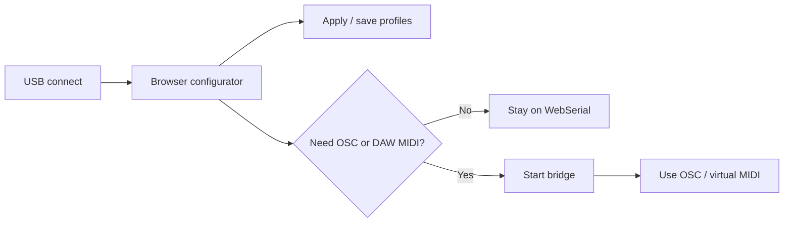

# Quickstart for Performers

This is the shortest path from plugging in the board to using it live.

## 1. Connect the board

1. Plug MOARkNOBS-42 into your computer over USB.
2. Wait for the board to enumerate.
3. If the board is new or newly flashed, confirm it responds to `HELLO` before show-day use.

## 2. Start with the browser configurator

Use the browser configurator when you want direct USB setup, profile management, and live monitoring without extra routing software.

Use **Stage** mode at a gig. It keeps connection state, firmware identity, active profile, power safety, slot activity, envelope levels, scene recall, and the documented panic-baseline help visible without exposing raw schema forms or lab panels.

Use **Configure** or **Lab** when preparing mappings. Configure keeps everyday slot mapping visible; Lab restores the full bench with EF/ARG/filter/LED editors, import/export, monitor, scope, MIDI monitor, and debug surfaces.

Use **Lab** tools for debugging. Treat those as bench surfaces, not the normal show screen.

Start here:

- [Configurator Tour](../guides/Configurator.md) for the current configurator workflow
- [Operator Tutorial](../guides/OperatorTutorial.md) for the practical operating model
- [Connectivity Guide](ConnectivityGuide.md) if you are not sure whether you need the bridge

## 3. Connect in the configurator

1. Serve the configurator from `http://localhost` or use the published project URL you normally deploy from.
2. Open the configurator. Add `?mode=stage` when you want the performer dashboard first.
3. Click **Connect**.
4. Pick the MOARkNOBS-42 serial device.
5. Wait for the connection banner to show the device identity and firmware details.

## 4. Save and load profiles

- Use profile slots `A` through `D` for on-device saved states.
- Use **Load profile** to recall a stored device state.
- Use **Save profile** after you have applied and confirmed the setup you want to keep.
- Use export/download if you want an external JSON backup as well.

More detail: [Profile Workflow](../guides/ProfileWorkflow.md).

## 5. Use the bridge only when you need it

Use the Node bridge when you need one of these:

- OSC into Max, Pd, TouchOSC, or another OSC host
- A virtual MIDI port for a DAW
- A fallback path when the browser/workstation setup is not the right tool

Bridge details: [OSC Bridge](../guides/OSCBridge.md) and [Performer Bridge Guide](../guides/BridgeForPerformers.md).

## 6. If connection fails

- Re-seat the USB cable and confirm it is a data cable.
- Reopen the configurator and reconnect.
- Serve the configurator from `http://localhost` or another allowed secure context.
- If WebSerial is not working in your browser/workflow, switch to the bridge path in [Connectivity Guide](ConnectivityGuide.md).
- If the board itself is not responding, check [Troubleshooting](../validation/Troubleshooting.md).

## 7. Before a rehearsal or public demo

- Run [Demo Test Punch List](../validation/DemoTestPunchList.md).
- Use [Validation Flow](../validation/ValidationFlow.md) if you need to decide whether the setup is merely connected, actually demo-ready, or still in bench-only status.
