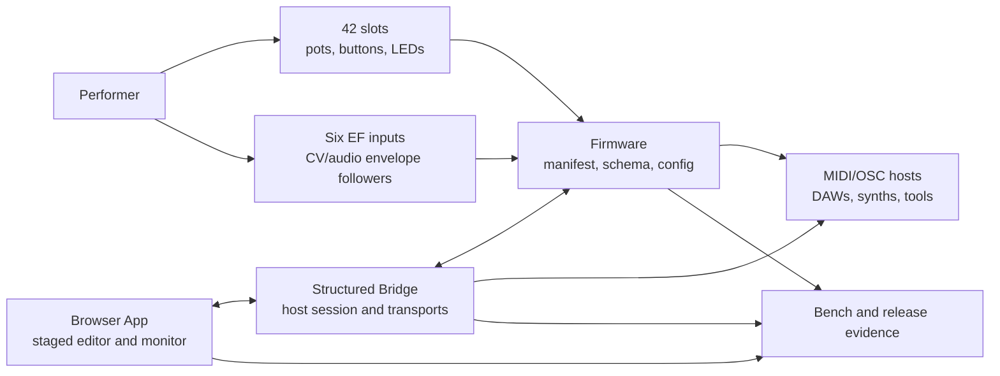

# System Map

> **Doc class:** Orientation. Use this page to see how the physical instrument, App, Bridge, firmware contracts, and evidence docs fit together.

MN42 is a specific reactive performance instrument, not a generic controller platform. The system is easiest to read as one object with several truth boundaries: the hardware exposes controls and signals, firmware owns the runtime behavior, the App stages and applies configuration, and the Bridge gives the browser a structured host/device session.

## Reading It

- The **object** is the 42-slot controller with six envelope followers and reactive modulation.
- The **firmware** is the source of truth for persisted profile/config state and supported capabilities.
- The **App** is the operator surface for staging, applying, monitoring, and profile work.
- The **Bridge** gives desktop browsers structured access to device state and host transports.
- The **contracts** define what the App, Bridge, and firmware promise to each other.
- The **evidence docs** record what has actually been tested.

## Truth Boundaries

Use the contracts when behavior matters:

- [Manifest Contract](../reference/ManifestContract.md) for firmware capabilities, schema, and release boundary data.
- [Bridge Transport Contract](../bridge/BridgeTransportContract.md) for browser-to-Bridge session behavior.
- [MN42 Line Protocol](../reference/MN42LineProtocol.md) and [Serial Protocol](../reference/SerialProtocol.md) for device command lanes.
- [Modulation Matrix Contract](../reference/ModulationMatrixContract.md) for EF, ARG, LFO, and route reporting.

Use the evidence pages when readiness matters:

- [TESTING](../validation/TESTING.md) for software and hardware-test lanes.
- [Release Criteria](../release/ReleaseCriteria.md) for release gates.
- [Bench Receipts](../bench/README.md) for observed App, Bridge, firmware, host, latency, and noise receipts.

## Next Pages

- [Object Card](ObjectCard.md) for the physical definition.
- [Configure Without Recompiling](ConfigureWithoutRecompiling.md) for what can be changed from the App/Bridge path.
- [One Signal Path](../learn/OneSignalPath.md) for a compact teaching path through the system.
- [Guided Routes](GuidedRoutes.md) if you want a role-based reading order.
