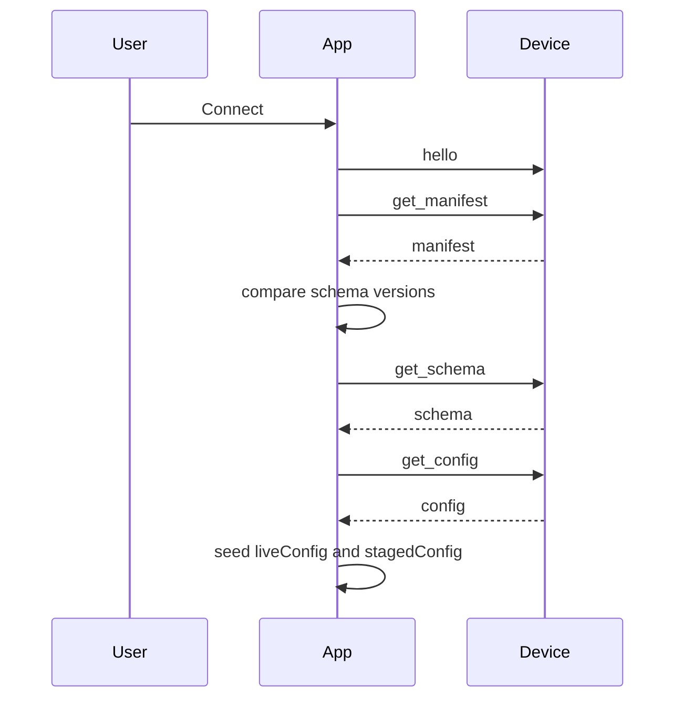
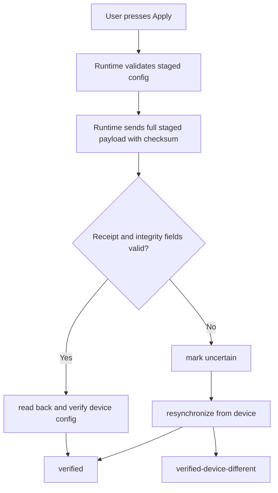

# Configurator Tour

Current App contract/support boundary: [App/README.md](https://github.com/bseverns/MOARkNOBS-42/blob/main/App/README.md), [Host Compatibility](../reference/HostCompatibility.md), [Documentation Truth Map](../reference/DocumentationTruthMap.md).

The browser app is not just a remote control. It is the safest place to understand the firmware contract because it has to negotiate identity, schema compatibility, staged edits, and confirmation from the device before pretending anything changed.

## The core idea

The configurator keeps two versions of the world:

- **live config** – what the device most recently confirmed
- **staged config** – what the user is currently editing

That split lets the UI show meaningful diffs and preserve local work. After transmission, an ambiguous outcome is resolved by authoritative device readback; it is not described as rollback. See [Configuration Transaction Model](../reference/ConfigurationTransactionModel.md).

## Connect flow

If the manifest schema does not match the app's local contract, the app raises a migration-required path before it allows live writes.

## What happens when you edit

Most controls do **not** immediately rewrite device state.

1. you change a field
2. the form system validates and clamps it against `config_schema.json`
3. the app mutates `stagedConfig`
4. the diff panel compares `stagedConfig` to `liveConfig`
5. Apply becomes available only when the staged payload is valid

Some controls can also issue field-level writes through the runtime patch lane, but even then the runtime stages locally first so the UI never loses track of intent. On native WebSerial, the production contract is still full Apply with verified ACK.

## Presets are starting points, profiles are memory

The preset picker is there to help users learn the instrument on purpose instead of by superstition.

- Picking a preset stages a candidate config in the browser.
- It does **not** persist anything until you apply it.
- It only becomes long-term device memory when you explicitly save that state into profile A, B, C, or D.

That means you can safely audition mappings, compare ideas, and keep one preset as a teaching scaffold while another becomes your actual stored performance profile.

If you want the human explanation for every shipped preset, read [Preset Library](PresetLibrary.md).

## What happens when you apply

This is the important safety behavior:

- a valid receipt starts or completes verification
- a missing or mismatched receipt means the outcome is uncertain
- authoritative readback determines what the device actually contains

## What the configurator helps users learn

The app is useful because it turns protocol details into visible actions:

- **manifest identity** becomes a connection banner
- **schema versioning** becomes migration warnings
- **config validity** becomes disabled Apply until the payload is legal
- **device patches** become visible live updates instead of invisible background state changes
- **transport uncertainty** becomes an explicit resynchronization workflow

## Where to go next

- Read [Operator Tutorial](OperatorTutorial.md) for the practical “how to operate this machine” walkthrough.
- Read [Profile Workflow](ProfileWorkflow.md) if you want the save/load/reset flow explained step by step.
- Read [Failure-First Guide](../validation/FailureFirst.md) if your mental model is forming through recovery cases.
- Read [WebSerial Protocol](WebSerial.md) for the lower-level message model.
- Read [Preset Library](PresetLibrary.md) for what each shipped preset is trying to teach.
- Read [Testing](../validation/TESTING.md) for what the simulator and Playwright suite actually prove.
- Read [Bridge For Performers](BridgeForPerformers.md) if your interest is more live workflow than development.
