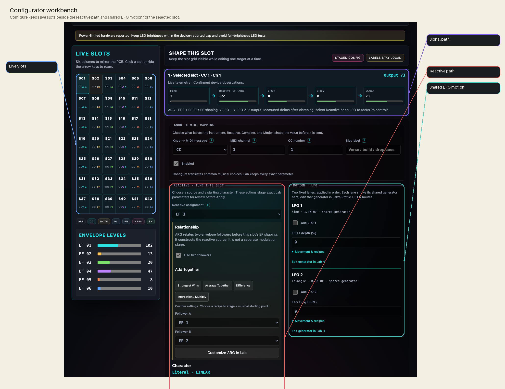
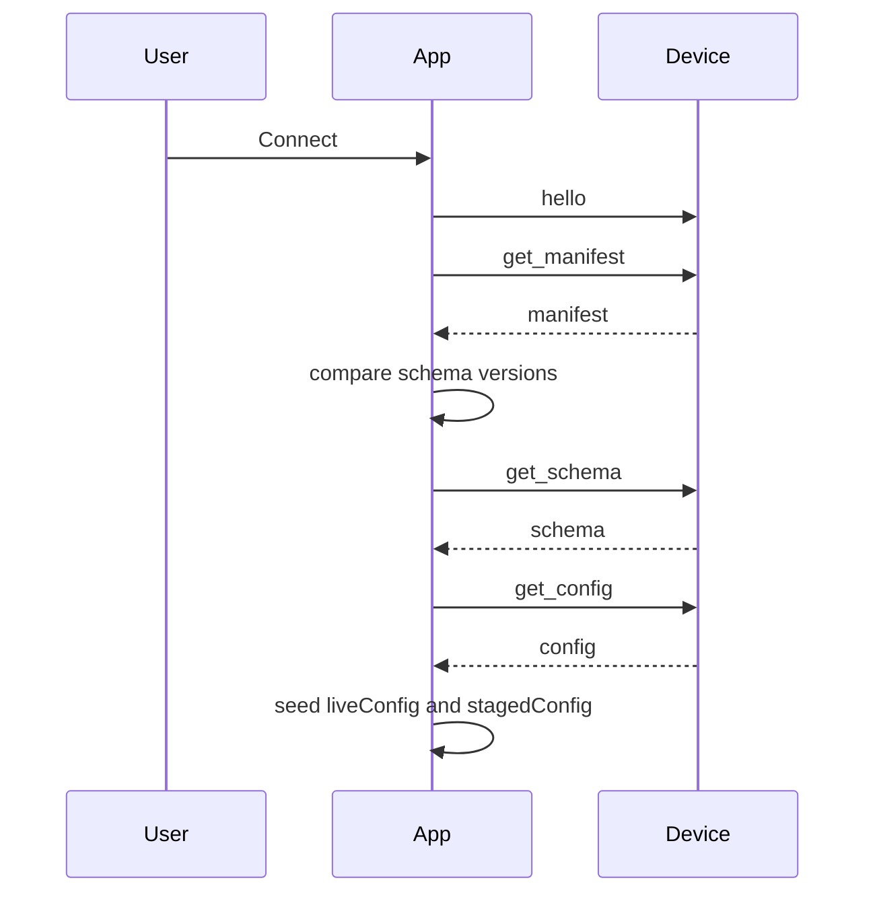
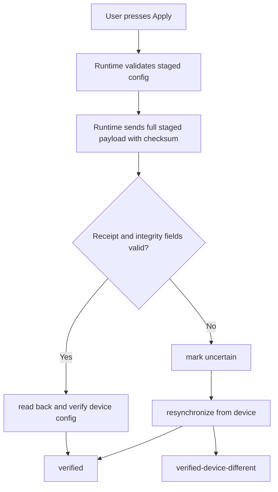

# Configurator Tour

Current App contract/support boundary: [App/README.md](https://github.com/bseverns/MOARkNOBS-42/blob/main/App/README.md), [Host Compatibility](../reference/HostCompatibility.md), [Documentation Truth Map](../reference/DocumentationTruthMap.md).

The browser app is not just a remote control. It is the safest place to understand the firmware contract because it has to negotiate identity, schema compatibility, staged edits, and confirmation from the device before pretending anything changed.




## The core idea

The configurator keeps two versions of the world:

- **live config** – what the device most recently confirmed
- **staged config** – what the user is currently editing

That split lets the UI show meaningful diffs and preserve local work. After transmission, an ambiguous outcome is resolved by authoritative device readback; it is not described as rollback. See [Configuration Transaction Model](../reference/ConfigurationTransactionModel.md).

## Connect flow



If the manifest schema does not match the app's local contract, the app raises a migration-required path before it allows live writes.

## What happens when you edit

Most controls do **not** immediately rewrite device state.

1. you change a field
2. the form system validates and clamps it against `config_schema.json`
3. the app mutates `stagedConfig`
4. the diff panel compares `stagedConfig` to `liveConfig`
5. Apply becomes available only when the staged payload is valid

Some controls can also issue field-level writes through the runtime patch lane, but even then the runtime stages locally first so the UI never loses track of intent. On native WebSerial, the production contract is still full Apply with verified ACK.

## Selected-slot tuning translates Lab; it does not replace it

Configure centers the selected slot with a persistent identity, mapping, measured output, and three musical shaping zones. It follows this progression:

```text
recipe -> musical feel -> translated summary -> exact Lab parameters
```

The App's `tuning_catalog.js` is presentation metadata only. It supplies musician-first labels, explanations, and deterministic recipe patches. `config_schema.json` still decides whether a configuration is structurally valid, and firmware/readback still decides what the device actually contains. The catalog is tested against the schema enum lists so it cannot silently add or omit a firmware value.

Configure exposes:

- **Source** — the exact EF assignment for this slot
- **Character** — small selected-slot EF recipes such as Clean / Neutral, Smooth, Punchy, Gate, and Experimental
- **Response** — a readable summary derived from the exact smoothing, detector, attack, and release values; it is not a new firmware parameter
- **Amount** — Adaptive explicitly enables auto-gain; Subtle, Moderate, and Strong explicitly disable auto-gain and stage gain 0.5, 1, or 2. The summary retains the exact mechanism.
- **Direction** — a musical translation of the firmware destination mode, such as **Louder → more** or **Signal replaces value**; Lab retains the exact token.
- **Combine / ARG** — enable two followers, choose source A/B, and stage Strongest Wins, Average Together, Difference, or Interaction recipes. ARG chooses the reactive input before the slot’s EF shaping; it is not an additional independent output delta. An EF assignment still gates this path.
- **Motion / LFO** — each fixed lane has its own switch and signed depth. **Movement & recipes** discloses combine mode and centered-motion recipes. Shape/rate remain shared generator settings in Lab’s Profile LFO & Routes.

Lab keeps every underlying control. Enum choices lead with musical language while retaining the exact token, for example **Smooth · LOWPASS**, **Punchy · EXPONENTIAL**, **Average Together · AVG**, and **Strongest Wins · MAXX**.

### State and exact Lab controls

**State · Presets, profiles & backups** groups starting presets, profile switching/saving, and JSON backups. Presets and imports stage a draft; Apply sends it; profile save persists it. Existing dirty-draft and capability guards remain in force. Opening the drawer does not issue a write.

Lab’s continuous slot parameters pair exact numeric inputs with sliders. Attack/release and other millisecond time constants use logarithmic travel; smoothing, gain, and lane depth use linear travel. Double-click a continuous control, or use its **Reset to confirmed** button, to stage the last confirmed field value. No reset writes immediately.

The smaller Apply dock reserves scroll space and keeps focused controls clear of it. Screenshot checks include the dock when dirty, rather than hiding it.

### Recipe boundaries

Recipes use the same staged config path as manual edits. They do not write immediately.

| Recipe family | Changes | Deliberately preserves |
| --- | --- | --- |
| EF character | selected slot's EF response fields | EF source, calibration baseline, gain, direction, every other slot |
| ARG | selected slot's enable + method | source A/B and every other slot |
| Fixed LFO | one selected slot-local lane | the other lane and every other slot |

Recipes show a persistent explanation below their controls, including on touch devices. Staged markers identify affected controls; Review remains the complete diff and focuses the corresponding Lab tab, slot, lane, and field. **Customize in Lab** opens the relevant exact controls, and **Return to Configure** preserves the selected slot and lane.

The signal strip displays hand/base → reactive EF/ARG delta → LFO 1 delta → LFO 2 delta → resolved output. Contribution graphics use one coherent device snapshot, never arithmetic reconstructed from staged settings. Missing or stale contribution data is explicitly unreported; no ARG-specific delta is invented.

The compact EF evidence line reuses the App's current telemetry snapshot: EF identity, active/recent/inactive state, current level, resolved slot output, EF contribution when reported, and gate threshold when relevant. It is host-observed visualization, not physical-device validation or latency measurement.

Simulator modulation is behavioral rehearsal, not analog calibration or hardware-validation evidence. Its deterministic LFO traces follow the declared shape, and its EF model intentionally maps only enough existing tuning fields to make recipe differences visible without claiming circuit fidelity.

When firmware sends a `slot_patch`, the App says **Device reported** because the frame proves device state but does not reliably prove whether the originating action was a deck press or another device-side path. Clean editor state follows that truth without becoming a false browser draft; unrelated staged intent is preserved and conflicts remain visible.

## Live controls remain a separate authority lane

Jitter, Device Clock, Note Dynamics, and the Live Arp Engine use immediate runtime RPCs. They do not join the main staged configuration Apply. Multi-field Jitter and Clock forms protect unfinished local input from telemetry until **Push live override** succeeds; disconnect deliberately clears that pending local draft.

Lab presents one **Shared Arp Engine**, not two arpeggiators. The context switch chooses either current live engine state (`SET_ARP`) or one profile's saved defaults (`SET_PROFILE`). Selected Slot carries its staged root note plus profile assignment and live start/stop actions. The profile assignment disclosure remains the bulk inspection path. Shape and timing are shared by every running arp slot; firmware changes are not required for this information architecture.

## Presets are starting points, profiles are memory

The preset picker is there to help users learn the instrument on purpose instead of by superstition.

- Picking a preset stages a candidate config in the browser.
- It does **not** persist anything until you apply it.
- It only becomes long-term device memory when you explicitly save that state into profile A, B, C, or D.

That means you can safely audition mappings, compare ideas, and keep one preset as a teaching scaffold while another becomes your actual stored performance profile.

If you want the human explanation for every shipped preset, read [Preset Library](PresetLibrary.md).

## What happens when you apply



This is the important safety behavior:

- a valid receipt starts or completes verification
- a missing or mismatched receipt means the outcome is uncertain
- authoritative readback determines what the device actually contains

After a verified Apply, Configure may offer **Return to pre-Apply state**. This action stages the previously confirmed snapshot for review; it does not write to the device. The operator must Apply again. A later device patch or authoritative hydration invalidates that snapshot so the App does not offer a stale return path.

## What the configurator helps users learn

The app is useful because it turns protocol details into visible actions:

- **manifest identity** becomes a connection banner
- **schema versioning** becomes migration warnings
- **config validity** becomes disabled Apply until the payload is legal
- **device patches** become visible live updates instead of invisible background state changes
- **transport uncertainty** becomes an explicit resynchronization workflow

## Where to go next

- Read [Operator Tutorial](OperatorTutorial.md) for the practical “how to operate this machine” walkthrough.
- Read [Profile Workflow](ProfileWorkflow.md) if you want the save/load/reset flow explained step by step.
- Read [Failure-First Guide](../validation/FailureFirst.md) if your mental model is forming through recovery cases.
- Read [WebSerial Protocol](WebSerial.md) for the lower-level message model.
- Read [Preset Library](PresetLibrary.md) for what each shipped preset is trying to teach.
- Read [Testing](../validation/TESTING.md) for what the simulator and Playwright suite actually prove.
- Read [Bridge For Performers](BridgeForPerformers.md) if your interest is more live workflow than development.
