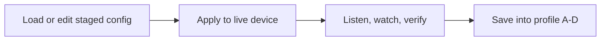

# Profile Workflow

This page exists because profiles are one of the easiest places for a newcomer to get confused.

The short version:

- a **preset** is a browser-side starting point
- a **profile** is a saved device memory slot

If you mix those up, the configurator feels unpredictable. If you keep them separate, the workflow becomes calm and deliberate.

## The profile panel as a workflow

Use the profile area as a four-step process, not as a pile of unrelated buttons.

### 1. Pick a target profile slot

Choose A, B, C, or D based on what role you want it to play:

- A: safe baseline
- B: current rehearsal idea
- C: alternate mapping
- D: risky experiment or show-specific scene

The exact slot names do not matter. The role does.

### 2. Stage changes first

This can come from:

- editing the form directly
- loading a preset from the picker
- importing a JSON config

At this point nothing permanent has happened yet.

### 3. Apply to the live device

This is when the browser actually pushes the staged config to the deck. Only after the device acknowledges the change should you treat the new state as real.

### 4. Save the live state into a profile

Saving a profile is what turns "I like this right now" into "I can get back here later."

That is the core mental model:

_Alt text: Flowchart showing the profile workflow moving from staged edits to Apply, then verification, then saving into a permanent device profile slot._

## What each button is for

### Save profile

Use this when the current live state is good and you want it to persist in the selected slot.

On current firmware this writes the selected device slot directly over the native `SAVE_PROFILE` path.
If the browser disables this button, treat that as a stale firmware or disconnected-session clue rather than a hidden feature flag. Use **Download profile** for a file backup until the device reconnects cleanly.

### Load profile

Use this when you want to recall the saved EEPROM state from the selected slot and make it active again.

On current firmware this recalls the selected device slot through `LOAD_PROFILE` and makes that slot active.
If this control is disabled, the browser is usually protecting you from stale firmware, a disconnected device, or a failed handshake.

### Reset profile

Use this when you want to wipe the selected slot back to its baseline/default state.

On current firmware this restores the selected slot to the firmware baseline through `RESET_PROFILE`, then marks that slot active.
If this control is disabled, reconnect first and confirm the manifest loaded; do not assume the slot was reset remotely.

### Download profile

Use this when you want a portable JSON backup of the current staged or active idea outside the device.

### Upload profile

Use this when you want to bring in a saved JSON and stage it for review.

## The safe beginner ritual

If you are not yet comfortable, do this every time:

1. choose a target slot
2. stage one preset or a small set of edits
3. apply
4. confirm the rig behaves the way you expect
5. save into that same slot

That order makes it much harder to lose a known-good setup.

## Common mistakes

### "I picked a preset and thought it was already saved"

It is not. The preset picker stages locally first. You still need to Apply, and then Save if you want persistence.

### "I loaded a profile and my unsaved browser changes vanished"

That is expected. Load profile means "replace the current live/staged context with the device snapshot from that slot."

### "I saved into the wrong slot"

Use one slot as a permanent baseline so you always have a clean place to recover from.

### "I do not know whether I should export a preset or save a profile"

- export when you want a file
- save profile when you want on-device recall

### "The profile buttons are disabled even though this repo says they are supported"

That usually means one of three things:

- you are not connected
- the manifest handshake did not complete
- the board is running older firmware than the current app/docs expect

## Suggested slot roles

For many users this simple scheme is enough:

| Slot | Role                               |
| ---- | ---------------------------------- |
| A    | stable baseline                    |
| B    | current rehearsal build            |
| C    | alternate arrangement              |
| D    | risky experiment or one-song setup |

The point is not the labels themselves. The point is that every slot should have a job.

## Read next

- [Musician-First Guide](../getting-started/MusicianFirstGuide.md) for the rehearsal-first version of this workflow
- [Preset Library](PresetLibrary.md) for browser-side starting points
- [Failure-First Guide](../validation/FailureFirst.md) for what to do when profile actions feel confusing
- [WebSerial Protocol](WebSerial.md) for the underlying `GET_PROFILE` / `SET_PROFILE` snapshot behavior
