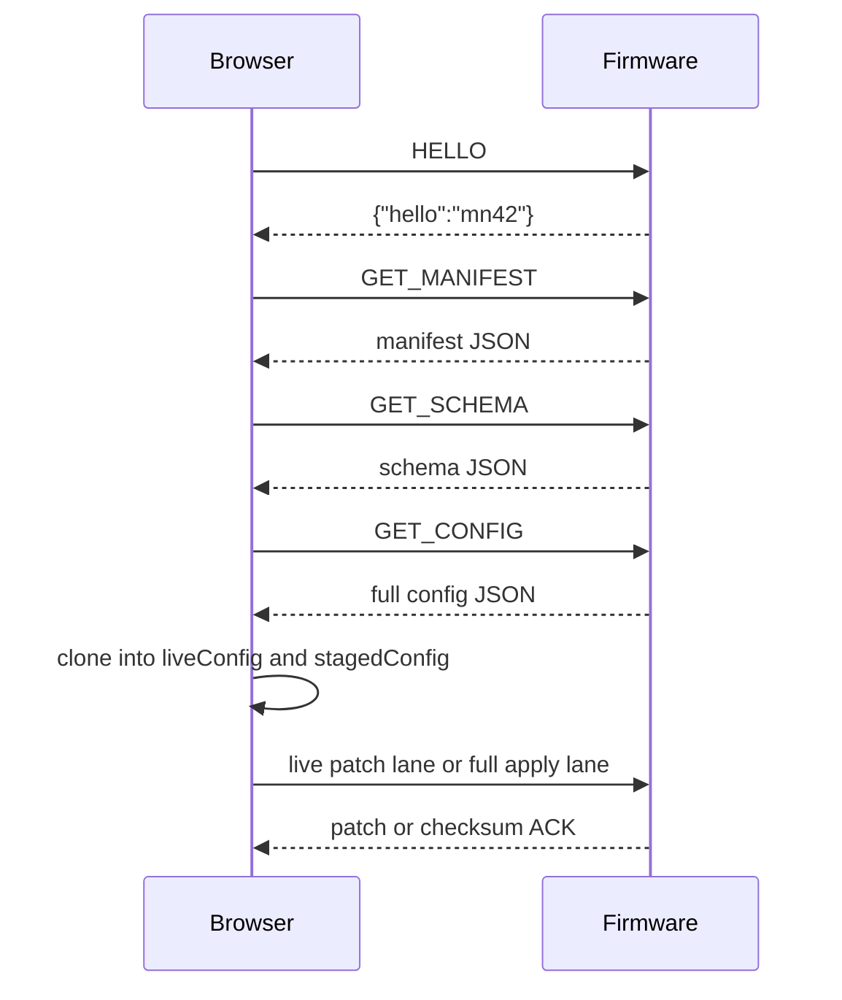
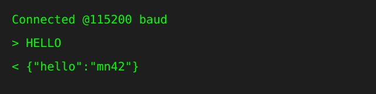

# WebSerial Walkthrough

This is an explanatory guide, not the canonical protocol reference. For the current line-level contract, defer to [MN42 Line Protocol](../reference/MN42LineProtocol.md), [Serial Protocol](../reference/SerialProtocol.md), and [Documentation Truth Map](../reference/DocumentationTruthMap.md).

The raw WebSerial reference tells you what messages exist. This page explains why the conversation is structured that way and what a newcomer should expect to happen from the moment the browser connects.

The short version is: the browser does not blindly trust the device, and the device does not blindly trust the browser.

## The session story

_Alt text: Sequence diagram showing a browser sending HELLO, requesting manifest and config, then staging edits and receiving patches or acknowledgements from the firmware._

That flow is the heart of the configurator.

## Step 1: identify the device before editing it

The browser starts by saying hello, then asks for the manifest.

The manifest is not decorative metadata. It tells the browser:

- what device is connected
- what firmware version it is running
- what schema version the device expects
- how many slots, pots, envelopes, and LEDs the UI should assume

That is why the browser can show identity banners and schema mismatch warnings before it lets anyone edit live state.

## Step 2: hydrate a trustworthy model

Once the manifest makes sense, the browser requests the full configuration and splits it into two copies:

- `liveConfig`: what the device most recently confirmed
- `stagedConfig`: what the user is currently editing

That split is the most important safety feature in the app. It lets the UI be honest about what is merely proposed versus what the device has actually accepted.

## Step 3: edit locally first

When a user changes a field, the browser usually edits `stagedConfig` first.

That means the UI can:

- show diffs before applying changes
- batch related changes together
- preview migrations
- recover cleanly if a write is rejected

Without staged state, the browser would have to pretend every local change was already true on the device.

## Step 4: send the smallest safe write

There are two common write shapes:

- a narrow patch lane for field-level edits when the active transport supports it
- a broader staged apply lane that carries complete state and a checksum

The right mental model is not "the browser streams every keystroke forever." The right model is "the browser tries to send the smallest truthful mutation and waits for device confirmation."

## Step 5: listen for patches and telemetry

The firmware streams two useful classes of output:

- periodic state snapshots
- targeted patch messages when a smaller part of the state changes

This matters because the configurator is not a static settings form. It is a live monitor:

- slot values move
- envelope followers breathe
- LFO values animate
- diagnostics tell you when the firmware is under pressure

## Step 6: commit or roll back

When the browser sends a larger apply, the firmware answers with a checksum-backed acknowledgement. That acknowledgement is what allows the browser to advance `liveConfig` to the newly staged state.

If the acknowledgement does not match expectations, the runtime can roll back instead of pretending the write succeeded.

That is a quiet but critical part of the contract. It keeps the UI from lying.

## Why the protocol feels more formal than a hobby serial app

This protocol is a little stricter than a typical "send some JSON over USB" tool because the browser is acting like an editor for a real instrument state:

- version mismatches matter
- partial writes matter
- persistence matters
- diagnostics matter
- rollback matters

The point is not ceremony for its own sake. The point is to make on-stage and on-bench editing trustworthy.

## What new users should remember

If the configurator feels careful, that is intentional.

It is trying to protect four things at once:

1. device identity
2. schema compatibility
3. staged versus confirmed state
4. safe apply behavior

Once you understand those four ideas, the rest of the WebSerial reference becomes much easier to read.

## Read next

- [Configurator Tour](Configurator.md) for the UI-facing side of this exchange
- [WebSerial Protocol](WebSerial.md) for the full command and payload reference
- [App README](https://github.com/bseverns/MOARkNOBS-42/blob/main/App/README.md) for the runtime-side implementation model
