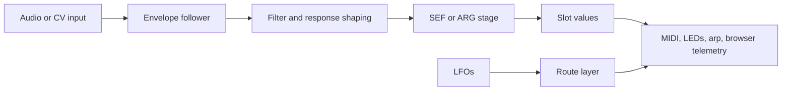
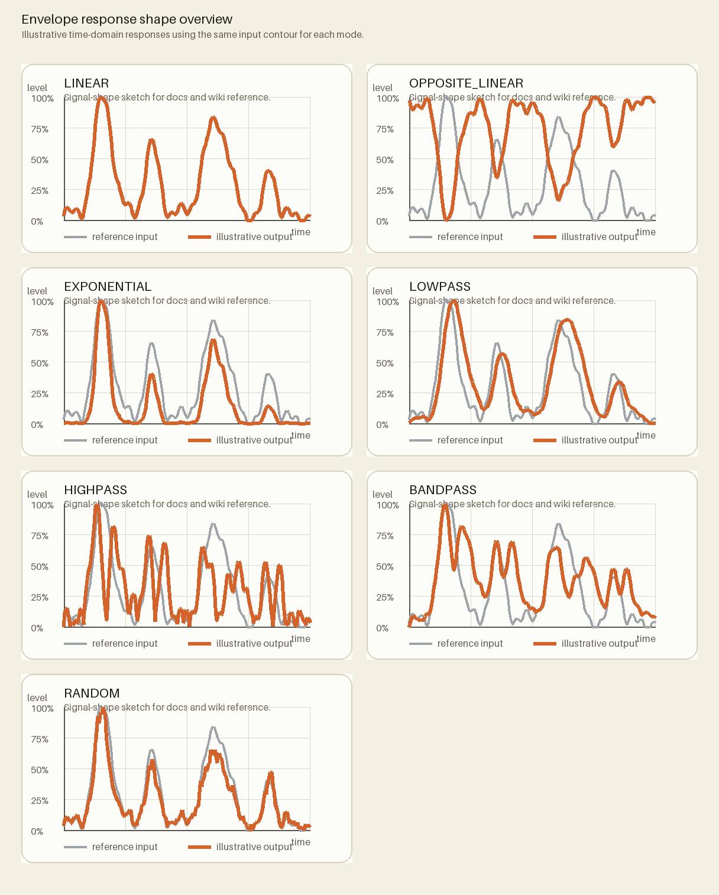

# Reactive Control Guide

This page explains the part of the rig that most often gets learned by folklore: envelope followers, filter shapes, ARG combinations, and LFO routes.

These controls are where MOARkNOBS-42 stops behaving like a flat MIDI controller and starts behaving like a reactive instrument.

## The reactive signal path

_Alt text: Flowchart showing reactive control moving from input through envelope following, filtering, optional ARG blending, then out into slots, MIDI, LEDs, arpeggiator behavior, and browser telemetry, while LFO routes feed the same output layer._

The easiest mistake is to treat these as "advanced extras." They are really the motion engine of the instrument.

## Envelope followers: what they are doing

An envelope follower turns changing signal level into a usable control signal. In practice that means:

- a louder or more active source creates a bigger value
- a quieter or decaying source creates a smaller value
- the firmware can then map that motion to slots, LEDs, or note behavior

If you want the analog-to-digital background, the source overview still lives in [firmware/include/EnvelopeFollower/README.md](https://github.com/bseverns/MOARkNOBS-42/blob/main/firmware/include/EnvelopeFollower/README.md).

## Filter shapes: how the follower feels

These are less about "correct" and more about "what kind of motion do you want?"

The gray line is the same reference input in every panel. The orange line is the illustrative output for that mode.

| Filter type       | What it feels like                          | Good first use                        |
| ----------------- | ------------------------------------------- | ------------------------------------- |
| `LINEAR`          | direct, literal, unshaped                   | baseline learning                     |
| `OPPOSITE_LINEAR` | inverted response                           | when loud should pull values down     |
| `EXPONENTIAL`     | sharp on attacks, softer on tails           | punchy reactive demos                 |
| `RANDOM`          | animated and unstable in an intentional way | modular or generative moods           |
| `LOWPASS`         | smoother, less fizzy motion                 | follower cleanup and stable control   |
| `HIGHPASS`        | ignores slow drift, reacts to fast change   | transient-heavy sources               |
| `BANDPASS`        | focused slice of motion                     | more selective, characterful response |

Rule of thumb:

- start with `LINEAR` if you are learning
- switch to `LOWPASS` if the motion feels too jittery
- use `EXPONENTIAL` when you want obvious attacks
- use `BANDPASS` or `RANDOM` only once you want character rather than predictability

For a fuller "which one should I choose first?" explanation, read [Filter Feel Guide](FilterFeelGuide.md).

## SEF versus ARG

### SEF

SEF is the straight path: one follower influences one slot path directly.

Use SEF when:

- you want legible cause and effect
- you are calibrating a new input
- you are teaching the system to a new player

### ARG

ARG is the blender path: two envelope sources are combined with a math method to create a new modulation result.

Use ARG when:

- you want interaction rather than simple following
- you want one signal to exaggerate or oppose another
- you want the deck to behave more like a small modular control system

## ARG methods: what they do musically

The firmware supports fourteen ARG methods. The official formulas live in [firmware/include/EnvelopeFollower/README.md](https://github.com/bseverns/MOARkNOBS-42/blob/main/firmware/include/EnvelopeFollower/README.md#arg-methods). For learners, the more useful question is what they _feel_ like.

| Method | Plain-language behavior          | Good use                         |
| ------ | -------------------------------- | -------------------------------- |
| `PLUS` | both inputs reinforce each other | obvious combined motion          |
| `MIN`  | A subtracts B                    | ducking/contrast experiments     |
| `PECK` | B subtracts A                    | same contrast, reversed emphasis |
| `SHAV` | softer subtraction               | restrained offset behavior       |
| `SQAR` | combined magnitude               | fuller composite energy          |
| `BABS` | A compared against absolute B    | ratio-like interaction           |
| `TABS` | stronger version of `BABS`       | more aggressive ratio feel       |
| `MULT` | both inputs multiply together    | ring-mod-like intensity          |
| `DIVI` | A divided by B-ish behavior      | weird comparative motion         |
| `AVG`  | compromise blend                 | smoother two-source behavior     |
| `XABS` | absolute difference              | "how different are these?"       |
| `MAXX` | whichever is larger wins         | strongest source dominates       |
| `MINN` | whichever is smaller wins        | quieter source dominates         |
| `XORR` | bitwise glitch behavior          | chaotic or experimental use      |

Recommended first ARG methods:

1. `PLUS`
2. `AVG`
3. `MAXX`
4. `XABS`

Those four teach the concept without immediately throwing you into math-punk territory.

For the longer musical grouping, read [ARG Guide](ARGGuide.md).

## LFO routes: where the motion can go

Two routed LFOs live in the stack. The current documented internal targets are:

- `EfGainTrim`
- `ArpSwing`
- `VelocityShift`
- `NoteChance`
- `ArpGate`
- `JitterDepth`
- `JitterSmoothness`

That means the same oscillator can:

- change how hard the envelope follower output bites
- push the arpeggiator away from straight timing
- nudge outgoing note velocity up/down
- open/close note-generation probability in performance
- lengthen/shorten arpeggiator note gate
- broaden/tighten random motion depth
- smooth/roughen random motion timing feel

The browser and WebSerial telemetry expose these values so the UI can draw what the firmware is actually doing.

For a route-by-route explanation, read [LFO Route Guide](LfoRouteGuide.md).

### On-device LFO quick-tune mode

You can now tune LFO behavior directly on the hardware without opening the app first.

- enter/exit mode: `Ctrl0 + Ctrl1 + Ctrl3`
- select oscillator: `Ctrl0` = LFO1, `Ctrl1` = LFO2
- cycle shape: `Ctrl2`
- toggle sync: `Ctrl3`
- cycle internal target route: `Ctrl4`
- cycle order: `EfGainTrim -> ArpSwing -> VelocityShift -> NoteChance -> ArpGate -> JitterDepth -> JitterSmoothness`
- `CtrlPot0` adjusts frequency (used in free-run, stored either way)
- `CtrlPot1` adjusts depth
- exit mode: `Ctrl5`

Why this matters:

- it gives LFO the same "reachable from the panel" status as EF/ARG controls
- you can shape motion during rehearsal without leaving performance posture
- it makes LFO behavior audibly/visibly testable before deeper route editing in app/bridge tools

## How to learn reactive controls without drowning

Use this order:

1. one envelope follower
2. `LINEAR` or `LOWPASS`
3. no ARG yet
4. one obvious output, usually `ArpSwing` or `VelocityShift`
5. only then add ARG or LFO routes

That sequence keeps cause and effect visible.

## Good starter combinations

### Stable and legible

- filter: `LOWPASS`
- mode: SEF
- no ARG
- LFO target: `VelocityShift`

Best for first demos.

### Punchy reactive control

- filter: `EXPONENTIAL`
- ARG method: `MAXX`
- LFO target: `ArpSwing`

Best for showing the rig respond musically rather than just numerically.

### Experimental patch-lab mode

- filter: `RANDOM` or `BANDPASS`
- ARG method: `XABS` or `MULT`
- route to external MIDI/OSC

Best for advanced exploration, not for first contact.

## Read next

- [Preset Library](PresetLibrary.md) for which shipped presets demonstrate these behaviors
- [Profile Workflow](ProfileWorkflow.md) for how to preserve a reactive setup once you like it
- [Failure-First Guide](../validation/FailureFirst.md) for what to check when reactive behavior gets confusing
