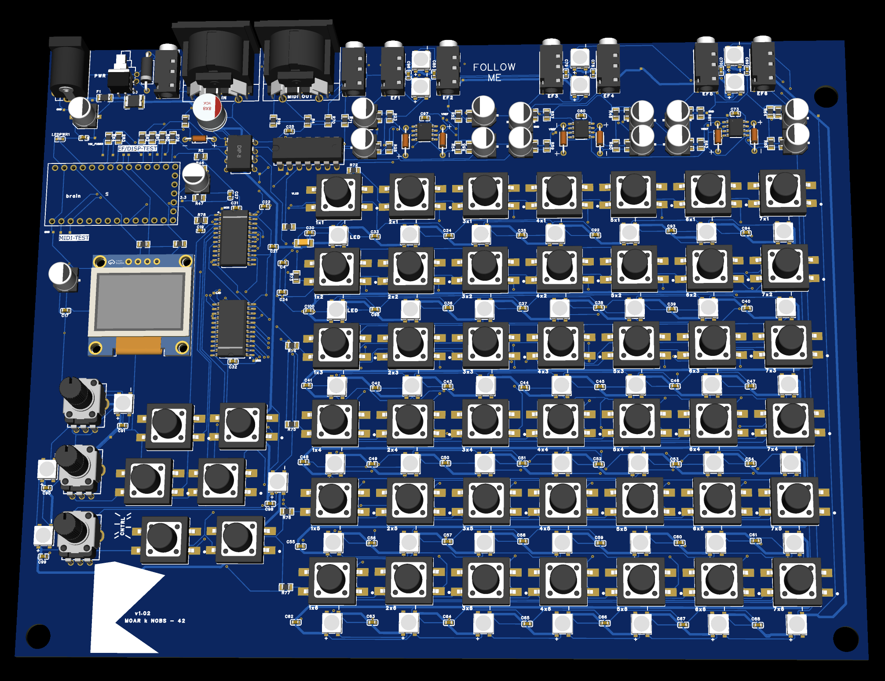

---
hide:
  - navigation
  - toc
---

Small-batch MIDI/OSC performance instrument

# MOARkNOBS-42

{ .hero-image }

MOARkNOBS-42 is a documented performance instrument for artists, builders, and instrument hackers who want a control surface they can actually understand. It combines the physical board, open firmware, a browser configurator, profile recall, an OSC / virtual MIDI bridge path, and a public paper trail for how the whole system behaves.

It is designed less like a sealed appliance and more like an instrument whose logic stays visible.

_A top-level system diagram would help here: hardware, browser configurator, bridge, and validation lanes in one glance._

  <a class="md-button md-button--primary" href="project/PilotRun.md">Join pilot run / interest list</a>
  <a class="md-button" href="#core-features">See features</a>
  <a class="md-button" href="getting-started/WhyMN42.md">Start here / learn how it works</a>

## Validated host surfaces

The broad workflow story is real, but the compatibility claim should be read conservatively.

- strongest direct-browser evidence in this repo: Chromium-based configurator over WebSerial
- strongest desktop host evidence in this repo: Node 24 bridge with the browser console and `/app/` configurator path
- documented but still setup-specific: OSC hosts and DAW virtual MIDI workflows
- not claimed here as a verified production path: Firefox/Safari WebSerial and signed one-click bridge installers

See [Host Compatibility](reference/HostCompatibility.md) and [Connectivity Guide](getting-started/ConnectivityGuide.md) before treating the project like a universal host/browser promise.

If you want the repo's document tie-break rules before you go deeper, read [Documentation Truth Map](reference/DocumentationTruthMap.md).

## What it is

MOARkNOBS-42 is a small-batch MIDI/OSC performance instrument with a surrounding ecosystem, not just a bare controller board.

The object in your hands is only part of the story.

_A simple three-panel image would help separate the hardware surface, configurator, and bridge into one mental model._

- **Surface**

  The hardware is a real performance surface with documented signal flow, MIDI I/O, reactive inputs, and a control layout meant to stay legible.

- **Configurator**

  The browser configurator handles setup, monitoring, staged edits, and profile management without hiding the device contract behind mystery software.

- **Bridge**

  The bridge path opens documented OSC and virtual MIDI workflows when direct browser connection is not the right fit for the host setup.

If you want the short outsider-friendly version first, read [Why MN42](getting-started/WhyMN42.md).

## Why it feels different

Many controllers are designed to disappear behind presets, hidden mappings, or sealed software stacks. MOARkNOBS-42 goes the other direction.

- The hardware, firmware, configurator, and bridge are documented as one legible system.
- The instrument is open enough to rebuild, audit, and remix rather than merely consume.
- The docs are part of the instrument, not a last-minute appendix.
- Validation, support boundaries, and unverified areas are called out directly instead of buried under marketing language.

The goal is not mass-market smoothness. The goal is an instrument whose control logic stays visible.

## Core features

- **42 virtual slots**

  The instrument centers around 42 virtual slots that can be mapped, recalled, and watched as part of the same runtime system.

- **Six envelope followers**

  Six reactive inputs let the rig respond to real signal activity instead of only static knob gestures.

- **Browser configurator**

  The configurator handles setup, monitoring, staged edits, and profile work in plain language over the documented device contract.

- **Profiles and recall**

  Profile slots `A` through `D` let you save, load, reset, and back up working states instead of rebuilding a setup live.

- **OSC / virtual MIDI bridge**

  The bridge exposes documented OSC and virtual MIDI paths, and now includes a browser-driven local console.

- **Dual MIDI hardware formats**

  Current repo docs describe both 5-pin DIN and 1/8" TRS Type-A MIDI hardware support.

## Who it's for

- **Experimental musicians**

  For performers who want the controller to be part of the instrument, not just a utility layer.

- **Sound and media artists**

  For people working across browser tools, OSC hosts, DAWs, installation contexts, or custom performance setups.

- **Advanced builders**

  For people comfortable with fabrication files, flashing firmware, and validating real hardware behavior on the bench.

- **Educators and instrument hackers**

  For workshops, studios, and classrooms where openness, legibility, and rebuildability matter as much as the final sound.

This is best suited to people who are comfortable exploring systems rather than expecting every edge case to be hidden behind a wizard.

## Pilot Run / Artist Edition

The right frame for a first small-batch release is a pilot run: an artist-run instrument release with a documented ecosystem around it, not a generic consumer launch.

What that currently means in this project:

- the instrument hardware itself
- the current firmware and its documented behavior
- the browser configurator workflow
- the OSC / virtual MIDI bridge workflow
- the builder, performer, validation, and troubleshooting docs that explain how to use and verify it

What it does not mean:

- implied mass-market support coverage
- undocumented host compatibility guarantees
- invented timelines, pricing, or bundle promises that are not yet published

See [Pilot Run / Artist Edition](project/PilotRun.md) for the project-specific explanation.

## What it is not

This is not a generic plug-and-play controller for everyone.

It is not framed here as a sealed appliance, a beginner-friendly consumer gadget, or a promise that every host/workflow has already been validated. It is a particular kind of open, teachable performance instrument for people who value legibility, modification, and documented behavior.

## Support boundary

Support here is docs-first and artist-run.

The repo publishes workflows, validation guidance, and support boundaries clearly, but it does not promise consumer-style warranty handling, substitute-part approval, or universal one-on-one setup support. The practical boundary is described in [License and Support](project/LicenseAndSupport.md).

## Interested in the first batch?

If the instrument makes sense for your setup, the next useful step is not a vague preorder mindset. It is reading the pilot-run framing, checking the support boundary, and choosing the workflow path that matches how you actually work.

  <a class="md-button md-button--primary" href="project/PilotRun.md">Read pilot run details</a>
  <a class="md-button" href="project/LicenseAndSupport.md">Read support boundary</a>
  <a class="md-button" href="getting-started/QuickstartForPerformers.md">See performer workflow</a>

## Choose your next step

- **Quickstart for Builders**

  Ordering parts, flashing firmware, and first bring-up: [Quickstart for Builders](getting-started/QuickstartForBuilders.md)

- **Quickstart for Performers**

  Connect the board, use the configurator, and work with profiles: [Quickstart for Performers](getting-started/QuickstartForPerformers.md)

- **Connectivity Guide**

  Decide between direct WebSerial and the bridge path: [Connectivity Guide](getting-started/ConnectivityGuide.md)

- **Validation Flow**

  Use the conservative go/no-go path from bring-up to demo-ready: [Validation Flow](validation/ValidationFlow.md)

- **Documentation Truth Map**

  See which pages define current truth versus plans, evidence, or historical context: [Documentation Truth Map](reference/DocumentationTruthMap.md)

- **Demo Test Punch List**

  Run a real-world prototype or rehearsal pass: [Demo Test Punch List](validation/DemoTestPunchList.md)

- **Guided Routes and deep docs**

  Choose a learning path or dive into the dense technical library: [Guided Routes](getting-started/GuidedRoutes.md) and [Docs Guide](project/DocsGuide.md)

## FAQ

  
Do I need to code?

Not necessarily. A performer can use the configurator and profile workflow without changing firmware. A builder or remixer will get much more out of the project if they are comfortable reading docs, flashing firmware, and following validation steps.

  
Is it open source?

Yes. The repo publishes firmware, software, hardware documentation, and supporting docs under the licenses described in [License and Support](project/LicenseAndSupport.md).

  
Is this a finished consumer product?

Not in the sense of a mass-market plug-and-play device with universal compatibility claims. The project is documented, real, and usable, but it is still framed honestly as a small-batch, artist-run instrument ecosystem with explicit validation and support boundaries.

  
What does the configurator do?

The browser configurator is the main setup and monitoring surface. It loads manifest/config data, stages edits safely, applies changes, and handles profile save/load workflows over the documented device contract.

  
What support is included?

The main support surface is the documentation itself: quickstarts, connectivity guidance, validation flow, troubleshooting, and license/support boundaries. See [License and Support](project/LicenseAndSupport.md) and [Pilot Run](project/PilotRun.md) for the practical limits.

  
Why would I choose this instead of a generic MIDI controller?

Because the value here is not just the control surface. It is the combination of hardware, firmware, configurator, bridge, and unusually explicit documentation. If that matters to you, read [Why MN42](getting-started/WhyMN42.md).

