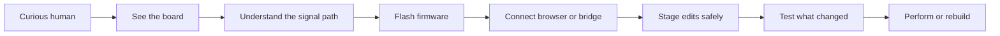
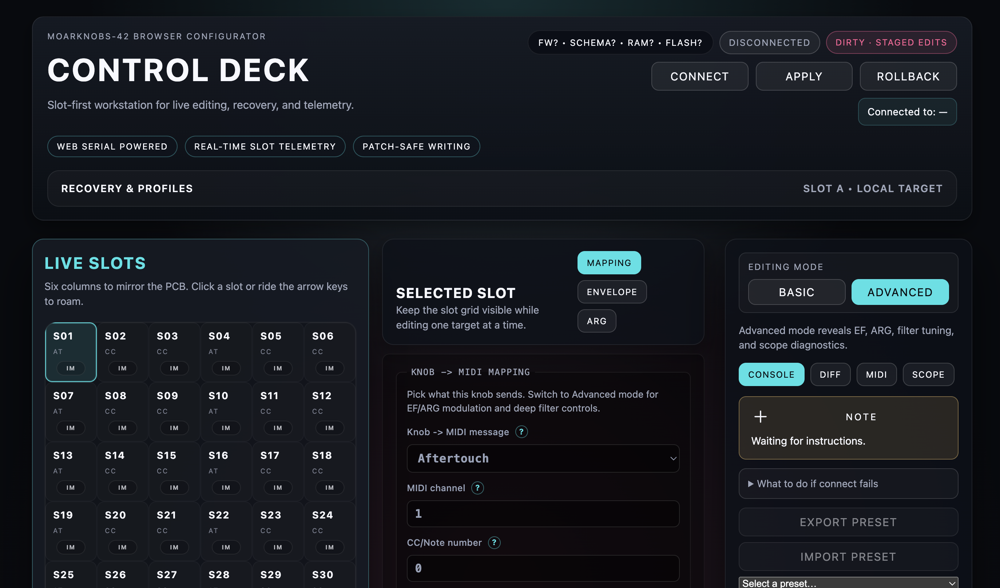

# MOARkNOBS-42

{ .hero-image }

> A microcontroller instrument that wants to be learned, rebuilt, and argued with rather than merely used.

MOARkNOBS-42 is a MIDI/OSC controller, a firmware project, a hardware build, and a teaching document all at once. The point is not just that it works. The point is that a new builder can open the repo, follow the trail, and understand why the instrument behaves the way it does.

This site is organized for three audiences:

- **New users** who want the shortest path from "what is this?" to "I made it do something."
- **Builders** who need wiring, flashing, testing, and recovery instructions that do not hide the ugly parts.
- **Learners** who want the signal path, the runtime contract, and the history of decisions instead of a pile of unexplained files.

If you want a route designed for your role instead of building one yourself, start with [Guided Routes](GuidedRoutes.md).

## Start with the story

The machine makes the most sense when you treat it like a chain of promises:

1. the hardware has to power up cleanly
2. the firmware has to expose a stable contract
3. the browser and bridge have to respect that contract
4. the tests have to tell you what is proven and what still needs a real board

## Choose your lane

- **I am new here**

  Start with [New User Story](StartHere.md), then walk through [Process Overview](ProcessOverview.md).

- **I want to build the hardware**

  Open the [Builder's Handbook](BuildersHandbook.md), then keep [Troubleshooting](Troubleshooting.md) nearby.

- **I want to use the configurator**

  Read [Configurator Tour](Configurator.md), then [WebSerial Walkthrough](ProtocolWalkthrough.md).

- **I want to understand the presets**

  Read [Preset Library](PresetLibrary.md) before you start auditioning mappings.

- **I want the vocabulary first**

  Read [Glossary](Glossary.md), then [Reactive Control Guide](ReactiveControlGuide.md).

- **I want to learn the reactive controls**

  Read [Reactive Control Guide](ReactiveControlGuide.md), then [ARG Guide](ARGGuide.md), [Filter Feel Guide](FilterFeelGuide.md), and [LFO Route Guide](LfoRouteGuide.md).

- **I want a route for builders, learners, or musicians**

  Read [Guided Routes](GuidedRoutes.md).

- **I just want a playable rehearsal setup**

  Read [Musician-First Guide](MusicianFirstGuide.md).

- **I want to verify changes**

  Go straight to [Testing Story](TestingStory.md) and [Release Story](ReleaseStory.md).

- **I want the low-level details**

  Dive into [Pin Map](PinMap.md), [EEPROM Layout](EEPROMLayout.md), and [Assumption Ledger](assumption-ledger.md).

- **I want the whole story**

  Read [History](HISTORY.md) and [Lineage](lineage.md).

## What the rig looks like

### Board view

### Configurator view

The hardware and browser are meant to be legible to each other. The board tells you where the signals enter; the configurator tells you what those signals mean.

## Why the docs are so dense

Many instrument repos explain the final interface but not the path to understanding it. This one tries to keep the path visible.

- The **builder docs** explain how to wire and recover the machine.
- The **protocol docs** explain what the browser and bridge are actually allowed to assume.
- The **testing docs** explain what the automated suite proves versus what still requires bench time.
- The **history docs** explain why some corners look overbuilt: often because they already failed once in a more naive form.

## Recommended first walk

If you want the best newcomer path, use this order:

1. [New User Story](StartHere.md)
2. [Process Overview](ProcessOverview.md)
3. [Configurator Tour](Configurator.md)
4. [WebSerial Walkthrough](ProtocolWalkthrough.md)
5. [Preset Library](PresetLibrary.md)
6. [Glossary](Glossary.md)
7. [Reactive Control Guide](ReactiveControlGuide.md)
8. [Testing Story](TestingStory.md)
9. [Troubleshooting](Troubleshooting.md)

That route gets you from concept to first successful interaction without throwing you straight into the deepest internal docs.
