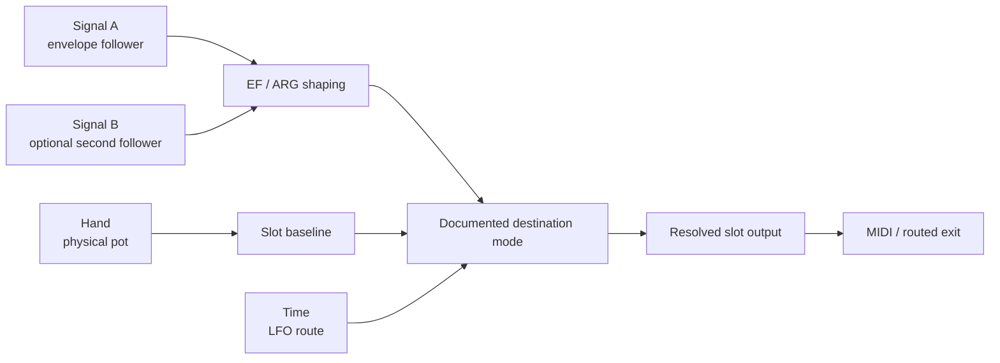

# Who Controls This Slot?

A physical knob and a slot value are related, but they are not the same thing.

The knob is one source. The slot is the firmware-owned destination that resolves configured behavior and emits MIDI or another routed result. Understanding MN42 starts with asking what is allowed to move that destination now.

## Path One: The Slot Reacts

For a reactive slot, the performer's hand establishes a physical baseline. Sound and time can shape the resolved output around it.



The exact relationship is configured rather than implied:

- EF can add, subtract, replace, scale, or move around center.
- ARG combines two follower signals before the EF contribution reaches the destination.
- LFO routes can replace a value, contribute through fixed-lane modes, or target an internal modulation bus.
- transport-facing output is rate-limited and coalesced so modulation does not become an unbounded event queue.

Multiple writers can be musically useful, but they are not silently declared equivalent. The modulation matrix reports route modes and warns about shared writers so the performer can see the relationship being created.

## Path Two: Another Machine Takes Over

Incoming MIDI follows a narrower path because takeover must remain unambiguous.

```mermaid
sequenceDiagram
  participant M as External MIDI
  participant S as Eligible direct CC slot
  participant P as Physical pot
  M->>S: Establish remote value
  P-->>S: Move below remote value; no jump
  P-->>S: Cross remote value
  S->>S: Physical control resumes ownership
```

With soft pickup:

1. An incoming CC establishes the virtual slot value.
2. Firmware keeps the physical pot from immediately snapping it back.
3. The performer moves the pot toward the remote value.
4. When the pot crosses that value, physical control resumes smoothly.

The binding belongs to the profile and runs in firmware over DIN or USB without the App or Bridge attached. Supported machine-level destinations can also receive incoming MIDI, but they do not use the slot takeover gesture.

## Why These Paths Are Separate

Current firmware accepts slot takeover only for active, direct, unmodulated CC slots. It rejects note, NRPN/RPN, SysEx, and independently modulated slot baselines rather than guessing how remote ownership should interact with another resolver.

So the accurate model is not “every source controls every slot at once.” It is:

- MN42 offers several explicit control relationships;
- each relationship has a visible mode and eligibility boundary;
- profiles preserve the relationship;
- the performer can reason about who or what is moving the result.

That constraint is part of the instrument's legibility, not a missing UI shortcut.

## Who Controls Configuration?

Performance values and saved configuration use different authority lanes.

```text
edit in App -> staged config -> Apply -> firmware ACK/readback -> live config
```

The App does not declare a staged edit live until the device verifies it. The Bridge can carry that structured session while separately routing host MIDI and OSC. A successful host route is not evidence that a staged device configuration was applied.

## Try It

- For reactive composition, begin with one pot plus one EF. Add ARG or an LFO only after the first contribution is obvious.
- For takeover, bind one external CC to one eligible direct slot, enable soft pickup, then deliberately cross the remote value with the physical pot.
- Use Stage to watch movement, Configure to make the everyday mapping, and Lab to inspect exact route and contribution evidence.

## Where To Read Next

- [Why MN42](../getting-started/WhyMN42.md)
- [Reactive Control Guide](../guides/ReactiveControlGuide.md)
- [Reactive Modulation Matrix](../guides/ReactiveModulationMatrix.md)
- [MIDI Input Mapping](../guides/MidiInputMapping.md)
- [Modulation Matrix Contract](../reference/ModulationMatrixContract.md)
