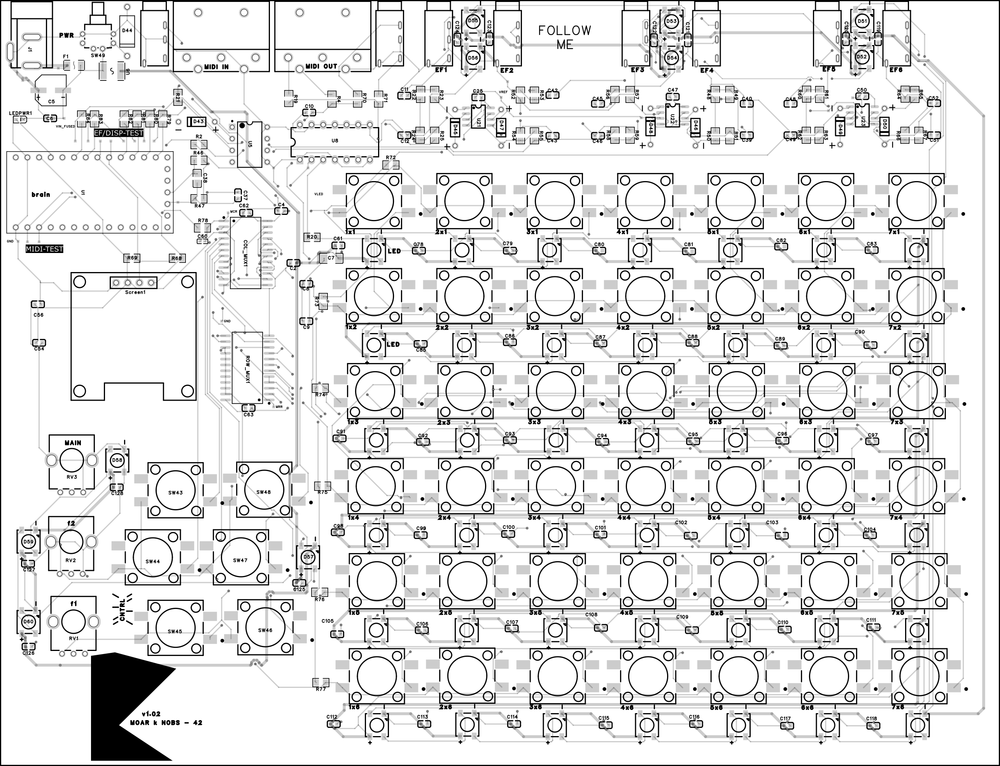
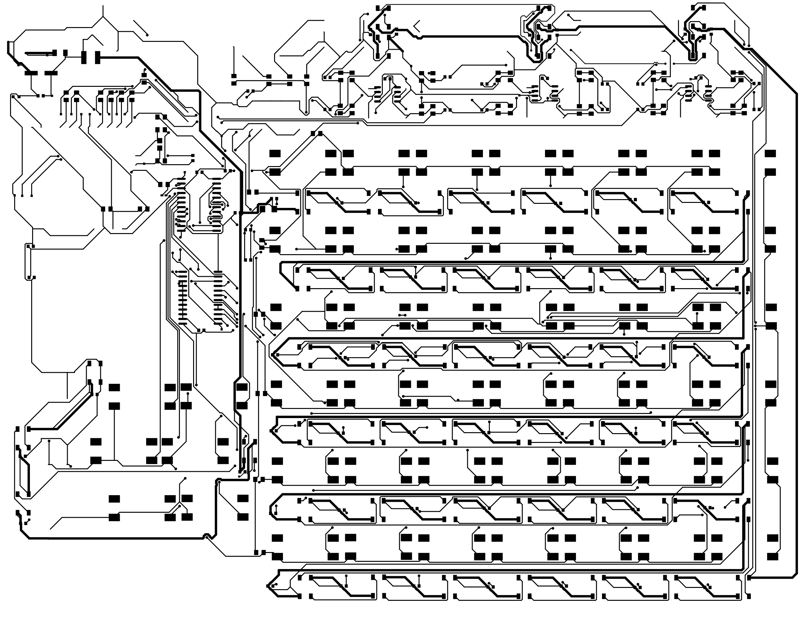
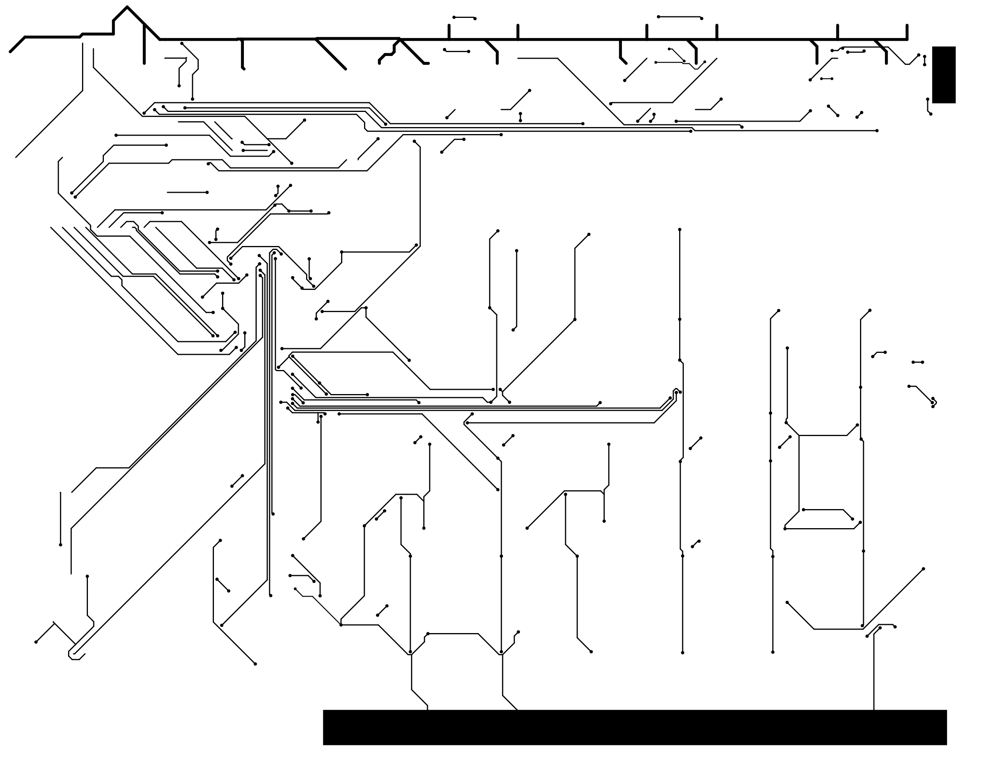
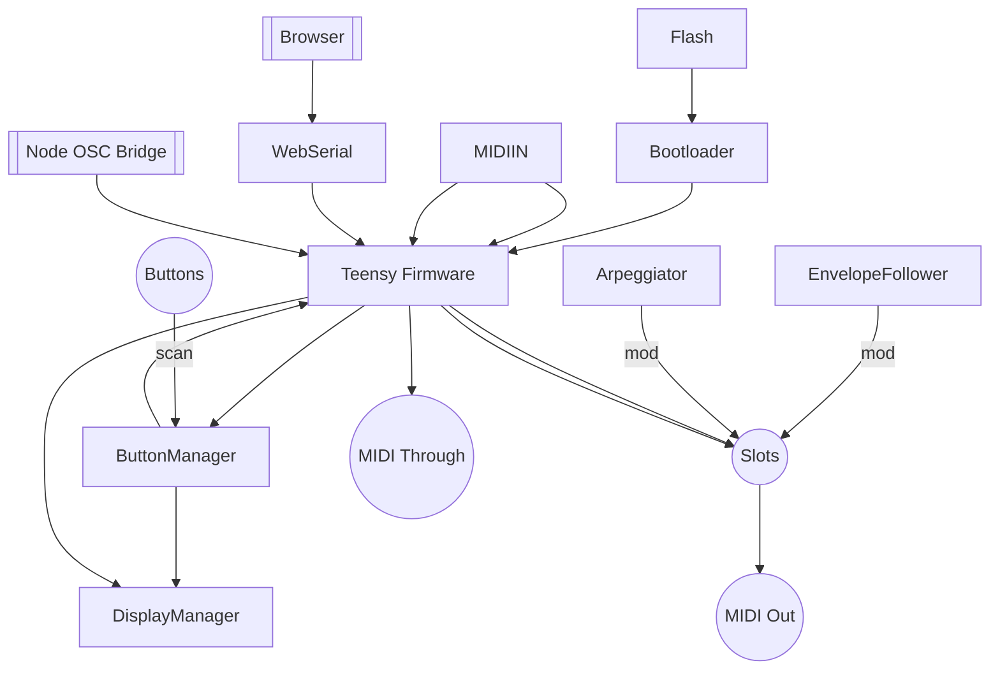

# Docs Guide

> Hardware's signed off and etched in copper. This folder is the reference stash for the whole machine—schematics, firmware lore, and every misadventure we've documented.

Welcome to the MOARkNOBS-42 documentation playground. This page helps you navigate the library of notes, design scraps, and operational docs we keep around to teach ourselves and the next hacker.

Need the fast track from bare board to release? Hit the [Process Overview](ProcessOverview.md).

Craving the bird's-eye view? The [systemflow sketch pages](../sketch/systemFlow/hw/buttonMatrix.md) rip the machine into subsystems so you can see how every knob, LED, and envelope fits together before you dive into the weeds.

## Folder layout

The docs tree is organized by function now, so the folder name tells you what kind of page you are opening before you click it:

- [`getting-started/`](../getting-started/StartHere.md) for first-pass orientation, quickstarts, and builder/performer entry points.
- [`guides/`](../guides/Configurator.md) for workflow walkthroughs and feature-driven operating guides.
- [`reference/`](../reference/Glossary.md) for maps, architecture notes, compatibility tables, and factual lookup material.
- [`validation/`](../validation/TESTING.md) for testing, troubleshooting, demo readiness, and go/no-go checklists.
- [`release/`](../release/ReleaseGuide.md) for packaging, reproducibility, and release execution.
- [`project/`](DocsGuide.md) for repo-level process, history, support boundary, and meta documentation.
- Supporting material stays in purpose-specific folders: `assets/` for shared images/diagrams, plus [`bench/`](../bench/README.md), [`sketch/`](../sketchbook/index.md), [`examples/`](../examples/README.md), [`interop/`](../interop/seedbox.md), and [`thermal/`](../thermal/README.md).

If you only need the canonical operational docs, start here:

- [TESTING.md](../validation/TESTING.md) for what the current automated/manual coverage actually proves
- [ValidationFlow.md](../validation/ValidationFlow.md) for the bring-up to demo-ready decision path
- [DemoTestPunchList.md](../validation/DemoTestPunchList.md) for the operator demo pass on a real prototype
- [ReleaseGuide.md](../release/ReleaseGuide.md) for the human release checklist
- [REPRODUCIBILITY.md](https://github.com/bseverns/benzknober/blob/main/REPRODUCIBILITY.md) for the exact artifact-building recipe
- [App/README.md](https://github.com/bseverns/benzknober/blob/main/App/README.md) for the browser/runtime/schema/Apply contract

## Local site preview

The repo now ships with a MkDocs scaffold so the docs can read like a guided site instead of a loose folder dump.

```bash
pip install -r requirements.txt
mkdocs serve
```

Then open the local URL MkDocs prints in your terminal.

| Doc | Why it exists | Keep it fresh |
| --- | --- | --- |
| [Primers/MIDI-DSP101.md](../Primers/MIDI-DSP101.md) | MIDI basics and the DSP tricks our firmware leans on | Sync when firmware MIDI features or filter math shift |
| [ProcessOverview.md](ProcessOverview.md) | Full build and release flow | Update when hardware or firmware release steps move |
| [TESTING.md](../validation/TESTING.md) | Canonical test workflow + coverage map | Refresh when test scope or commands move |
| [ReleaseGuide.md](../release/ReleaseGuide.md) | Human release checklist | Refresh when release ritual or asset list changes |
| [REPRODUCIBILITY.md](https://github.com/bseverns/benzknober/blob/main/REPRODUCIBILITY.md) | Canonical deterministic artifact recipe | Refresh when `release.sh` or artifact shape changes |
| [App/README.md](https://github.com/bseverns/benzknober/blob/main/App/README.md) | App/runtime contract and simulator notes | Refresh when manifest/schema/apply semantics change |

## Accessibility

- Every diagram and board glam shot sports alt text so screen readers get the same gossip as eyeballs.
- Headings descend one level at a time—no surprise teleporting from H1 to H4.
- Code blocks and tables stay lightweight so zoom tools and high-contrast themes can rage without breaking layout.

## PCB Gallery

> Fast glamor shots live here so the hardware README can stay lean. Want the cadaver-level detail? The [Sketchbook](../sketchbook/index.md) and the system-flow sketch pages hold every layer and subsystem sketch.



Layer spelunking:




### Everything Everywhere



## System Capabilities

- [Hardware README](https://github.com/bseverns/benzknober/blob/main/hardware/README.md#sparkfun-shortcut) — final board layout, power rails, and a SparkFun shortcut for the silicon.
- [Firmware README](https://github.com/bseverns/benzknober/blob/main/firmware/README.md) — how the code slings MIDI, wrangles envelope followers, and keeps the LEDs honest.
- Firmware reference tables: [button map & combo guide](https://github.com/bseverns/benzknober/blob/main/firmware/include/ButtonManager/README.md#button-map), [filter types](https://github.com/bseverns/benzknober/blob/main/firmware/include/EnvelopeFollower/README.md#filter-types), [arp settings](https://github.com/bseverns/benzknober/blob/main/firmware/include/Arpeggiator/README.md#arp-settings), [MIDI types](https://github.com/bseverns/benzknober/blob/main/firmware/include/MIDIHandler/README.md#supported-message-types), [ARG methods](https://github.com/bseverns/benzknober/blob/main/firmware/include/EnvelopeFollower/README.md#arg-methods), [display hooks](https://github.com/bseverns/benzknober/blob/main/firmware/include/DisplayManager/README.md#key-methods).

## Choose Your Adventure

> Need a refresher before you dive? Hit the [MIDI + DSP 101 Primer](../Primers/MIDI-DSP101.md) for channel lore, CC etiquette, and the envelope math our modules lean on.

- [BuildersHandbook.md](../getting-started/BuildersHandbook.md) — wire it, flash it, and smoke-test it.
- [GuidedRoutes.md](../getting-started/GuidedRoutes.md) — audience-specific reading lanes for builders, learners, and musicians.
- [Glossary.md](../reference/Glossary.md) — canonical definitions for presets, profiles, EF, ARG, staged config, and other stack vocabulary.
- [Troubleshooting.md](../validation/Troubleshooting.md) — chase gremlins when the box won't boot or buttons go rogue.
- [HISTORY.md](HISTORY.md) — chronological ride through the project's evolution. Commit references, design pivots, and the "why" behind the build.
- [Options_DNI.md](../reference/Options_DNI.md) — the optional / Do Not Install cheat sheet. Use this before you lock a BOM or when you're deciding what not to solder.
- [PinMap.md](../reference/PinMap.md) — every MCU pin's mission and mayhem.
- [EEPROMLayout.md](../reference/EEPROMLayout.md) — where config bytes live and die.
- [FirmwareUpdate.md](../guides/FirmwareUpdate.md) — flash new brains without desoldering.
- [TESTING.md](../validation/TESTING.md) — unit tests to full-stack thrash sessions.
- [ValidationFlow.md](../validation/ValidationFlow.md) — the conservative go/no-go path from first boot to demo-ready status.
- [DemoTestPunchList.md](../validation/DemoTestPunchList.md) — a short real-board punch list for prototype arrival, rehearsal, and public demos.
- [DemoPolish.md](../validation/DemoPolish.md) — runbook for final demo soak, EXT clock checks, panic-reset verification, and asset packing.
- [TODO.md](TODO.md) — post-release wishlist for when the first build is out and you're itching for v2.
- [ReleaseGuide.md](../release/ReleaseGuide.md) — full release playbook. For quick steps see [Release Story](../release/ReleaseStory.md).
- [CONTRIBUTING.md](https://github.com/bseverns/benzknober/blob/main/CONTRIBUTING.md) — patch etiquette and repo contract.
- [Sketchbook](../sketchbook/index.md) — raw schematics and subsystem scribbles when you need the gory details.
  Highlights:
    - [buttonMatrix.md](../sketch/systemFlow/hw/buttonMatrix.md) — how the 42-button grid scans its soul.
    - [display.md](../sketch/systemFlow/hw/display.md) — wrangling pixels and I²C.
    - [envelopeFE.md](../sketch/systemFlow/hw/envelopeFE.md) — analog envelope follower circuits.
    - Plenty more (midi opto, power antics, board PDFs) for late-night study.
- [WebSerial.md](../guides/WebSerial.md) — how the board chats with browsers, negotiates schema versions, and keeps presets safe.
- [PresetLibrary.md](../guides/PresetLibrary.md) — what each shipped configurator preset is for, what it teaches, and how it differs from the device's saved profiles.
- [MusicianFirstGuide.md](../getting-started/MusicianFirstGuide.md) — the shortest path from first connection to one trustworthy rehearsal setup.
- [ProfileWorkflow.md](../guides/ProfileWorkflow.md) — how staging, applying, saving, loading, resetting, and exporting fit together.
- [ReactiveControlGuide.md](../guides/ReactiveControlGuide.md) — a human explanation of EF, filter, ARG, and LFO route behavior.
- [ARGGuide.md](../guides/ARGGuide.md) — the ARG methods grouped by feel rather than by raw formula.
- [FilterFeelGuide.md](../guides/FilterFeelGuide.md) — how each follower shape feels in practice and which to learn first.
- [LfoRouteGuide.md](../guides/LfoRouteGuide.md) — what the internal LFO targets actually change musically.
- [ComboGuide.md](../guides/ComboGuide.md) — hardware combos grouped by intention instead of raw matrix order.
- [FailureFirst.md](../validation/FailureFirst.md) — common "what just happened?" situations and what they usually mean.
- [OSCBridge.md](../guides/OSCBridge.md) — quickstart for OSC + virtual MIDI bridge usage, including DAW setup and troubleshooting.
- [BridgeForPerformers.md](../guides/BridgeForPerformers.md) — one-page show-day checklist for running bridge + OSC/DAW fast.
- [BridgePackaging.md](../release/BridgePackaging.md) — implementation plan for shipping one-click bridge binaries/installers.
- [release/bridge-artifacts-checklist.md](../release/bridge-artifacts-checklist.md) — per-release template for bridge binary assets, checksums, and sign-off.
- [thermal/README.md](../thermal/README.md) — keep the silicon from frying itself.

## Exporting the narrative report

The long-form release report (`report-CDSsample.md`) is meant to ship right next to the binaries.
When you need a pretty PDF for Zenodo, a class handout, or a grant package, run our Pandoc helper:

```bash
./tools/render_report.sh
```

By default the PDF lands in `docs/dist/MOARkNOBS-42-report.pdf`. Set `PDF_ENGINE=xelatex`
if you prefer a different LaTeX backend than [Tectonic](https://tectonic-typesetting.github.io/).
Pass an alternate output directory as the first argument if you want the PDF elsewhere.

## Why these specific parts?

> Quick hits on why each chunk of silicon shows up and where SparkFun teaches the tricks. Longer sourcing diary still lives in
> [hardware/Parts.md](https://github.com/bseverns/benzknober/blob/main/hardware/Parts.md) when you want BOM-level receipts.

- **Teensy 4.0** — horsepower with USB baked in. The [Teensy 4.0 Hookup Guide](https://learn.sparkfun.com/tutorials/teensy-40-hookup-guide) covers pinout, power, and programming basics.
- **CD74HC4067 analog mux** — collapses 42 buttons into one ADC read. The [16‑Channel Mux Breakout Guide](https://learn.sparkfun.com/tutorials/16-channel-analogdigital-multiplexer-breakout-cd74hc4067-hookup-guide) shows how to breadboard the trick.
- **SN74HCT245 level shifter** — keeps 5 V button buses from smoking the 3 V3 MCU. SparkFun's [Logic Level Shifting 101](https://learn.sparkfun.com/tutorials/logic-level-shifting) explains the voltage translation.
- **6N138 optocoupler** — isolates MIDI IN. SparkFun's [MIDI Tutorial](https://learn.sparkfun.com/tutorials/midi-tutorial/all) breaks down DIN wiring and opto‑isolation.
- **MCP6002 op‑amp** — rectifies audio for the envelope followers. SparkFun's [Op-Amp Basics](https://learn.sparkfun.com/tutorials/op-amps/all) digs into precision rectifiers and biasing.
- **WS2812 LEDs** — one data pin, full-color rage. SparkFun's [WS2812 Breakout Hookup Guide](https://learn.sparkfun.com/tutorials/ws2812-breakout-hookup-guide) covers timing and power layout.

### Lab Playlist: choose your own adventure

Warm up your brain before flashing firmware.

- [Logic Level Shifting 101](https://learn.sparkfun.com/tutorials/logic-level-shifting) — keep 5 V gear from roasting 3 V3 brains.
- [Demystifying SPI](https://learn.sparkfun.com/tutorials/serial-peripheral-interface-spi) — the bus behind future displays and flash chips.
- [UART vs. MIDI](https://learn.sparkfun.com/tutorials/midi-tutorial/all) — MIDI rides a current loop, not plain UART; this primer shows the difference.
- [Op-Amp Basics](https://learn.sparkfun.com/tutorials/op-amps/all) — build envelope followers, filters, or fuzz boxes without fear.
