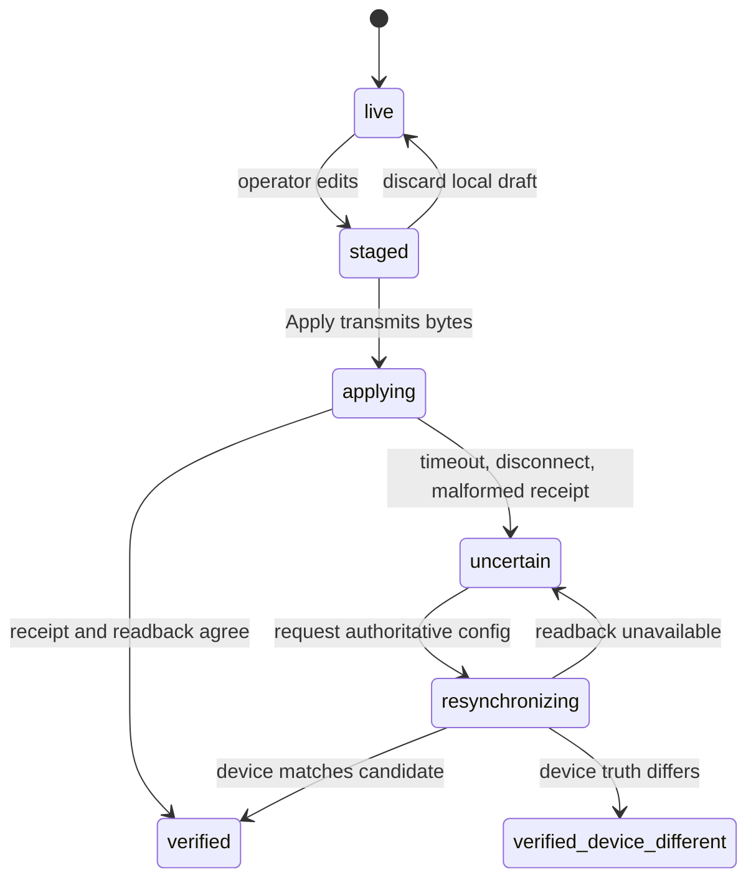

# Configuration Transaction Model

> **Doc class:** Contract. Last reviewed: 2026-07-27.

This page defines the authoritative meaning of configuration state in the App, Bridge, and firmware. Guides should link here rather than inventing their own Apply or rollback rules.

## States

- **live**: the most recently verified device configuration.
- **staged**: the operator's local candidate. It may differ from live.
- **applying**: configuration bytes have crossed the transport and a result is pending.
- **uncertain**: transmission may have committed, but the receipt cannot prove the result.
- **resynchronizing**: the App or Bridge is reading configuration from the device.
- **verified**: authoritative device truth is known and agrees with the candidate.
- **verified-device-different**: authoritative device truth is known and differs from the candidate.
- **local draft discarded**: an operator deliberately replaces an untransmitted draft with live state.

## Normative rules

1. Before transmission, the operator may discard a local draft.
2. After any Apply bytes are transmitted, timeout, disconnect, malformed ACK, or missing integrity fields do **not** prove rollback.
3. Ambiguous outcomes enter `uncertain` and require authoritative device readback.
4. Apply and local-draft discard remain disabled while a transaction is `applying`, `uncertain`, or `resynchronizing`.
5. Profile, scene, macro, live-control, and read failures never discard unrelated staged configuration.
6. Structured Bridge staging is revisioned. Apply uses the revision acknowledged for the newest local draft.
7. Firmware/device state wins after readback. A differing readback is reported as `verified-device-different`, not rollback.
8. Edits created while Apply is in flight remain a separate next draft; verification never promotes or discards that newer draft.
9. An unsent browser draft survives structured-Bridge disconnect/reconnect and is reconciled only after remote live truth has been adopted.

## What “rollback” means

Use **discard local draft** for a candidate that has not crossed the transport. Use **firmware rejection** only when the response contract guarantees rejection happened before commit. Do not use rollback to describe an unknown transmitted outcome.
