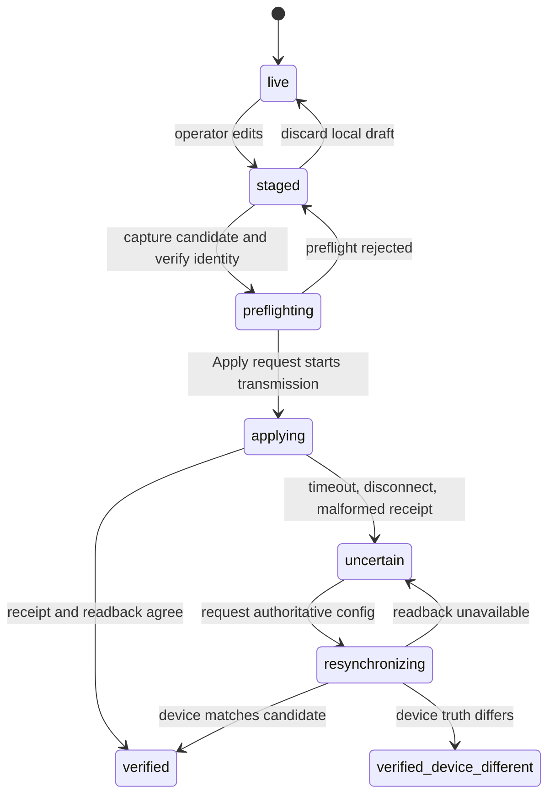

# Configuration Transaction Model

> **Doc class:** Contract. Last reviewed: 2026-07-27.

This page defines the authoritative meaning of configuration state in the App, Bridge, and firmware. Guides should link here rather than inventing their own Apply or rollback rules.

## States

- **live**: the most recently verified device configuration.
- **staged**: the operator's local candidate. It may differ from live.
- **applying**: configuration bytes have crossed the transport and a result is pending.
- **preflighting**: the App has captured an immutable candidate and is completing
  Bridge revision/identity checks; serial Apply transmission has not begun.
- **uncertain**: transmission may have committed, but the receipt cannot prove the result.
- **resynchronizing**: the App or Bridge is reading configuration from the device.
- **verified**: authoritative device truth is known and agrees with the candidate.
- **verified-device-different**: authoritative device truth is known and differs from the candidate.
- **local draft discarded**: an operator deliberately replaces an untransmitted draft with live state.

## Normative rules

1. Before transmission, the operator may discard a local draft.
2. After any Apply bytes are transmitted, timeout, disconnect, malformed ACK, or missing integrity fields do **not** prove rollback.
3. Ambiguous outcomes enter `uncertain` and require authoritative device readback.
4. Apply and local-draft discard remain disabled while a transaction is `preflighting`, `applying`, `uncertain`, or `resynchronizing`.
5. Profile, scene, macro, live-control, and read failures never discard unrelated staged configuration.
6. Structured Bridge staging is revisioned. Apply uses the revision acknowledged for the newest local draft.
7. Firmware/device state wins after readback. A differing readback is reported as `verified-device-different`, not rollback.
8. Device authority and draft dirtiness are independent. The Bridge session and App expose `deviceAuthority` (`verified`, `preflighting`, `applying`, `uncertain`, `resynchronizing`, or `verified-device-different`) and `draftState` (`clean` or `dirty`). `transactionState` remains an App compatibility projection for older UI consumers.
9. Editing during `uncertain` or `resynchronizing` updates a separate next draft and must not change the authority state or clear the unresolved transaction token.
10. Edits created while Apply is in flight remain a separate next draft; verification never promotes or discards that newer draft.
11. A structured Bridge rejection is reconciled against the Bridge session's `lastApplyResult`; WebSocket-event and HTTP-response ordering must produce the same authority state.
12. An expired Bridge writer remains permanently cancelled even after successful readback clears public uncertainty. A delayed serial callback cannot resume its old payload.
13. An unsent browser draft survives structured-Bridge disconnect/reconnect and is reconciled only after remote live truth has been adopted.
14. Simulator RPC support is declared as an explicit mapping to firmware native commands and is checked against the firmware dispatch and scene handlers in hosted contract checks.
15. The Bridge keeps serial-write lifecycle ownership in a dedicated Apply transaction writer; device-session code owns authoritative state transitions, readback, and events.
16. An uncertain Bridge transaction retains the immutable transmitted candidate. Authoritative readback equal to that candidate becomes `resynchronized`; different readback becomes `verified-device-different`, with device truth live and the attempted candidate still staged and dirty.
17. Structured stage and Apply requests bind a browser attempt with `clientApplyId`, `stagedRevision`, and `stagedDigest`. Receipts and session snapshots repeat that identity. A refreshed receipt may resolve a failed HTTP request only when all three fields match the captured candidate; an older or uncorrelated receipt leaves the current attempt uncertain.
18. Writer completion is terminal. A serial promise that rejects after ACK completion cannot abort the lane, reject the completed transaction, or move verified authority back to uncertainty.
19. Device patch reconciliation may update live and staged documents while Apply is unresolved, but it must preserve `preflighting`, `applying`, `uncertain`, or `resynchronizing` authority.
20. If Apply verifies its captured candidate while newer edits remain staged, the UI keeps the diff visible and reports that the captured configuration applied; it does not claim the whole editor is synced.
21. Structured Apply failures are classified as `preflight-rejected`, `transmission-unknown`, or `device-rejected-before-commit`. Only `transmission-unknown` creates new uncertainty.
22. Preflight rejection proves the current attempt did not enter the serial writer. Device authority remains verified, the local draft stays dirty, and correction/retry remains available.
23. A definitive firmware rejection receipt carries the same `clientApplyId`, `stagedRevision`, and `stagedDigest` as the rejected candidate so the App can correlate verified rollback without inventing uncertainty.
24. Background stage synchronization is suspended after Apply captures its candidate and remains suspended until the identity-stage/Apply handoff finishes. Edits made during that interval queue as the next draft and stage afterward.
25. The `/ws/events` bootstrap snapshot and individual config events expose authority, draft state, and correlation identity immediately; consumers do not need an HTTP refresh to complete the session contract.
26. Browser data cannot mark itself authoritative. Explicit device readback and recall paths use `hydrateAuthoritativeConfig()`; imports and presets use `stage()`.
27. Only an explicit structured Bridge Apply result with `applied: false` and
    recognized reason `clean` is a definitive pre-transmission completion. It
    releases `preflighting`, restores verified authority, and retains any local
    draft still different from App live state. A missing, malformed, or
    unrecognized result is `transmission-unknown`; it cannot prove a no-op.
28. If a queued draft is rejected while a prior Apply remains unresolved, its
    retry request persists across in-flight stage completion. Every terminal
    Apply event (`ack`, `rollback`, `resynchronized`, or
    `verified-device-different`) drains that retry after the active request
    settles, regardless of event/HTTP ordering.

## What “rollback” means

Use **discard local draft** for a candidate that has not crossed the transport. Use **firmware rejection** only when the response contract guarantees rejection happened before commit. Do not use rollback to describe an unknown transmitted outcome.
