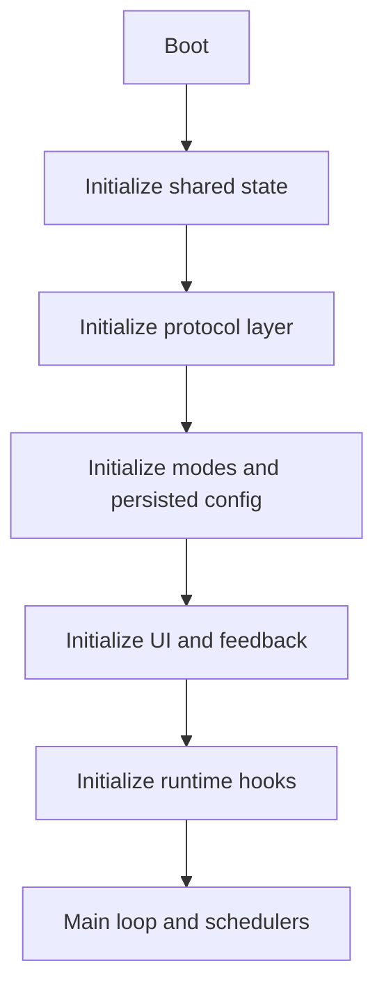
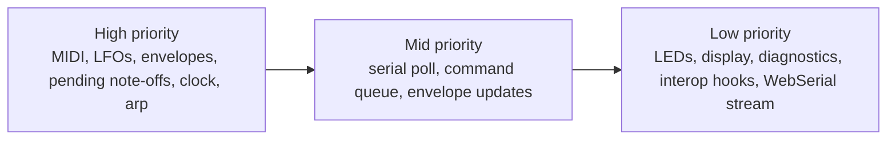
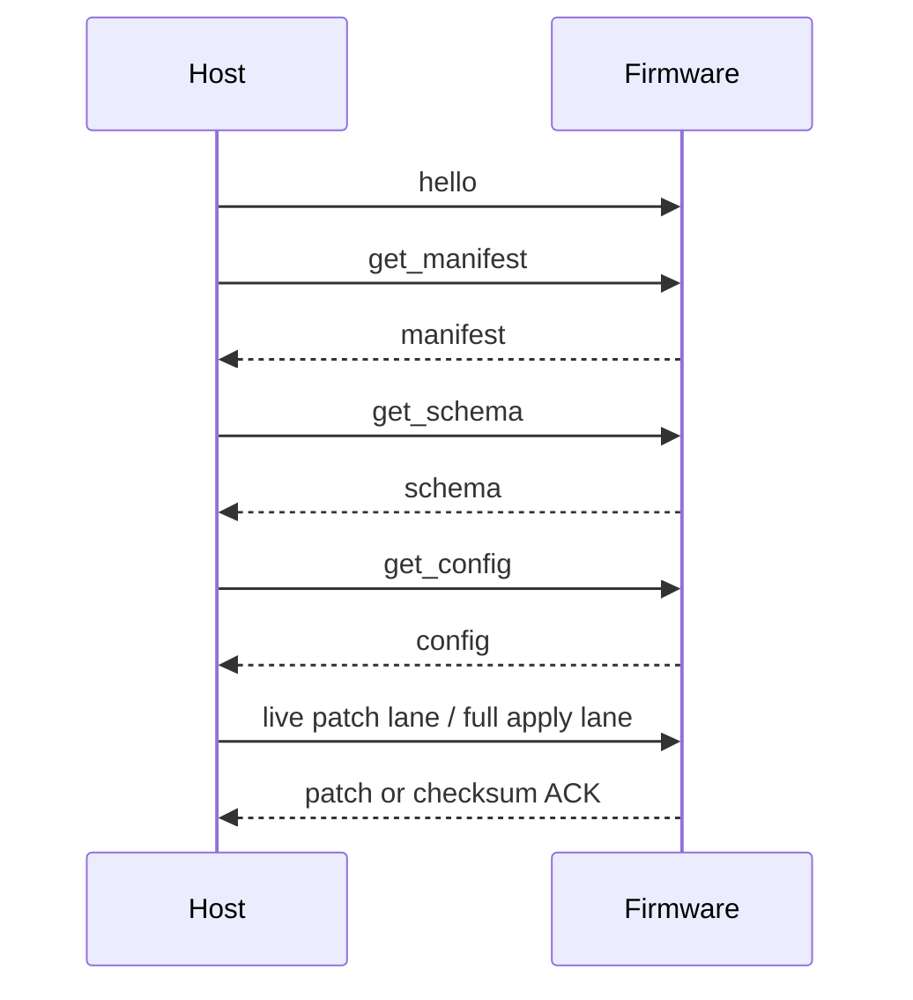

# Firmware Architecture Story

This page explains architecture shape, not the canonical host/device contract. For current protocol truth, defer to [Manifest Contract](ManifestContract.md), [MN42 Line Protocol](MN42LineProtocol.md), [Serial Protocol](SerialProtocol.md), and [Documentation Truth Map](DocumentationTruthMap.md).

The firmware is easiest to understand if you read it as a choreography problem rather than a loose collection of modules.

The job is not just "handle MIDI." The real job is:

- scan physical inputs
- keep time-sensitive work predictable
- preserve state safely
- expose a contract the browser and bridge can trust
- fail in ways the user can actually recover from

## The high-level shape

That shape matters because the codebase is deliberately organized so boot order is legible.

## The central design choice

The firmware uses shared, long-lived state on purpose.

That choice is not fashionable, but it is pragmatic on a small real-time microcontroller:

- lifetimes stay obvious
- boot order can be narrated
- modules do not allocate unpredictably at runtime
- the browser/runtime contract has one stable world to interrogate

## The three timing tiers

The scheduler is the clearest place to understand the runtime model.

This split is one of the most important architectural decisions in the stack:

- **high priority** protects timing-sensitive musical behavior
- **mid priority** handles parsing and configuration work
- **low priority** handles feedback, diagnostics, and slower host-facing interop chatter

The recent scheduler tests now assert this layout directly so task registration mistakes stop hiding in plain sight.

## The state and persistence story

The firmware keeps a persistent model of the instrument, not just a live control stream.

That means the code has to manage:

- slot definitions
- per-slot envelope/ARG payloads
- profile snapshots
- LED state
- recovery from corrupted or outdated EEPROM data

This is why `ConfigManager` and the EEPROM layout matter so much. They are not boring bookkeeping; they are the difference between an instrument that remembers itself and one that randomly forgets who it was.

## The protocol story

The browser and bridge do not talk to the firmware as if it were a dumb serial terminal anymore.

They expect a contract:

1. the device says who it is through the manifest
2. the device declares its schema version
3. the device can emit full config and incremental patches
4. the host can stage or apply changes safely
5. the device can confirm an apply with a checksum-backed ACK

That is what makes the browser's staged/live split meaningful instead of cosmetic.

## The orchestration story

Some modules are easy to understand in isolation:

- `LFO`
- `EnvelopeFollower`
- `LedAnimator`
- `SysExTemplate`

The more interesting story is what happens between them.

That orchestration layer is where:

- scheduler cadence meets runtime service
- diagnostics become visible telemetry
- WebSerial snapshots become host-visible state
- UI tuning helpers become stored payloads

That area used to be relatively under-tested. It now has direct coverage for scheduler layout, runtime note-off behavior, WebSerial payload emission, and UI helper logic, which makes the architecture more trustworthy to extend.

## The browser handshake from the firmware side

The firmware side of this exchange matters because it is where "state" stops being a private implementation detail and becomes something another system is allowed to reason about.

## Why this architecture reads the way it does

The code has gradually become more explicit because ambiguity was expensive:

- unclear scheduler ownership hid real bugs
- under-explained protocol changes made the browser harder to trust
- weak release metadata made build provenance fuzzy
- persistence without clear recovery semantics made the system harder to debug

The result is a stack that is somewhat more defensive and verbose than a toy controller needs to be. That is intentional. It is trying to be an instrument and a teaching artifact at the same time.

## Read next

- [Testing](../validation/TESTING.md) for what the current automated suite proves
- [WebSerial Protocol](../guides/WebSerial.md) for the contract the firmware exposes to hosts
- [Assumption Ledger](assumption-ledger.md) for what is confirmed in source versus what still needs bench receipts
- [History](../project/HISTORY.md) for how the architecture got this way
