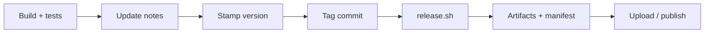

# Release Guide

Need to cut a proper drop? Start with [Release Story](ReleaseStory.md), then treat this file as the operator checklist and [Reproducibility](Reproducibility.md) as the canonical artifact recipe.

Current release/support boundary: [Release Boundary Index](ReleaseBoundaryIndex.md), [Host Compatibility](../reference/HostCompatibility.md), [bridge/README.md](https://github.com/bseverns/MOARkNOBS-42/blob/main/bridge/README.md), [Bridge Signing Plan](BridgeSigningPlan.md), [Documentation Truth Map](../reference/DocumentationTruthMap.md).



1. **Run the gauntlet** – build (`pio run -d firmware -e teensy40_main`) and test (`pio test -d firmware -e teensy40_unity -vvv`, `npm --prefix bridge test`, `npm --prefix App test`). For a beta/public candidate, run `./release_verify_hil.sh`; it always runs the bridge and app suites, and it adds Unity/full-stack HIL when `TEST_PORT` or an auto-detected board is available. Use `REQUIRE_HIL=1` when hardware evidence is mandatory.
2. **Refresh the human-facing release notes** – update [CHANGELOG.md](https://github.com/bseverns/MOARkNOBS-42/blob/main/CHANGELOG.md) and the relevant entry in [HISTORY.md](../project/HISTORY.md) so both the terse delta log and the longer narrative are current.
3. **Confirm version stamping** – firmware version strings come from `FW_VERSION`/`GIT_SHA`, which are stringized in [firmware/include/version.h](https://github.com/bseverns/MOARkNOBS-42/blob/main/firmware/include/version.h) and injected by [firmware/scripts/version.py](https://github.com/bseverns/MOARkNOBS-42/blob/main/firmware/scripts/version.py). For local release builds, export the intended tag before invoking the release script:
   ```bash
   FW_VERSION=vX.Y.Z ./release.sh vX.Y.Z
   ```
   - `release.sh` now runs two explicit lanes:
     - `release_verify_hil.sh` (hardware verification; enforce with `REQUIRE_HIL=1`)
     - `release_build.sh` (deterministic artifact generation)
   - `release_verify_hil.sh` feeds the generated `dist/mn42_vX.Y.Z_hardware-test_verification.json` so artifacts explicitly show what verification was executed versus skipped.
   - `release_build.sh` refuses tracked source changes before packaging so `dist/mn42_vX.Y.Z_hardware-test_manifest.json` records a clean source commit.
4. **Commit it** – lock in doc updates and any release prep changes with a commit.
5. **Tag it loud** – `git tag -a vX.Y.Z -m "vX.Y.Z"` to mark the moment. The release workflow rejects lightweight tags, non-semantic tag names, and tags without a matching dated `CHANGELOG.md` heading.
6. **Push the tag** – `git push origin vX.Y.Z` kicks CI into `.github/workflows/release.yml`.
7. **Review the prerelease** – after every required build lane succeeds, CI creates or updates the GitHub prerelease, appends a factual artifact index, and attaches the complete output set.
   - The release workflow builds hardware-test firmware artifacts, a frozen browser App ZIP, and unsigned hardware-test bridge packages (`macOS x64 + arm64`, `Linux x64`, `Windows x64`). It also stores the core and Bridge bundles as workflow artifacts.
   - Release packaging is blocked unless bridge tests, app tests, and `teensy40_main` firmware build pass in the release workflow.
   - GitHub Release creation and asset upload happen only in the final publication job, after both the core and Bridge artifact bundles exist.
   - GitHub Release asset labels must keep the current boundary visible: hardware-test/prerelease, not beta/public.
   - Read `mn42_vX.Y.Z_hardware-test_verification.json` before publishing notes: default hosted runners use optional HIL mode unless you provide a hardware port.
   - Bridge uploads include per-target checksums, bridge third-party license payloads, artifact manifest metadata, and hardware-test/prerelease labels.
8. **Add or refine human notes** – CI-generated notes and the artifact index provide the factual floor; edit the prerelease description if the milestone needs a stronger narrative.
9. **Celebrate or debug** – if CI faceplants, fix it and cut a new tag rather than moving the failed tag. If it works, cue the lights.

## Bridge packaging track

Unsigned bridge packaging now runs automatically in the release workflow. The remaining manual track is signing and installer-grade polish for beta/public outward artifacts:

1. Follow [`BridgePackaging.md`](BridgePackaging.md) phases for the current release target.
2. Review the generated bridge artifacts and checksums from CI.
3. For a beta/public macOS artifact, run `npm --prefix bridge run package:macos` with `REQUIRE_BRIDGE_SIGNING=1`, `APPLE_CODESIGN_IDENTITY`, `APPLE_NOTARY_KEY`, `APPLE_NOTARY_KEY_ID`, and `APPLE_NOTARY_ISSUER_ID`.
4. Attach/verify signed bridge artifacts alongside firmware files on the GitHub release when you are producing a signed outward-facing release.
5. Verify docs match the shipped UX (`docs/guides/OSCBridge.md`, `docs/guides/BridgeForPerformers.md`, `bridge/README.md`).
6. Complete the artifact checklist template: [`release/bridge-artifacts-checklist.md`](bridge-artifacts-checklist.md).
