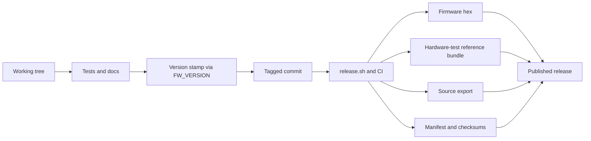

# How A Release Becomes Real

This page is release narrative, not the canonical release procedure or support-boundary source.

For current release steps and artifact truth, defer to [Release Guide](ReleaseGuide.md), [Reproducibility](Reproducibility.md), [Host Compatibility](../reference/HostCompatibility.md), and [Documentation Truth Map](../reference/DocumentationTruthMap.md).

A release in this repo is not just a firmware hex with a tag on it. It is a chain of evidence that the artifact, the source tree, and the published notes still point at the same thing.

This page is the story-first version. The exact operator steps still live in [Release Guide](ReleaseGuide.md) and the artifact recipe still lives in [Reproducibility](Reproducibility.md) plus the root-level playbook.

## The release promise

When someone downloads a release, they should be able to answer:

- what source produced this artifact?
- what firmware version does the device report internally?
- what checks proved it before publishing?
- what hardware-test reference and source bundles belong to that exact drop?

If those answers drift apart, the release stops being trustworthy.

## The release path

_Alt text: Flowchart showing a release moving from tested source through version stamping, tagging, CI, and final published hardware-test artifacts including firmware, hardware reference files, source export, manifest, and checksums._

_A companion screenshot of the actual `dist/` output would help readers connect the flowchart to the files they will see on disk._

## Why `FW_VERSION` matters so much

The release process now documents and enforces a subtle but important rule: the version in the artifact filename and the version embedded in firmware metadata need to match.

That is why the release flow injects `FW_VERSION` at build time instead of assuming the tag name will magically appear inside the binary. Without that step, you can publish a correctly named file that still reports `0.0.0` when the browser asks for the manifest.

That kind of mismatch is exactly the sort of thing story-first docs should make impossible to miss.

## What gets checked before publishing

The release path has three kinds of checks:

### 1. Does the stack still work?

- deterministic firmware build passes
- the verification lane records exactly what ran (required HIL, optional Unity-only, or skipped)
- app/bridge/system status is explicit in the hardware-test verification JSON rather than implied

### 2. Do the docs and notes still match reality?

- release notes are updated
- history/log docs reflect notable repo events
- user-facing instructions still describe the actual workflow

### 3. Can the output be audited later?

- hardware-test/prerelease artifacts are generated deterministically
- manifest records provenance
- checksums allow later verification

_A small table or artifact gallery would help here by pairing each check with the file that proves it._

## Why the hardware reference and source bundles are part of the story

This project is not only software. The release also needs to say, clearly, what board reference files and source snapshot belong to the published firmware. At the current boundary, those files are hardware-test references rather than orderable fabrication outputs. That is what turns the release from "download this binary" into "audit this prototype artifact set and understand where it came from."

## Common ways releases go wrong

These are the failures worth remembering:

- the tag exists but the embedded firmware version does not match it
- the notes describe changes that were never actually merged
- the firmware artifact exists but the source export or checksums do not
- the docs describe an older release path than the CI is actually running

Good release docs exist to make those mismatches obvious before the publish button gets pressed.

For this repo, the fastest mismatch detector is to compare your release notes against two files:

- `dist/mn42_vX.Y.Z_hardware-test_verification.json` (what verification actually executed)
- `dist/mn42_vX.Y.Z_hardware-test_manifest.json` (artifact hashes + provenance + copied verification summary)

## The practical sequence

If you are shipping a release by hand, think in this order:

1. prove the code
2. prove the notes
3. stamp the version
4. tag the exact commit
5. let CI build the receipts
6. publish only the artifacts that still agree with each other

## Read next

- [Release Guide](ReleaseGuide.md) for the operator checklist
- [Reproducibility](Reproducibility.md) for the short artifact recipe
- [`REPRODUCIBILITY.md`](https://github.com/bseverns/MOARkNOBS-42/blob/main/REPRODUCIBILITY.md) for the full root-level playbook
